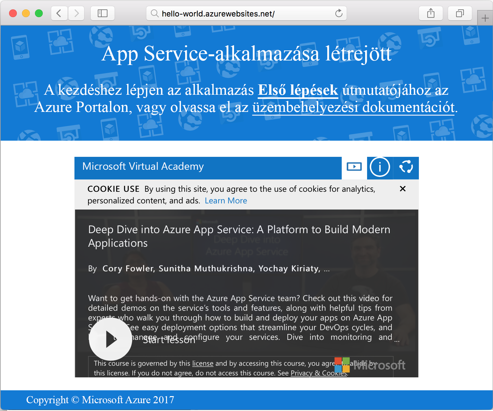

# <a name="create-a-ruby-app-in-app-service-on-linux"></a>Az App Service Linux Ruby-alkalmazás létrehozása

[App Service Linux](app-service-linux-intro.md) jól skálázható, önálló javítási a webhelyszolgáltató biztosít. A gyors üzembe helyezés bemutatja, hogyan hozzon létre egy alapszintű Ruby sínek alkalmazásra, majd telepítheti az Azure Linux webalkalmazásként.


## <a name="prerequisites"></a>Előfeltételek

* [Ruby 2.4.1 vagy magasabb](https://www.ruby-lang.org/en/documentation/installation/#rubyinstaller).
* [Git](https://git-scm.com/downloads).
* Egy [aktív Azure-előfizetéssel](https://azure.microsoft.com/pricing/free-trial/?ref=microsoft.com&utm_source=microsoft.com&utm_medium=docs&utm_campaign=visualstudio).

[!INCLUDE [quickstarts-free-trial-note](../../../includes/quickstarts-free-trial-note.md)]

## <a name="download-the-sample"></a>A minta letöltése

Egy terminálablakot futtassa a következő parancsot a helyi számítógépen, a minta app tárház klónozása:

```bash
git clone https://github.com/Azure-Samples/ruby-docs-hello-world
```

## <a name="run-the-application-locally"></a>Az alkalmazás helyi futtatása

Futtassa a sínek kiszolgáló ahhoz, hogy az alkalmazás működéséhez. Módosítsa a *hello életben* könyvtár, és a `rails server` indítja el a kiszolgálón.

```bash
cd hello-world\bin
rails server
```

Nyissa meg webböngészővel, `http://localhost:3000` az alkalmazás helyi teszteléséhez.


## <a name="modify-app-to-display-welcome-message"></a>Módosítsa a alkalmazást az üdvözlő üzenet megjelenítése

Módosítsa az alkalmazás, így üdvözlő üzenet megjeleníti. Először be kell állítania egy útvonal módosításával a *~/workspace/ruby-docs-hello-world/config/routes.rb* fájlt a nevű útvonal `hello`.

  ```ruby
  Rails.application.routes.draw do
      #For details on the DSL available within this file, see http://guides.rubyonrails.org/routing.html
      root 'application#hello'
  end
  ```

Módosítsa az alkalmazás a tartományvezérlő, a rendszer visszaadja az üzenet HTML formátumban a böngészőben. 

Nyissa meg *~/workspace/hello-world/app/controllers/application_controller.rb* szerkesztésre. Módosítsa a `ApplicationController` kikeresni a következő osztály, például a következő példakód:

  ```ruby
  class ApplicationController > ActionController :: base
    protect_from_forgery with: :exception
    def hello
      render html: "Hello, world from Azure Web App on Linux!"
    end
  end
  ```

Az alkalmazás konfigurálva van. Nyissa meg webböngészővel, `http://localhost:3000` a legfelső szintű kezdőlapja megerősítéséhez.


[!INCLUDE [Try Cloud Shell](../../../includes/cloud-shell-try-it.md)]

[!INCLUDE [Configure deployment user](../../../includes/configure-deployment-user.md)]

## <a name="create-a-ruby-web-app-on-azure"></a>Ruby-webalkalmazás létrehozása az Azure-on

Erőforráscsoport szükséges az eszközök szükségesek a webalkalmazás tartalmazza. Erőforráscsoport létrehozásához használja a [az csoport létrehozása]() parancsot.

```azurecli-interactive
az group create --location westeurope --name myResourceGroup
```

Használja a [az App Service-csomagot hozzon létre](https://docs.microsoft.com/cli/azure/appservice/plan#az_appservice_plan_create) parancsot a webalkalmazás az app service-csomag létrehozásához.

```azurecli-interactive
az appservice plan create --name myAppServicePlan --resource-group myResourceGroup --is-linux
```

Ezt követően adja ki a [az webalkalmazás létrehozása](https://docs.microsoft.com/cli/azure/webapp) parancsot a webes alkalmazás, amely használja az újonnan létrehozott service-csomag létrehozásához. Figyelje meg, hogy a futtatókörnyezet értéke `ruby|2.3`. Ne felejtse el lecserélni `<app name>` egy egyedi alkalmazásnévvel rendelkező.

```azurecli-interactive
az webapp create --resource-group myResourceGroup --plan myAppServicePlan --name <app name> \
--runtime "ruby|2.3" --deployment-local-git
```

A parancs kimenetében azt jelzi, hogy az újonnan létrehozott webalkalmazáshoz, valamint a telepítés URL-CÍMÉT kapcsolatos információkat. A következő mintát kell hasonlítania. Másolja az URL-cím későbbi használatra ebben az oktatóanyagban.

```bash
https://<deployment user name>@<app name>.scm.azurewebsites.net/<app name>.git
```

A webalkalmazás létrehozása után egy **áttekintése** a lap megtekintéséhez érhető el. Keresse meg azt. A következő kezdőkép lap jelenik meg:




## <a name="deploy-your-application"></a>Az alkalmazás központi telepítése

Az Azure webhelyének helyi alkalmazást telepíti a következő parancsok futtatásával:

```bash
git remote add azure <Git deployment URL from above>
git add -A
git commit -m "Initial deployment commit"
git push azure master
```

Győződjön meg arról, hogy a távoli üzembe helyezési műveleteinek sikeres jelentést. A parancsok a kimenet az alábbihoz hasonló termékek:

```bash
remote: Using sass-rails 5.0.6
remote: Updating files in vendor/cache
remote: Bundle gems are installed into ./vendor/bundle
remote: Updating files in vendor/cache
remote: ~site/repository
remote: Finished successfully.
remote: Running post deployment command(s)...
remote: Deployment successful.
To https://<your web app name>.scm.azurewebsites.net/<your web app name>.git
  579ccb....2ca5f31  master -> master
myuser@ubuntu1234:~workspace/<app name>$
```

A telepítés befejezése után indítsa újra a webes alkalmazást a központi telepítés használatával érvénybe a [az webalkalmazás újraindítása](https://docs.microsoft.com/cli/azure/webapp#az_webapp_restart) parancsban, ahogy az itt látható:

```azurecli-interactive
az webapp restart --name <app name> --resource-group myResourceGroup
```

Keresse meg a helyet, és ellenőrizze az eredményt.

```bash
http://<app name>.azurewebsites.net
```


> [!NOTE]
> Az alkalmazás újraindul, miközben megpróbálta keresse meg a hely HTTP-állapotkódot eredményez `Error 503 Server unavailable`. Teljes újraindítására néhány percig is eltarthat.
>

[!INCLUDE [Clean-up section](../../../includes/cli-script-clean-up.md)]

## <a name="next-steps"></a>Következő lépések

[Linux – gyakori kérdések az Azure App Service](https://docs.microsoft.com/azure/app-service-web/app-service-linux-faq.md)
