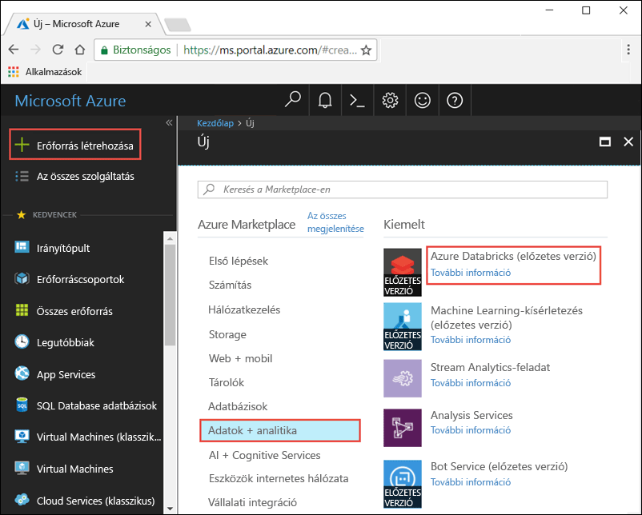
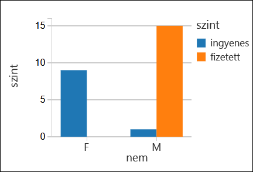
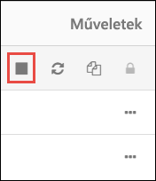

# <a name="quickstart-run-a-spark-job-on-azure-databricks-using-the-azure-portal"></a>Gyors üzembe helyezés: A Spark feladat futtatása az Azure Databricks az Azure portál használatával

A gyors üzembe helyezés az Azure Databricks munkaterülethez és belül futó Apache Spark-fürt létrehozását szemlélteti. Végül megismerheti, hogyan Spark végezzen a Databricks fürtön. Az Azure Databricks további információkért lásd: [Mi az Azure Databricks?](what-is-azure-databricks.md)

## <a name="log-in-to-the-azure-portal"></a>Jelentkezzen be az Azure portálra.

Jelentkezzen be a [Azure-portálon](https://portal.azure.com).

## <a name="create-a-databricks-workspace"></a>Databricks munkaterület létrehozása

Ebben a szakaszban hozzon létre egy Azure Databricks munkaterületet, az Azure portál használatával. 

1. Az Azure portálon kattintson  **+** , kattintson a **adatok + analitika**, és kattintson a **(előzetes verzió) Azure Databricks**. 

    

2. A **(előzetes verzió) Azure Databricks**, kattintson a **létrehozása**.

    > [!NOTE]
    > Az Azure Databricks jelenleg korlátozott előzetes. Ha azt szeretné, hogy figyelembe kell venni az előzetes engedélyezése az Azure-előfizetéshez, adja meg a [bejelentkezési űrlap kitöltése](https://databricks.azurewebsites.net/).

2. A **Azure Databricks szolgáltatás**, adja meg a következő értékeket:

    

    * A **munkaterületnevet**, adja meg a Databricks munkaterület nevét.
    * A **előfizetés**, a legördülő listában válassza ki az Azure-előfizetéshez.
    * A **erőforráscsoport**, adja meg, hogy hozzon létre egy új erőforráscsoportot, vagy használjon egy meglévőt. Egy erőforráscsoport egy olyan tároló, amely egy Azure megoldás kapcsolódó erőforrásokat tárol. További információkért lásd: [Azure erőforráscsoport áttekintése](../azure-resource-manager/resource-group-overview.md).
    * A **hely**, jelölje be **USA keleti régiója 2**. Más elérhető régiók, lásd: [Azure-szolgáltatások rendelkezésre régiónként](https://azure.microsoft.com/regions/services/).

3. Kattintson a **Create** (Létrehozás) gombra.

## <a name="create-a-spark-cluster-in-databricks"></a>A Databricks Spark-fürt létrehozása

1. Az Azure portálon, nyissa meg a létrehozott Databricks munkaterületet, és kattintson **inicializálása munkaterület**.

2. Ekkor megnyílik a Azure Databricks portálon. Kattintson a portálról **fürt**.

    

3. Az a **új fürt** lapján adja meg a fürt létrehozásához.

    

    * Adja meg a fürt nevét.
    * Mindenképpen jelölje ki a **Terminate tevékenység ___ perc elteltével** jelölőnégyzetet. Adja meg egy időtartamot (percben) leáll a fürtben, ha a fürt nem használja.
    * Fogadja el az összes többi alapértelmezett értéket. 
    * Kattintson a **fürt létrehozása**. Ha fut a fürtön, notebookok csatlakoztatni a fürthöz, és feladatok futtatása Spark.

Fürtök létrehozásával kapcsolatos további információkért lásd: [Spark-fürt létrehozása az Azure Databricks](https://docs.azuredatabricks.net/user-guide/clusters/create.html).

## <a name="run-a-spark-sql-job"></a>A Spark SQL-feladat futtatása

Ez a szakasz a Kezdés előtt végre kell hajtania a következő:

* [Az Azure storage-fiók létrehozása](../storage/common/storage-create-storage-account.md#create-a-storage-account). 
* A minta JSON-fájl letöltésére [a Githubról](https://github.com/Azure/usql/blob/master/Examples/Samples/Data/json/radiowebsite/small_radio_json.json). 
* A minta JSON-fájl feltöltése a létrehozott Azure-tárfiókot. Használhat [Microsoft Azure Tártallózó](../vs-azure-tools-storage-manage-with-storage-explorer.md) fájlok feltöltéséhez.

A következő lépésekkel a notebook létrehozása Databricks, konfigurálja a notebook adatokat olvasni az Azure Blob storage-fiók, és futtassa a Spark SQL-feladat az adatokat.

1. Kattintson a bal oldali ablaktáblában **munkaterület**. Az a **munkaterület** legördülő menüben kattintson **létrehozása**, és kattintson a **Notebook**.

    

2. Az a **Notebook létrehozása** párbeszédpanel mezőben adjon meg egy nevet, válasszon **Scala** nyelv, és válassza ki a korábban létrehozott Spark-fürtön.

    

    Kattintson a **Create** (Létrehozás) gombra.

3. Cserélje le a következő kódrészletet `{YOUR STORAGE ACCOUNT NAME}` az Azure storage-fiók nevét a létrehozott és `{YOUR STORAGE ACCOUNT ACCESS KEY}` az a fiók tárelérési kulcs. Illessze be a kódrészletet a notebook a cella üres, és nyomja le a SHIFT + ENTER a kódcella futtatásához. Ez részlet konfigurálja a notebook adatokat olvasni az Azure blob Storage tárolóban.

       spark.conf.set("fs.azure.account.key.{YOUR STORAGE ACCOUNT NAME}.blob.core.windows.net", "{YOUR STORAGE ACCOUNT ACCESS KEY}")
    
    Hogyan lehet lekérni a tárfiók hívóbetűjét, lásd: [a tárelérési kulcsok kezelése](../storage/common/storage-create-storage-account.md#manage-your-storage-account)

    > [!NOTE]
    > Azure Data Lake Store az Azure Databricks Spark-fürt is használható. Útmutatásért lásd: [használata Data Lake Store az Azure Databricks](https://go.microsoft.com/fwlink/?linkid=864084).

4. Hozzon létre egy ideiglenes tábla a JSON mintaadatfájlokat származó adatok használ egy SQL-utasítás futtatása **small_radio_json.json**. Cserélje le a helyőrző értékeket a következő kódrészletet a tároló nevének és a tárfiók nevét. Illessze be a kódrészletet a notebook celláiban kódot, és nyomja le a SHIFT + ENTER BILLENTYŰT. A kódrészletet a `path` az Azure Storage-fiók feltöltött minta JSON-fájl helyét jelöli.

    ```sql
    %sql 
    CREATE TEMPORARY TABLE radio_sample_data
    USING json
    OPTIONS (
     path "wasbs://{YOUR CONTAINER NAME}@{YOUR STORAGE ACCOUNT NAME}.blob.core.windows.net/small_radio_json.json"
    )
    ```

    A parancs sikeresen befejeződött, követően az adatok a JSON-fájlból Databricks fürt táblázatként.

    A `%sql` nyelvi magic parancs segítségével futtassa egy SQL-kódot a notebook, akkor is, ha a notebook más típusú. További információkért lásd: [jegyzetfüzet nyelvek keverése](https://docs.azuredatabricks.net/user-guide/notebooks/index.html#mixing-languages-in-a-notebook).

5. Pillanatkép készítése a mintaadatok JSON jobb megértése érdekében a lekérdezést, amely minden vizsgáljuk meg. Az alábbi kódrészletben illessze be a kódot a cellát és nyomja le az **SHIFT + ENTER**.

    ```sql
    %sql 
    SELECT * from radio_sample_data
    ```

6. A táblázatos kimenet jelenik például (csak az egyes oszlopok láthatók) az alábbi képernyőfelvételen látható módon:

    

    Egyéb részletek a mintaadatok rögzíti a célközönség rádió csatorna nemének (oszlopnév, **nemét**), és hogy az előfizetés ingyenes és fizetős (oszlopnév, **szint**).

7. Most hozzon létre az adatok megjelenítése az egyes nemét, hány felhasználó ingyenes fiókkal rendelkezik, és hány fizetett előfizetők vizuális ábrázolását. A táblázatos kimenet alján kattintson a **sávdiagram** ikonra, végül **megrajzolásához beállítások**.

    

8. A **testreszabása tőzsdei**, fogd és vidd értékei a képernyőfelvételen látható módon.

    

    * Állítsa be **kulcsok** való **nemét**.
    * Állítsa be **adatsorozat-csoportok** való **szint**.
    * Állítsa be **értékek** való **szint**.
    * Állítsa be **összesítési** való **száma**.

    Kattintson az **Alkalmaz** gombra.

9. A kimenet a vizuális ábrázolását írja le az alábbi képernyőfelvételen látható:

     

## <a name="clean-up-resources"></a>Az erőforrások eltávolítása

A Spark-fürt létrehozásakor, ha a jelölőnégyzet kijelölt **Terminate tevékenység ___ perc elteltével**, a fürt automatikusan leáll, ha inaktív volt a megadott időpontban.

Ha nem jelölte be a jelölőnégyzetet, a fürtöt kézzel kell véget. Ehhez az Azure Databricks munkaterületről, a bal oldali ablaktáblán kattintson **fürtök**. A fürt megszakítja, vigye a mutatót a három pont alatt **műveletek** oszlopba, és kattintson a **megszakítási** ikonra.



## <a name="next-steps"></a>Következő lépések

Ebben a cikkben egy Spark-fürt létrehozása az Azure Databricks, és egy adatok az Azure storage használata Spark feladat futott. Is megtalálhatja [adatforrások Spark](https://docs.azuredatabricks.net/spark/latest/data-sources/index.html) adatokat importálhat más adatforrások Azure Databricks módjáról. A következő cikkben megtudhatja, hogyan használható az Azure Data Lake Store Azure Databricks továbblépés.

> [!div class="nextstepaction"]
>[Használjon Data Lake Store az Azure Databricks](https://go.microsoft.com/fwlink/?linkid=864084)