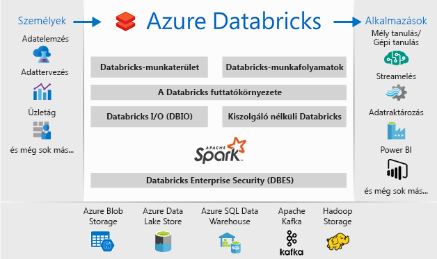
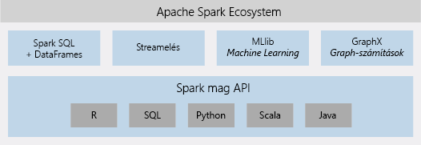

# Mi az az Azure Databricks?

Az Azure Databricks a Microsoft Azure Cloud Services platformra optimalizált Apache Spark-alapú elemzési platform. Az Apache Spark alapítóival közösen tervezett Databricks integrálva van az Azure-ral, így egyetlen kattintással beállítható, zökkenőmentes munkafolyamatokat tesz lehetővé, valamint olyan interaktív munkaterületet biztosít, amellyel lehetővé válik az adatszakértők, az adatmérnökök és az üzleti elemzők közötti együttműködés.

## Apache Spark-alapú elemzési platform

Az Azure Databricks a teljesen nyílt forráskódú Apache Spark fürtszolgáltatás technológiáiból és képességeiből áll. Az Apache Spark az Azure Databricksben a következő összetevőkből áll:

* **Spark SQL és DataFrames**: A Spark SQL a strukturált adatokkal végzett munka során használható Spark-modul. A DataFrame egy elosztott adatgyűjtemény megnevezett oszlopokba rendezve. Elméleti szinten azonos a relációs adatbázisokban található táblákkal vagy R/Python adatkeretekkel.

* **Streamelés**: Valós idejű adatfeldolgozás és -elemzés analitikai és interaktív alkalmazásokhoz. Integrálható az HDFS, Flume és Kafka szolgáltatásokkal.

* **MLib**: Gyakori tanulási algoritmusokból és segédeszközökből álló Machine Learning-könyvtár, beleértve a besorolást, regressziót, fürtözést, együttműködési szűrést, dimenziócsökkentést, valamint mögöttes optimalizálási primitíveket.

* **GraphX**: Grafikonok és grafikonszámítások a használati esetek széles köréhez, a kognitív analitikától egészen az adatfeltárásig.

* **Spark Core API**: Támogatást biztosít az R, SQL, Python, Scala és Java szolgáltatásokhoz.

## Apache Spark az Azure Databricksben

Az Azure Databricks a Spark képességeire építve egy olyan felügyeletet nem igénylő felhőalapú platformot biztosít, amely a következőket tartalmazza:

- Teljes körűen felügyelt Spark-fürtök
- Interaktív munkaterület a felfedezéshez és vizualizációhoz
- Platform a kedvenc Spark-alapú alkalmazásai futtatásához

### Teljes körűen felügyelt Apache Spark-fürtök a felhőben

Az Azure Databricks egy olyan biztonságos és megbízható éles környezetet biztosít a felhőben, amelyet Spark-szakértők felügyelnek és támogatnak. A következőket teheti:

* Másodpercek alatt létrehozhat fürtöket.
* Dinamikusan és automatikusan fel- vagy leskálázhatja a fürtöket, beleértve a kiszolgáló nélküli fürtöket, és megoszthatja ezeket csapatok között. 
* Programozott módon használhat fürtöket REST API-k segítségével. 
* A Sparkra épülő biztonságos adatintegrációs képességek használatával központosítás nélkül egyesítheti az adatait. 
* Azonnali hozzáférést nyerhet a legújabb Apache Spark szolgáltatásokhoz minden kiadással.

### A Databricks futtatókörnyezete
A Databricks futtatókörnyezete az Apache Sparkra épül, és natív módon az Azure-felhőhöz készült. 

A **Kiszolgáló nélküli** beállítással az Azure Databricks teljesen megszünteti az infrastruktúra összetettségét és a specializált szakértelem szükségességét az adatinfrastruktúra beállításához és konfigurálásához. A Kiszolgáló nélküli beállítás segítségével az adatszakértők gyors iterációkat végezhetnek csapatként.

Az éles feladatok teljesítményével foglalkozó adatmérnökök számára az Azure Databricks egy olyan Spark-motort biztosít, amely az I/O-réteg és a feldolgozási réteg (Databricks I/O) különböző optimalizálásainak köszönhetően még gyorsabb és nagyobb teljesítményű.

### Munkaterület az együttműködéshez

Az együttműködési és integrált környezet révén az Azure Databricks leegyszerűsíti az adatfeltárás, a prototípus-készítés, illetve az adatvezérelt alkalmazások futtatásának folyamatát a Sparkban.

* Meghatározhatja az adatok felhasználási módját az egyszerű adatfeltárás segítségével.
* Az előrehaladást jegyzetfüzetekben dokumentálhatja az R, Python, Scala vagy SQL alkalmazásokban.
* Néhány kattintással megjelenítheti adatait, valamint olyan jól ismert eszközöket használhat, mint a Matplotlib, a ggplot vagy a d3.
* Interaktív irányítópultok használatával hozhat létre dinamikus jelentéseket.
* A Spark használatával egyidejűleg interakcióba léphet az adataival.

## Vállalati biztonság

Az Azure Databricks vállalati szintű Azure-biztonságot kínál, beleértve az adatait és vállalkozását védő Azure Active Directory integrációt, a szerepköralapú vezérlőket és az SLA-kat.

* Az integráció az Azure Active Directoryval lehetővé teszi, hogy teljes Azure-alapú megoldásokat futtasson az Azure Databricks használatával.
* Az Azure Databricks szerepköralapú hozzáférésével részletes felhasználói engedélyeket állíthat be jegyzetfüzetekhez, fürtökhöz, feladatokhoz és adatokhoz.
* Vállalati szintű SLA-k. 

## Integráció az Azure-szolgáltatásokkal

Az Azure Databricks mélyen együttműködik az Azure-adatbázisokkal és -tárolókkal: az SQL Data Warehouse, a Cosmos DB, a Data Lake Store és a Blob Storage szolgáltatásokkal. 

## Integráció a Power BI-jal
A Power BI és az Azure Databricks gazdag integrációjának köszönhetően gyorsan és könnyedén felfedezheti és megoszthatja hatékony betekintéseit. Egyéb BI-eszközöket is használhat, például a Tableau Software-t JDBC/ODBC fürtvégpontokon keresztül.

## További lépések

* [Rövid útmutató: Spark-feladatok futtatása az Azure Databricksben](quickstart-create-databricks-workspace-portal.md)
* [Spark-fürtök használata](https://docs.azuredatabricks.net/user-guide/clusters/index.html)
* [Jegyzetfüzetek használata](https://docs.azuredatabricks.net/user-guide/notebooks/index.html)
* [Spark-feladatok létrehozása](https://docs.azuredatabricks.net/user-guide/jobs.html)

 

