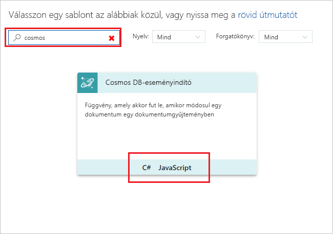
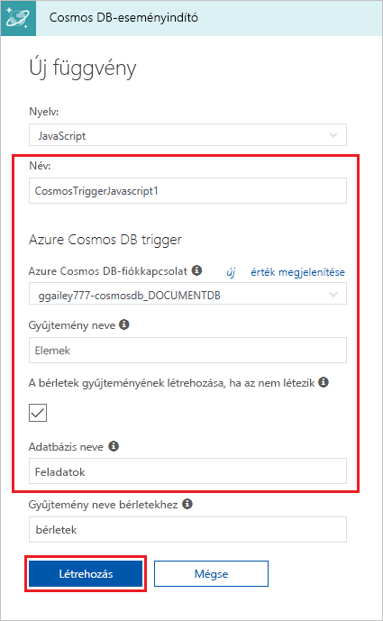
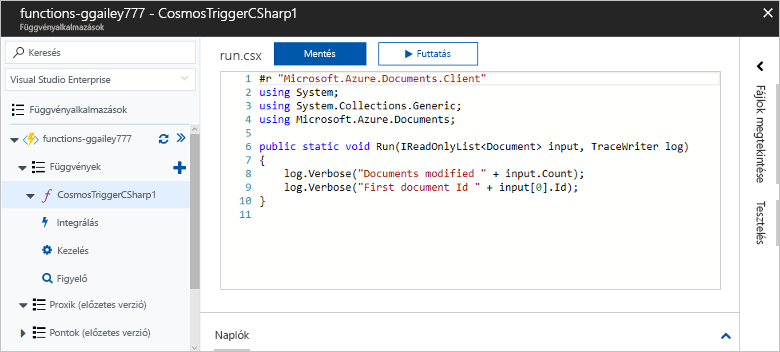
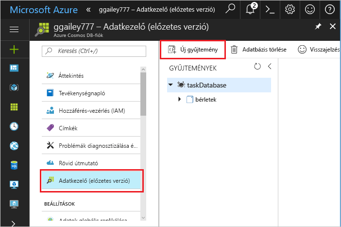
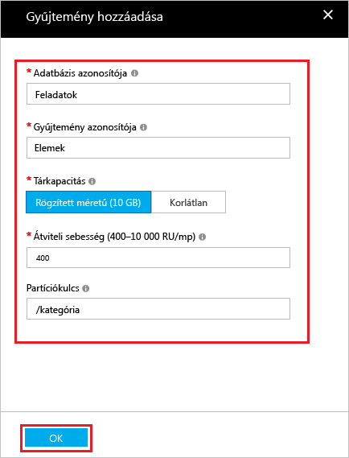

# Azure Cosmos DB által indított függvény létrehozása

Megtudhatja, hogyan hozzon létre egy függvényt váltódik ki, amikor az adatok kerülnek, vagy az Azure Cosmos Adatbázisba megváltozott. Azure Cosmos DB kapcsolatos további információkért lásd: [Azure Cosmos DB: kiszolgáló nélküli adatbázis számítási Azure Functions használatával](..\cosmos-db\serverless-computing-database.md).

## Előfeltételek

Az oktatóanyag elvégzéséhez:

+ Ha nem rendelkezik Azure-előfizetéssel, mindössze néhány perc alatt létrehozhat egy [ingyenes fiókot](https://azure.microsoft.com/free/?WT.mc_id=A261C142F) a virtuális gép létrehozásának megkezdése előtt.

[!INCLUDE [functions-portal-favorite-function-apps](../../includes/functions-portal-favorite-function-apps.md)]

## Azure-függvényalkalmazás létrehozása

[!INCLUDE [Create function app Azure portal](../../includes/functions-create-function-app-portal.md)]

Ezután létrehozhat egy függvényt az új függvényalkalmazásban.

## Azure Cosmos DB eseményindító létrehozása

1. Bontsa ki a függvényalkalmazást, és kattintson a **Függvények** elem melletti **+** gombra. Ha ez az első függvény a függvényalkalmazásban, jelölje ki az **Egyéni függvény** lehetőséget. Ez megjeleníti a függvénysablonok teljes készletét.

    

2. Keresse meg és válassza ki a **Azure CosmosDBTrigger** sablont a kívánt nyelvet.

    

3. Az új eseményindítót konfigurálja a beállításokat a lemezképet az alábbi táblázatban megadottak szerint.

    
    
    | Beállítás      | Ajánlott érték  | Leírás                                |
    | ------------ | ---------------- | ------------------------------------------ |
    | **A függvény neve** | Alapértelmezett | A sablon által javasolt alapértelmezett függvény nevét használja. |
    | **Adatbázis neve** | Feladatok | A gyűjteményhez a figyelni kívánt adatbázis nevét. |
    | **Gyűjtemény neve** | Elemek | Figyelni kívánt gyűjtemény nevét. |
    | **Ha még nem létezik a címbérlet-gyűjtemény létrehozása** | Bejelölve | A gyűjtemény még nem létezik, hozza létre. |

4. Válassza ki **új** mellett a **Azure Cosmos DB fiók kapcsolat** címkével, és válasszon ki egy meglévő Cosmos DB fiókot vagy **+ új létrehozása**. 
 
    

6. Új Cosmos DB fiók létrehozásakor használja a **új fiók** a táblázatban megadott beállításokat.

    | Beállítás      | Ajánlott érték  | Leírás                                |
    | ------------ | ---------------- | ------------------------------------------ |
    | **Azonosító** | Az adatbázis neve | Az Azure Cosmos DB adatbázisban egyedi azonosítója  |
    | **API** | SQL (DocumentDB) | Ez a témakör a dokumentum-adatbázis API-t használja.  |
    | **Előfizetés** | Azure-előfizetés | Azure-előfizetés  |
    | **Erőforráscsoport** | myResourceGroup |  Használja a függvényalkalmazást tartalmazó meglévő erőforráscsoportot. |
    | **Hely**  | WestEurope | Olyan helyet válasszon, amely közel van a függvényalkalmazáshoz vagy a tárolt dokumentumokat használó egyéb alkalmazásokhoz.  |

6. Az adatbázis létrehozásához kattintson az **OK** gombra. Az adatbázis létrehozása eltarthat néhány percig. Az adatbázis létrehozása után a rendszer az adatbázis kapcsolati karakterláncát függvényalkalmazás-beállításként tárolja. Az Alkalmazásbeállítás neve bekerül **Azure Cosmos DB fiók kapcsolat**. 

7. Kattintson a **létrehozása** létrehozása az Azure Cosmos DB indított függvény. A függvény létrehozása után a sablonokon alapuló funkciókódot jelenik meg.  

    

    Ez a függvény sablon a dokumentumok száma és az első Dokumentumazonosítója ír a naplókat. 

A következő Azure Cosmos DB fiókjához, és hozzon létre a **feladatok** gyűjtemény az adatbázisban. 

## Az Items gyűjtemény létrehozása

1. Nyissa meg a másik példányának a [Azure-portálon](https://portal.azure.com) új lapon a böngészőben. 

2. A portál bal oldalán, bontsa ki a ikon sáv típusú `cosmos` a keresőmezőbe, és válasszon **Azure Cosmos DB**.

    

2. Válassza ki az Azure Cosmos DB fiókját, majd válassza ki a **adatkezelő**. 
 
3. A **gyűjtemények**, válassza a **taskDatabase** válassza **új gyűjtemény**.

    

4. A **gyűjtemény hozzáadása**, a kép az alábbi táblázatban látható beállításokkal. 
 
    
 
    | Beállítás|Ajánlott érték|Leírás |
    | ---|---|--- |
    | **Adatbázis-azonosító:** | Feladatok |Az új adatbázis neve. Ennek egyeznie kell a függvénykötés definiált neve. |
    | **Gyűjtemény azonosítója** | Elemek | Az új gyűjtemény nevét. Ennek egyeznie kell a függvénykötés definiált neve.  |
    | **Tárolási kapacitás** | Rögzített méretű (10 GB)|Használja az alapértelmezett értéket. Ez az érték az adatbázis tárkapacitása. |
    | **Átviteli sebesség** |400 kérelemegység| Használja az alapértelmezett értéket. Később lehetősége lesz növelni az átviteli sebességet a késés csökkentése érdekében. |
    | **[Partíciókulcs](../cosmos-db/partition-data.md#design-for-partitioning)** | /kategória|Az egyes partíciók között az adatokat egyenletesen elosztó partíciókulcs. A megfelelő partíciókulcs kiválasztása fontos a nagy teljesítményű gyűjtemények létrehozásához. | 

1. Kattintson a **OK** létrehozásához a **feladatok** gyűjtemény. A gyűjtemény létrehozása egy rövid ideig is eltarthat.

Után a függvénykötés megadott gyűjtemény létezik, a függvény az új gyűjtemény dokumentumok hozzáadásával tesztelheti.

## A függvény tesztelése

1. Bontsa ki az új **taskCollection** Data Explorer, a gyűjtemény kiválasztása **dokumentumok**, majd jelölje be **új dokumentum**.

    

2. Cserélje ki annak tartalmát az új dokumentum a következő tartalmat, majd kattintson a **mentése**.

        {
            "id": "task1",
            "category": "general",
            "description": "some task"
        }

1. Váltás az első böngészőlapon, amely tartalmazza a függvényt a portálon. Bontsa ki a függvény naplókat, és győződjön meg arról, hogy az új dokumentum kiváltása a függvényt. Előfordulhat, hogy a `task1` dokumentum azonosító érték íródik a naplókat. 

    

4. (Választható) Lépjen vissza a dokumentum a módosítja, és kattintson a **frissítés**. Ezután térjen vissza a függvény naplókat, és győződjön meg arról, hogy a frissítés is elindul a függvény.

## Az erőforrások eltávolítása

[!INCLUDE [Next steps note](../../includes/functions-quickstart-cleanup.md)]

## Következő lépések

Egy függvényt, amely akkor fut, amikor egy dokumentum hozzáadása vagy módosítása az Azure Cosmos DB-ben létrehozott.

[!INCLUDE [Next steps note](../../includes/functions-quickstart-next-steps.md)]

További információ a tárolási üzenetsor eseményindítóiról: [Azure Functions – a tárolási üzenetsor kötései](functions-bindings-storage-queue.md).
