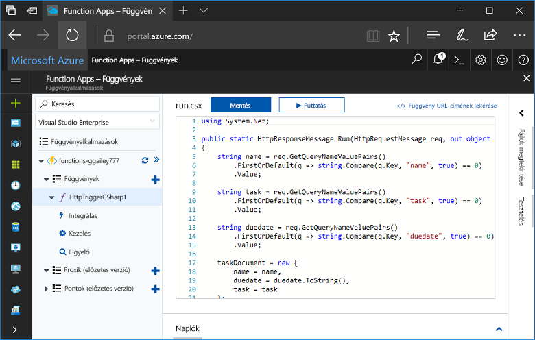
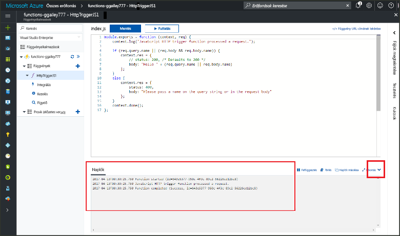

# Az első függvény létrehozása az Azure portálon

Az Azure Functions lehetővé teszi a kód végrehajtását kiszolgáló nélküli környezetben anélkül, hogy először létre kellene hoznia egy virtuális gépet vagy közzé kellene tennie egy webalkalmazást. Ebben a témakörben megismerheti, hogyan használhatja a Functions szolgáltatást egy „hello world” függvény létrehozására az Azure Portalon.

[!INCLUDE [quickstarts-free-trial-note](../../includes/quickstarts-free-trial-note.md)]

## Jelentkezzen be az Azure-ba

Jelentkezzen be az [Azure portálra](https://portal.azure.com/).

## Függvényalkalmazás létrehozása

Rendelkeznie kell egy függvényalkalmazással a függvények végrehajtásának biztosításához. A függvényalkalmazás lehetővé teszi, hogy logikai egységbe csoportosítsa a függvényeket az erőforrások egyszerűbb felügyelete, telepítése és megosztása érdekében. 

[!INCLUDE [Create function app Azure portal](../../includes/functions-create-function-app-portal.md)]

[!INCLUDE [functions-portal-favorite-function-apps](../../includes/functions-portal-favorite-function-apps.md)]

Ezután létrehozhat egy függvényt az új függvényalkalmazásban.

## HTTP által aktivált függvény létrehozása

1. Bontsa ki az új függvényalkalmazást, majd kattintson a **Függvények** elem melletti **+** gombra.

2.  A **Gyors kezdés** lapon kattintson a **WebHook + API** elemre, válassza ki a függvény nyelvét, és kattintson a **Függvény létrehozása** elemre. 
   
    

A rendszer létrehoz egy függvényt a választott nyelven a HTTP által indított függvények sablonjának használatával. Az új függvényt egy HTTP-kérelem küldésével futtathatja.

## A függvény tesztelése

1. Az új függvényben kattintson a **< /> Függvény URL-címének beolvasása** elemre, válassza a **default (Function key)** (alapértelmezett (funkcióbillentyű)) lehetőséget, majd kattintson a **Másolás** gombra. 

    

2. Illessze be a HTTP-kérelem URL-címét a böngésző címsorába. Az URL-címhez fűzze hozzá a `&name=<yourname>` lekérdezési karakterláncot, és hajtsa végre a kérelmet. Az alábbiakban látható a böngészőben a GET kérelemre a függvény által visszaadott válasz:

    

    A kérelem URL-címe alapértelmezés szerint tartalmazza a függvény HTTP protokollon keresztüli eléréséhez szükséges kulcsot.   

## A függvény naplóinak megtekintése 

A függvény futásakor a rendszer nyomkövetési adatok ír a naplókba. Az előző végrehajtás nyomkövetési adatainak megtekintéséhez térjen vissza a függvényhez a portálon, és a **Naplók** elem kibontásához kattintson a képernyő alján található felfelé mutató nyílra. 

## Az erőforrások eltávolítása

[!INCLUDE [Clean up resources](../../includes/functions-quickstart-cleanup.md)]

## Következő lépések

Létrehozott egy függvényalkalmazást és egy HTTP által aktivált egyszerű függvényt.  

[!INCLUDE [Next steps note](../../includes/functions-quickstart-next-steps.md)]

További információ: [Azure Functions – HTTP- és webhookkötések](functions-bindings-http-webhook.md).

