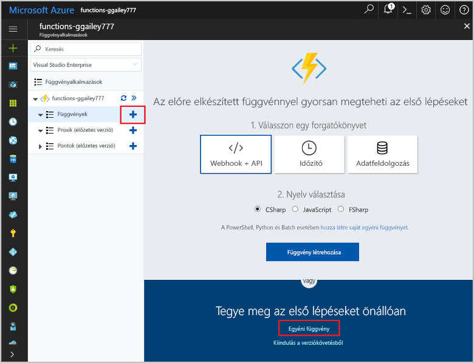
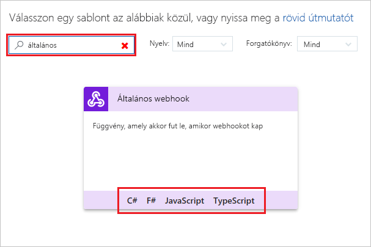
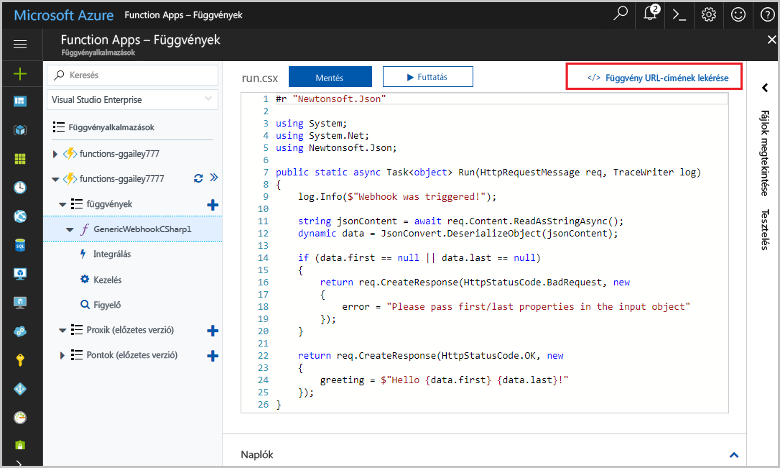
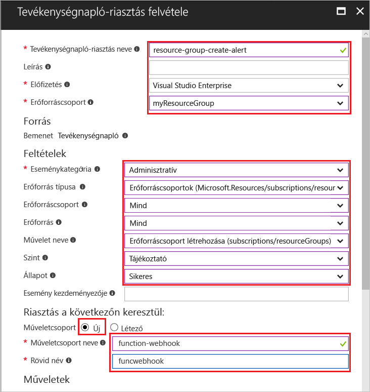

# <a name="create-a-function-triggered-by-a-generic-webhook"></a>Általános webhook által indított függvény létrehozása

Az Azure Functions lehetővé teszi a kód végrehajtását kiszolgáló nélküli környezetben anélkül, hogy először létre kellene hoznia egy virtuális gépet vagy közzé kellene tennie egy webalkalmazást. Konfigurálhatja például, a függvény aktiválására Azure figyelő által kiváltott riasztások alapján. Ez a témakör bemutatja, hogyan hajthat végre a C#-kódban, egy erőforráscsoportot az előfizetéshez való hozzáadásakor.   


## <a name="prerequisites"></a>Előfeltételek 

Az oktatóanyag elvégzéséhez:

+ Ha nem rendelkezik Azure-előfizetéssel, mindössze néhány perc alatt létrehozhat egy [ingyenes fiókot](https://azure.microsoft.com/free/?WT.mc_id=A261C142F) a virtuális gép létrehozásának megkezdése előtt.

[!INCLUDE [functions-portal-favorite-function-apps](../../includes/functions-portal-favorite-function-apps.md)]

## <a name="create-an-azure-function-app"></a>Azure-függvényalkalmazás létrehozása

[!INCLUDE [Create function app Azure portal](../../includes/functions-create-function-app-portal.md)]

Ezután létrehozhat egy függvényt az új függvényalkalmazásban.

## <a name="create-function"></a>Általános webhook indított függvény létrehozása

1. Bontsa ki a függvényalkalmazást, és kattintson a **Függvények** elem melletti **+** gombra. Ha ez a függvény az első címtárra, a függvény alkalmazásban, válassza ki a **egyéni függvény**. Ez megjeleníti a függvénysablonok teljes készletét.

    

2. Válassza ki a **általános WebHook - C#** sablont. Adja meg a C# függvény nevét, majd válasszon **létrehozása**.

      

2. Kattintson az új függvény **<> / Get függvény URL-cím**, majd másolja ki és mentse az értéket. Ez az érték a webhook konfigurálására használt. 

    
         
A következő hoz létre egy webhook végpont Azure figyelése tevékenység napló riasztást. 

## <a name="create-an-activity-log-alert"></a>Tevékenység napló riasztás létrehozása

1. Az Azure-portálon lépjen a **figyelő** szolgáltatás, válassza **riasztások**, és kattintson a **Hozzáadás figyelmeztetés a napló**.   

    

2. Használja a táblázatban megadott beállításokat:

    

    | Beállítás      |  Ajánlott érték   | Leírás                              |
    | ------------ |  ------- | -------------------------------------------------- |
    | **Tevékenység napló riasztás neve** | erőforrás-csoport-létrehozása – figyelmeztetés | A figyelmeztetés a napló nevét. |
    | **Előfizetés** | Az Ön előfizetése | Az előfizetés ehhez az oktatóanyaghoz használ. | 
    |  **Erőforráscsoport** | myResourceGroup | A riasztási erőforrások vannak telepítve az erőforráscsoport. Ugyanabban az erőforráscsoportban használata a függvénynek alkalmazásként megkönnyíti az oktatóanyag befejezése után karbantartása. |
    | **Eseménykategória** | Felügyeleti | Ebbe a kategóriába olyan Azure-erőforrások módosításait.  |
    | **Erőforrástípus** | Erőforráscsoportok | Szűrők riasztásokat az erőforrás-csoport tevékenységeket. |
    | **Erőforráscsoport**<br/>és **erőforrás** | Összes | Figyelje az összes erőforrást. |
    | **A művelet neve** | Create resource group (Erőforráscsoport létrehozása) | Riasztások létrehozásához a műveletek szűrése. |
    | **Szint** | Tájékoztató | Tájékoztatási szintű riasztások tartalmazzák. | 
    | **Állapot** | Sikeres | Sikeresen végrehajtott műveletek riasztások szűrése. |
    | **A művelet csoport** | új | Hozzon létre egy új művelet, amely meghatározza a művelet beolvassa, egy riasztás esetén. |
    | **A művelet csoport neve** | függvény-webhook | A művelet csoportnak a nevét.  | 
    | **Rövid név** | funcwebhook | A művelet csoport rövid nevét. |  

3. A **műveletek**, a táblázatban megadott beállításokkal művelet hozzáadása: 

    

    | Beállítás      |  Ajánlott érték   | Leírás                              |
    | ------------ |  ------- | -------------------------------------------------- |
    | **Name (Név)** | CallFunctionWebhook | A művelet nevét. |
    | **Művelet típusa** | Webhook | A rendszer a választ a riasztást, hogy a Webhook URL-cím neve. |
    | **Részletek** | Függvény URL-címe | Illessze be a korábban kimásolt függvény a webhook URL-CÍMÉT. |v

4. Kattintson a **OK** a riasztás és művelet csoport létrehozásához.  

A webhook neve erőforráscsoport létrehozásakor az előfizetéshez. Következő lépésként frissítse a kódot a kérelem törzsében naplóban JSON-adatokat kezelni a függvényben.   

## <a name="update-the-function-code"></a>A függvénykód módosítása

1. Lépjen vissza a függvény app a portálon, és bontsa ki a függvény. 

2. Cserélje le a C# parancsfájlkód a portálon a függvényben a következő kódot:

    ```csharp
    #r "Newtonsoft.Json"
    
    using System;
    using System.Net;
    using Newtonsoft.Json;
    using Newtonsoft.Json.Linq;
    
    public static async Task<object> Run(HttpRequestMessage req, TraceWriter log)
    {
        log.Info($"Webhook was triggered!");
    
        // Get the activityLog object from the JSON in the message body.
        string jsonContent = await req.Content.ReadAsStringAsync();
        JToken activityLog = JObject.Parse(jsonContent.ToString())
            .SelectToken("data.context.activityLog");
    
        // Return an error if the resource in the activity log isn't a resource group. 
        if (activityLog == null || !string.Equals((string)activityLog["resourceType"], 
            "Microsoft.Resources/subscriptions/resourcegroups"))
        {
            log.Error("An error occured");
            return req.CreateResponse(HttpStatusCode.BadRequest, new
            {
                error = "Unexpected message payload or wrong alert received."
            });
        }
    
        // Write information about the created resource group to the streaming log.
        log.Info(string.Format("Resource group '{0}' was {1} on {2}.",
            (string)activityLog["resourceGroupName"],
            ((string)activityLog["subStatus"]).ToLower(), 
            (DateTime)activityLog["submissionTimestamp"]));
    
        return req.CreateResponse(HttpStatusCode.OK);    
    }
    ```

A függvény most tesztelheti az előfizetés egy új erőforráscsoport létrehozásával.

## <a name="test-the-function"></a>A függvény tesztelése

1. Kattintson az Azure portál, válassza a bal oldali erőforrás csoport ikonra **+ Hozzáadás**, adjon meg egy **erőforráscsoport-név**, és válassza ki **létrehozása** futtatásával hozzon létre egy üres erőforráscsoportot.
    
    

2. Lépjen vissza a függvény, és bontsa ki a **naplók** ablak. Az erőforráscsoport létrehozása után a napló figyelmeztetés elindítja a webhook, és a funkciót hajtja végre. Az új erőforráscsoportot, a naplókban is megtekinthetők nevének megtekintéséhez.  

    

3. (Választható) Lépjen vissza, és törölje a létrehozott csoportot. Vegye figyelembe, hogy ez a tevékenység a függvény nem következik. Ennek az az oka törlési műveletek a riasztás által ki van szűrve. 

## <a name="clean-up-resources"></a>Az erőforrások eltávolítása

[!INCLUDE [Next steps note](../../includes/functions-quickstart-cleanup.md)]

## <a name="next-steps"></a>Következő lépések

Egy függvényt, amely akkor fut, amikor egy kérelem érkezett egy általános webhook hozott létre. 

[!INCLUDE [Next steps note](../../includes/functions-quickstart-next-steps.md)]

További információt a webhook-eseményindítókról az [Azure Functions – HTTP- és webhookkötések](functions-bindings-http-webhook.md) című témakörben talál. A C# funkciók fejlesztésével kapcsolatos további tudnivalókért lásd: [Azure Functions C# parancsfájl fejlesztői leírás](functions-reference-csharp.md).

