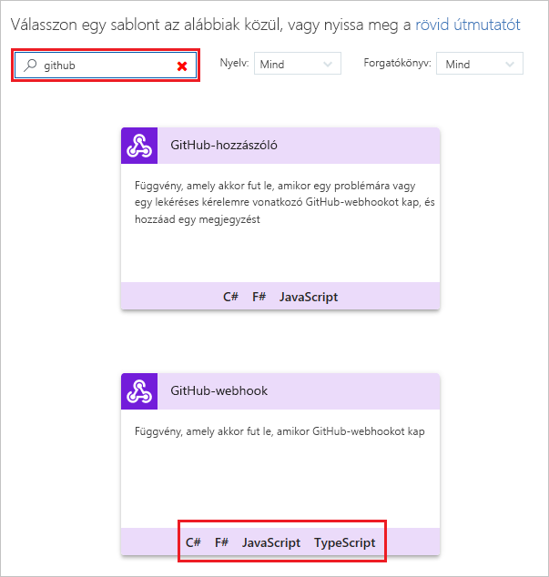

# GitHub-webhookok által meghívott függvények létrehozása

Itt megismerkedhet a GitHub-webhookok által meghívott függvények létrehozásával. 

A témakörhöz szükség lesz [Az első Azure-függvény létrehozása](functions-create-first-azure-function.md) témakörben létrehozott erőforrásokra.

Szüksége lesz továbbá egy GitHub-fiókra. Ha még nincs fiókja, [regisztrálhat egy ingyenes GitHub-fiókra](https://github.com/join). 

A témakörben foglalt lépések végrehajtása legfeljebb 5 percet vehet igénybe.

## A függvényalkalmazás megkeresése    

1. Jelentkezzen be az [Azure portálra](https://portal.azure.com/). 

2. A portál tetején a keresősávba írja be a függvényalkalmazás nevét, majd válassza ki a listáról.

## GitHub-webhook által aktivált függvény létrehozása

1. A függvényalkalmazásban kattintson a **Függvények** mellett a **+** gombra, majd a **GitHubWebHook** sablonra a kívánt nyelven, és végül a **Létrehozás** gombra.
   
     

2. Kattintson a **</> Függvény URL-címének lekérése** elemre, majd másolja és mentse az értékeket. Járjon el ugyanígy a **</> GitHub-titok lekérése** esetében. Ezekre az értékekre a GitHub-webhook konfigurálásához lesz szükség. 

     
         
A következő lépésben egy webhookot hoz létre a GitHub-tárban. 

## A webhook konfigurálása
1. A GitHubban lépjen a tulajdonában álló adattárra. Használhat bármely elágaztatott adattárat is.
 
2. Kattintson a **Settings** (Beállítások), majd a **Webhooks** (Webhookok) és végül az **Add webhook** (Webhook hozzáadása) elemre.
   
    

3. Illessze be a függvény URL-jét és titkos kulcsát a **Payload URL** (Hasznos adat URL) és a **Secret** (Titkos kulcs) mezőkbe, majd a **Content type** (Tartalom típusa) elemnél adja meg az **application/json** (alkalmazás/json) értéket.

4. Kattintson a **Let me select individual events** (Egyes események kiválasztása) gombra, válassza az **Issue comment** (Problémához fűzött megjegyzés) lehetőséget, majd kattintson az **Add webhook** (Webhook hozzáadása) parancsra.
   
    

Most a webhook arra van beállítva, hogy elindítsa a függvényt egy új, problémához fűzött megjegyzés hozzáadásakor. 

## A függvény tesztelése
1. A GitHub-tárban nyissa meg az **Issues** (Problémák) lapot egy új böngészőablakban.

2. Az új ablakban kattintson a **New Issue** (Új probléma) elemre, adjon meg egy címet, majd kattintson a **Submit new issue** (Új probléma küldése) gombra. 

2. A problémában írjon be egy megjegyzést, majd kattintson a **Comment** (Megjegyzés) elemre. 

3. A másik GitHub-ablakban kattintson az új webhook melletti **Edit** (Szerkesztés) elemre, görgessen lefelé a **Recent Deliveries** (Legutóbbi kézbesítések) pontig, és itt ellenőrizze, hogy a függvény dolgozott-e fel webhook-kérelmet. 
 
    

   A függvény válaszának tartalmaznia kell a következőt: `New GitHub comment: <Your issue comment text>`.

## Következő lépések

[!INCLUDE [Next steps note](../../includes/functions-quickstart-next-steps.md)]

[!INCLUDE [Getting Started Note](../../includes/functions-get-help.md)]

