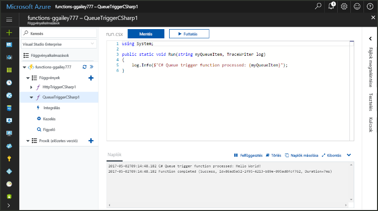
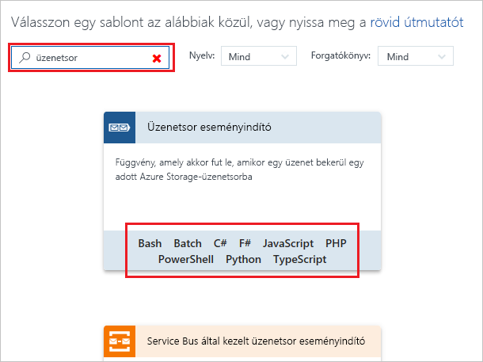
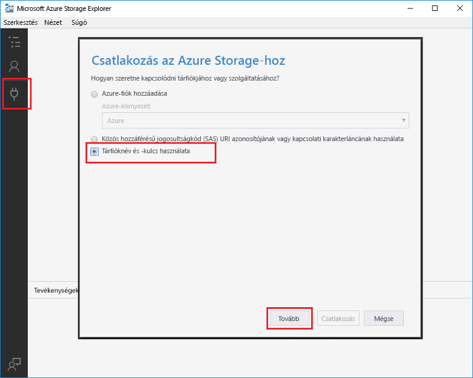
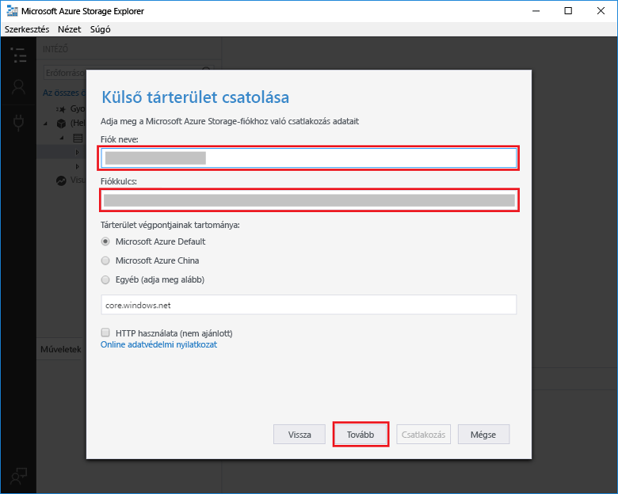

# Azure Storage-üzenetsor által aktivált függvény létrehozása

Ismerje meg, hogyan hozhat létre az Azure Storage üzenetsorába küldött üzenetek által aktivált függvényt.  

A témakörben foglalt lépések végrehajtása legfeljebb 5 percet vehet igénybe.

## Előfeltételek

[!INCLUDE [Previous quickstart note](../../includes/functions-quickstart-previous-topics.md)]

Le kell töltenie és telepítenie kell a [Microsoft Azure Storage Explorer](http://storageexplorer.com/) szoftvert. 

[!INCLUDE [functions-portal-favorite-function-apps](../../includes/functions-portal-favorite-function-apps.md)] 

## Üzenetsor által aktivált függvény létrehozása

Bontsa ki a függvényalkalmazást, kattintson a **Függvények** elem melletti **+** gombra, majd kattintson a kívánt nyelvű **QueueTrigger** sablonra. Ezután használja a táblázatban megadott beállításokat, és kattintson a **Létrehozás** gombra.

    
| Beállítás      |  Ajánlott érték   | Leírás                                        |
| ------------ |  ----------------- | -------------------------------------------------- |
| **Üzenetsor neve**   | myqueue-items    | A tárfiókhoz csatlakoztatni kívánt üzenetsor neve. |
| **Tárfiók kapcsolata** | AzureWebJobStorage | Választhatja a függvényalkalmazás által már használt tárfiókkapcsolatot, vagy létrehozhat egy újat.  |
| **A függvény neve** | Egyedi a függvényalkalmazásban | Az üzenetsor által aktivált függvény neve. |  

Ezután csatlakozzon az Azure Storage-fiókjához, és hozza létre a **myqueue-items** tárolót.

## Az üzenetsor létrehozása

1. A függvényben kattintson az **Integráció** elemre, bontsa ki a **Dokumentáció** elemet, és másolja a **Fiók neve** és a **Fiók kulcsa** értéket. Ezekkel a hitelesítő adatokkal csatlakozhat a tárfiókhoz. Ha már csatlakozott a tárfiókjához, folytassa a 4. lépéssel.
 
    v

2. Futtassa a [Microsoft Azure Storage Explorer](http://storageexplorer.com/) eszközt, kattintson a bal oldalon található csatlakozási ikonra, válassza a **Tárfiók nevének és kulcsának használata** lehetőséget, és kattintson a **Tovább** gombra.

    
    
3. Adja meg az 1. lépésben megállapított **Fiók neve** és **Fiók kulcsa** értéket, és kattintson a **Tovább**, majd a **Csatlakozás** gombra. 
  
    

4. Bontsa ki a csatolt tárfiókot, kattintson a jobb gombbal az **Üzenetsorok** elemre, kattintson az **Üzenetsor létrehozása** elemre, írja be a `myqueue-items` értéket, és nyomja meg az Enter billentyűt.
 
    

Az üzenetsor létrehozása után tesztelheti a függvényt úgy, hogy felvesz egy üzenetet az üzenetsorba.  

## A függvény tesztelése

1. Térjen vissza az Azure Portalra, keresse meg a függvényt, bontsa ki a **Naplók** elemet a lap alján, és győződjön meg arról, hogy a naplózási adatfolyam nincs leállítva.

2. A Storage Explorerben bontsa ki a tárfiókot, az **Üzenetsorok**, majd az **üzenetsorelemek** elemet, és kattintson az **Üzenet hozzáadása** elemre. 

    

2. Írja be a „Hello World!” üzenetet az **Üzenet szövege** mezőbe, és kattintson az **OK** gombra.
 
3. Várjon néhány másodpercet, majd térjen vissza a függvény naplóihoz, és győződjön meg arról, hogy megtörtént az új üzenet olvasása az üzenetsorból. 

    

4. Térjen vissza a Storage Explorerbe, kattintson a **Frissítés** elemre, és ellenőrizze, hogy megtörtént-e az üzenet feldolgozása, és hogy el lett-e távolítva az üzenetsorból.

## Az erőforrások eltávolítása

[!INCLUDE [Next steps note](../../includes/functions-quickstart-cleanup.md)]

## Következő lépések

Létrehozott egy függvényt, amely akkor fut, amikor üzenet felvétele történik a tárolási üzenetsorba. 

[!INCLUDE [Next steps note](../../includes/functions-quickstart-next-steps.md)]

További információ a tárolási üzenetsor eseményindítóiról: [Azure Functions – a tárolási üzenetsor kötései](functions-bindings-storage-queue.md). 

