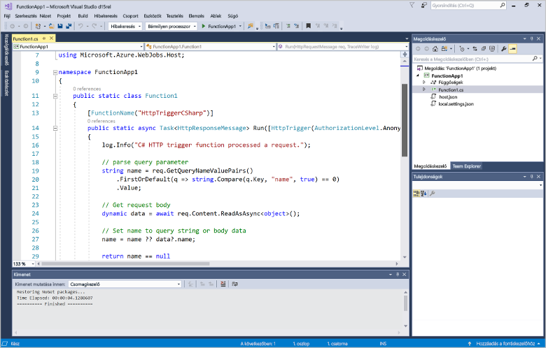
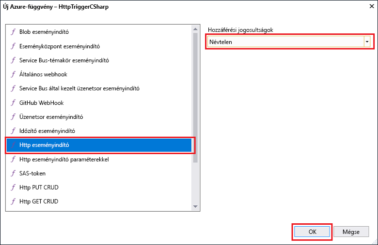

# Az első függvény létrehozása a Visual Studio használatával 

Az Azure Functions lehetővé teszi a kód végrehajtását kiszolgáló nélküli környezetben anélkül, hogy először létre kellene hoznia egy virtuális gépet vagy közzé kellene tennie egy webalkalmazást. 

Ebben a témakörben megtudhatja, hogy az Azure Functions Tools for Visual Studio 2017 használatával miként hozhat létre és tesztelhet helyileg egy „Helló világ!”-függvényt. Ezután közzéteheti a függvénykódot az Azure-ban.

## Előfeltételek

Az oktatóanyag elvégzéséhez a következőkre lesz szüksége:

* A [Visual Studio 2017 Preview 15.3-as verziója](https://www.visualstudio.com/vs/preview/), amely tartalmazza az **Azure-fejlesztési** számítási feladatot is.
    
    

[!INCLUDE [quickstarts-free-trial-note](../../includes/quickstarts-free-trial-note.md)]

## Az Azure Functions Tools for Visual Studio 2017 telepítése

Mielőtt nekifogna, töltse le és telepítse az Azure Functions Tools for Visual Studio 2017-et. Ezekhez az eszközökhöz legalább a Visual Studio 2017 Preview 15.3-as vagy későbbi verziója szükséges. Ha már telepítette az Azure Function Toolst, kihagyhatja ezt a részt.

[!INCLUDE [Install the Azure Functions Tools for Visual Studio](../../includes/functions-install-vstools.md)]   

## Hozzon létre egy Azure Functions-projektet a Visual Studióban

[!INCLUDE [Create a project using the Azure Functions template](../../includes/functions-vstools-create.md)]

Most, hogy már létrehozta a projektet, hozza létre első függvényét.

## A függvény létrehozása

A **Solution Explorer** (Megoldáskezelő) felületén kattintson a jobb gombbal a projektcsomópontra, majd válassza az **Add** (Hozzáadás)  > **New Item** (Új elem) lehetőséget. Válassza ki az **Azure Function** (Azure-függvény) elemet, majd kattintson az **Add** (Hozzáadás) lehetőségre.

Válassza ki a **HttpTrigger** elemet, adja meg a **Function Name** (Függvénynév) értékét, az **Access Rights** (Hozzáférési jog) lehetőségnél válassza az **Anonymous** (Névtelen) elemet, majd kattintson a **Create** (Létrehozás) lehetőségre. A létrehozott függvény HTTP-kéréssel bármely ügyfél részéről hozzáférhető. 

Most, hogy már létrehozta a HTTP-triggerrel aktivált függvényt, tesztelheti a helyi számítógépen.

## A függvény helyi tesztelése

[!INCLUDE [Test the function locally](../../includes/functions-vstools-test.md)]

Másolja a függvény URL-címét az Azure-függvény futtatókörnyezetéből.  

 Illessze be a HTTP-kérelem URL-címét a böngésző címsorába. Az URL-címhez fűzze hozzá a `&name=<yourname>` lekérdezési karakterláncot, és hajtsa végre a kérelmet. Az alábbiakban látható a böngészőben a helyi GET kérelemre a függvény által visszaadott válasz: 

A hibakeresés leállításához kattintson a **Stop** (Leállítás) gombra a Visual Studio eszköztárában.

Miután ellenőrizte, hogy a függvény megfelelően fut a helyi számítógépen, tegye közzé a projektet az Azure-ban.

## A projekt közzététele az Azure-ban

A projekt közzétételéhez rendelkeznie kell egy függvényalkalmazással.az Azure-előfizetéséhez. Közvetlenül a Visual Studióból is létrehozhat függvényalkalmazást.

[!INCLUDE [Publish the project to Azure](../../includes/functions-vstools-publish.md)]

## A függvény tesztelése az Azure-ban

Másolja a függvényalkalmazás alap URL-címét a Publish (Közzététel) profiloldalról. Cserélje ki a függvény helyi tesztelésekor használt `localhost:port` URL-címrészt az új alap URL-címmel. Ahogyan korábban, most is az URL-címhez fűzze hozzá a `&name=<yourname>` lekérdezési sztringet, és hajtsa végre a kérelmet.

A HTTP-triggert használó függvényt meghívó URL-cím így néz ki:

    http://<functionappname>.azurewebsites.net/api/<functionname>?name=<yourname> 

Illessze be a HTTP-kérelem új URL-címét a böngésző címsorába. Az alábbiakban látható a böngészőben a távoli GET kérelemre a függvény által visszaadott válasz: 

 

## Következő lépések

A Visual Studio segítéségével létrehozott egy egyszerű, HTTP-triggerrel aktivált függvényt tartalmazó C#-függvényalkalmazást. 

[!INCLUDE [functions-quickstart-next-steps](../../includes/functions-quickstart-next-steps.md)]

További információ az Azure Functions Core Tools használatával végzett helyi tesztelésről és hibakeresésről: [Code and test Azure Functions locally](functions-run-local.md) (Az Azure-függvények kódolása és helyi tesztelése). 

