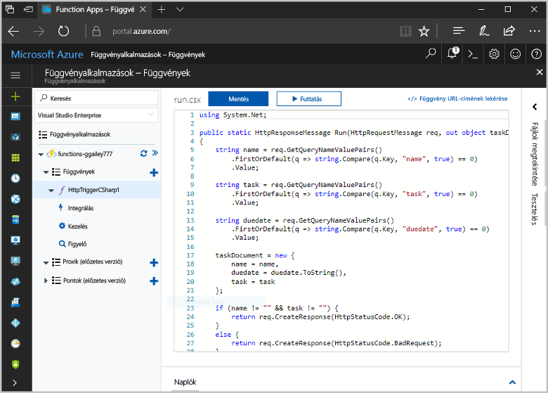

# <a name="store-unstructured-data-using-azure-functions-and-azure-cosmos-db"></a>Az Azure Functions és Azure Cosmos DB strukturálatlan adatok tárolásához

Az [Azure Cosmos DB](https://azure.microsoft.com/services/cosmos-db/) kiválóan alkalmas strukturálatlan és JSON-adatok tárolására. A Cosmos DB, az Azure Functions szolgáltatással kombinálva felgyorsítja és megkönnyíti az adattárolást, hiszen lényegesen kevesebb kódot igényel, mint amennyi egy relációs adatbázisban történő adattároláshoz szükséges.

Az Azure Functions bemeneti és kimeneti kötései deklaratív módszert biztosítanak a külső szolgáltatások adataihoz a függvényből történő csatlakozásra. Ebben a témakörben megtudhatja, hogyan módosíthat egy meglévő C#-függvényt egy kimeneti kötés hozzáadásához, amely strukturálatlan adatokat tárol egy Cosmos DB-dokumentumban. 



## <a name="prerequisites"></a>Előfeltételek

Az oktatóanyag elvégzéséhez:

[!INCLUDE [Previous quickstart note](../../includes/functions-quickstart-previous-topics.md)]

## <a name="add-an-output-binding"></a>Kimeneti kötés hozzáadása

1. Bontsa ki a függvényalkalmazást és a függvényt.

1. Válassza az oldal jobb felső sarkában található **Integráció** és **+ Új kimenet** elemeket. Válassza az **Azure Cosmos DB** elemet, majd kattintson a **Kiválasztás** lehetőségre.

    

3. Használja a táblázatban megadott **Azure Cosmos DB kimeneti** beállításokat: 

    

    | Beállítás      | Ajánlott érték  | Leírás                                |
    | ------------ | ---------------- | ------------------------------------------ |
    | **Dokumentumparaméter neve** | taskDocument | A Cosmos DB-objektumra utaló név a kódban. |
    | **Adatbázis neve** | taskDatabase | Adatbázis neve a dokumentumok mentéséhez. |
    | **Gyűjtemény neve** | TaskCollection | Az adatbázis-gyűjtemény nevét. |
    | **Ha az értéke true, létrehozza a Cosmos DB-adatbázist és -gyűjteményt** | Bejelölve | A gyűjtemény még nem létezik, hozza létre. |

4. Válassza ki **új** mellett a **Azure Cosmos DB dokumentum kapcsolat** címkével, és válassza a **+ új létrehozása**. 

5. Használja a táblázatban megadott, **új fiókra** vonatkozó beállításokat: 

    

    | Beállítás      | Ajánlott érték  | Leírás                                |
    | ------------ | ---------------- | ------------------------------------------ |
    | **Azonosító** | Az adatbázis neve | Az Azure Cosmos DB adatbázisban egyedi azonosítója  |
    | **API** | SQL (DocumentDB) | Válassza ki a dokumentum-adatbázis API-ját.  |
    | **Előfizetés** | Azure-előfizetés | Azure-előfizetés  |
    | **Erőforráscsoport** | myResourceGroup |  Használja a függvényalkalmazást tartalmazó meglévő erőforráscsoportot. |
    | **Hely**  | WestEurope | Olyan helyet válasszon, amely közel van a függvényalkalmazáshoz vagy a tárolt dokumentumokat használó egyéb alkalmazásokhoz.  |

6. Az adatbázis létrehozásához kattintson az **OK** gombra. Az adatbázis létrehozása eltarthat néhány percig. Az adatbázis létrehozása után a rendszer az adatbázis kapcsolati karakterláncát függvényalkalmazás-beállításként tárolja. Az Alkalmazásbeállítás neve bekerül **Azure Cosmos DB fiók kapcsolat**. 
 
8. A kapcsolati karakterlánc beállítása után a kötés létrehozásához válassza a **Mentés** lehetőséget.

## <a name="update-the-function-code"></a>A függvénykód módosítása

Cserélje le a meglévő C#-függvénykódot a következő kódra:

```csharp
using System.Net;

public static HttpResponseMessage Run(HttpRequestMessage req, out object taskDocument, TraceWriter log)
{
    string name = req.GetQueryNameValuePairs()
        .FirstOrDefault(q => string.Compare(q.Key, "name", true) == 0)
        .Value;

    string task = req.GetQueryNameValuePairs()
        .FirstOrDefault(q => string.Compare(q.Key, "task", true) == 0)
        .Value;

    string duedate = req.GetQueryNameValuePairs()
        .FirstOrDefault(q => string.Compare(q.Key, "duedate", true) == 0)
        .Value;

    taskDocument = new {
        name = name,
        duedate = duedate.ToString(),
        task = task
    };

    if (name != "" && task != "") {
        return req.CreateResponse(HttpStatusCode.OK);
    }
    else {
        return req.CreateResponse(HttpStatusCode.BadRequest);
    }
}

```
A mintakód beolvassa a HTTP-kérelem karakterláncait, és egy `taskDocument` objektum mezőihez rendeli azokat. A `taskDocument` kötés elküldi az ezen kötési paramétertől származó objektumadatokat a kötött dokumentum-adatbázisba tárolásra. Az adatbázis a függvény első futtatásakor jön létre.

## <a name="test-the-function-and-database"></a>A függvény és az adatbázis tesztelése

1. Bontsa ki a jobb oldali ablakot, és válassza a **Teszt** elemet. A **Lekérdezés** területen kattintson a **+ Paraméter hozzáadása** elemre, és adja hozzá a következő paramétereket a lekérdezési karakterlánchoz:

    + `name`
    + `task`
    + `duedate`

2. Kattintson a **Futtatás** parancsra, és ellenőrizze, hogy a rendszer 200-as állapotüzenetet ad-e vissza.

    

1. Az Azure Portal bal oldali menüjében bontsa ki az ikonsort, gépelje be a `cosmos` szöveget a keresőmezőbe, és válassza az **Azure Cosmos DB** lehetőséget.

    

2. Válassza ki az Azure Cosmos DB fiókját, majd válassza ki a **adatkezelő**. 

3. Bontsa ki a **Gyűjtemények** csomópontokat, válassza ki az új dokumentumot, és győződjön meg arról, hogy a dokumentum tartalmazza a lekérdezési karakterlánc értékeit, valamint további metaadatokat. 

    

Sikeresen hozzáadta a HTTP-eseményindítóval, amely a strukturálatlan adatot tárol egy Azure Cosmos DB kötés.

[!INCLUDE [Clean-up section](../../includes/clean-up-section-portal.md)]

## <a name="next-steps"></a>Következő lépések

[!INCLUDE [functions-quickstart-next-steps](../../includes/functions-quickstart-next-steps.md)]

A Cosmos DB-adatbázisokhoz végzett kötésről további információt az [Azure Functions Cosmos DB-kötéseket](functions-bindings-documentdb.md) ismertető cikk tartalmaz.
