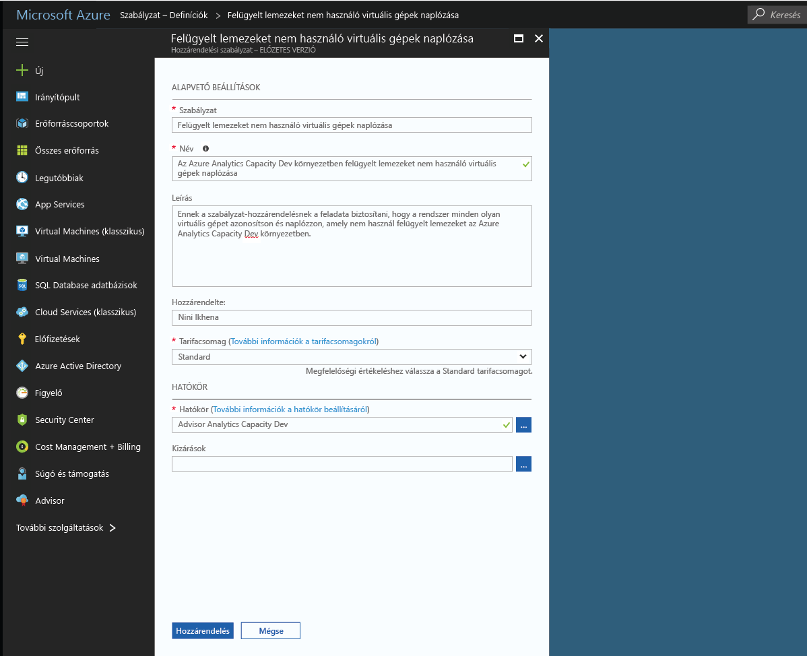

# Szabályzat-hozzárendelés létrehozása Azure környezetben a nem megfelelő erőforrások azonosításához
Az Azure-ral való megfelelőség megértéséhez szükséges első szempont a saját jelenlegi erőforrásainak ismerete. Ez a rövid útmutató végigvezeti Önt a folyamaton, amellyel létrehozhat egy felügyelt lemezeket nem használó virtuális gépek azonosítására szolgáló szabályzat-hozzárendelést.

A folyamat végén sikeresen fogja azonosítani a felügyelt lemezeket nem használó, azaz *nem megfelelő* virtuális gépeket.

Ha nem rendelkezik Azure-előfizetéssel, mindössze néhány perc alatt létrehozhat egy [ingyenes fiókot](https://azure.microsoft.com/free/?WT.mc_id=A261C142F) a virtuális gép létrehozásának megkezdése előtt.

## Az Azure Policy használata

Elérhető az Azure Policy nyilvános előzetes verziója. Hozzáférés kéréséhez regisztráció szükséges.

1. Látogasson el az Azure Policy webhelyére a https://aka.ms/getpolicy címen, majd válassza ki a **Feliratkozás** lehetőséget a bal oldali panelen.

   

2. Az Azure Policy használatához válassza ki azokat az előfizetéseket az **Előfizetés** listából, amelyekkel dolgozni szeretne. Ezután kattintson a **Regisztrálás** elemre.

   

   Az Előzetes verzió használatára vonatkozó kérelmét a rendszer automatikusan jóváhagyja. Kérjük, várjon legfeljebb 30 percet, amíg a rendszer feldolgozza a regisztrációját.

## Szabályzat-hozzárendelés létrehozása

Ebben a rövid útmutatóban egy szabályzat-hozzárendelést hozunk létre, és hozzárendeljük a *Felügyelt lemezek nélküli virtuális gépek naplózása* szabályzatdefiníciót.

1. Válassza ki a **Hozzárendelések** elemet az Azure Policy webhely bal oldali panelén.
2. Válassza a **Szabályzat hozzárendelése** lehetőséget a **Hozzárendelések** panel tetején.

   

3. A **Szabályzat hozzárendelése** oldalon kattintson a  a **Szabályzat** mező mellett az elérhető definíciók listájának megnyitásához.

   

   Az Azure Policy beépített szabályzatdefiníciókat tartalmaz, amelyeket felhasználhat. Többek között a következő beépített szabályzat-definíciókat láthatja:

   - Címke és a hozzá tartozó érték kényszerítése
   - Címke és a hozzá tartozó érték alkalmazása
   - SQL Server 12.0-ás verziójának megkövetelése

4. Keresse meg a *Felügyelt lemezeket nem használó virtuális gépek naplózása* definíciót a szabályzatdefiníciók között. Kattintson a szabályzatra, majd kattintson a **Hozzárendelés** elemre.

   

5. Írjon be egy a szabályzat-hozzárendeléshez tartozó megjelenítendő **Nevet**. Ebben az esetben a név legyen *Felügyelt lemezeket nem használó virtuális gépek naplózása*. Ha szeretné hozzáadhat egy **Leírást**. A leírás információt nyújt arról, hogyan azonosítja a szabályzat-hozzárendelés az összes ebben a környezetben létrehozott, felügyelt lemezeket nem használó virtuális gépet.
6. Módosítsa a tarifacsomagot a **Standard** szintre, hogy a szabályzat kiterjedjen a meglévő erőforrásokra.

   Az Azure Policy-ban két tarifacsomag létezik – *Ingyenes* és *Standard*. Az Ingyenes szinten csak a jövőbeli erőforrások esetében kényszeríthet szabályzatokat, míg a Standard szinten már meglévő erőforrások esetében is, hogy jobban átlássa a megfelelőségi állapotot. Mivel ez egy Korlátozott Előzetes Verzió, még nem bocsátottunk ki díjszabási modellt, így nem fog számlát kapni a *Standard* szint kiválasztásakor. A díjszabással kapcsolatos további információkért tekintse meg a következőt: [Azure Policy díjszabás](https://azure.microsoft.com/pricing/details/azure-policy/).

7. Válassza ki azt a **Hatókört**, amelyben a szabályzatot alkalmazni szeretné.  A hatókör határozza meg, hogy a szabályzat-hozzárendelés milyen erőforrások vagy erőforráscsoportok esetében lesz kényszerítve. Ez egyetlen előfizetéstől teljes erőforráscsoportokig terjedhet.
8. Válassza ki az Azure Policy használatához előzőleg regisztrált előfizetést (vagy erőforráscsoportot). Ebben a példában az alábbi előfizetést használjuk (az Ön lehetőségei ettől különbözni fognak): **Azure Analytics Capacity Dev**.

   

9. Válassza a **Hozzárendelés** elemet.

Most már készen áll a nem megfelelő erőforrások azonosítására a környezet megfelelési állapotának megismerése céljából.

## Nem megfelelő erőforrások azonosítása

Válassza a **Megfelelőség** elemet a bal oldali panelen, majd keresse meg az imént létrehozott szabályzat-hozzárendelést.

Ha vannak meglévő erőforrások, amelyek nem felelnek meg az új hozzárendelésnek, akkor a **Nem megfelelő erőforrások** lapon jelennek meg.

Ha a meglévő erőforrások kiértékelésekor egy feltétel néhány erőforrás esetében igaz, ezek az erőforrások a szabályzatnak nem megfelelőként lesznek megjelölve. Az alábbi táblázat azt mutatja be, hogyan működnek a ma elérhető különböző műveletek a feltételek kiértékelésének eredményeivel és az erőforrások megfelelőségi állapotával.

|Erőforrás  |Ha egy feltétel a szabályzatban  |Művelet a szabályzatban   |Megfelelőségi állapot  |
|-----------|---------|---------|---------|
|Létezik     |True (Igaz)     |Megtagadás     |Nem megfelelő |
|Létezik     |False (Hamis)    |Megtagadás     |Megfelelő     |
|Létezik     |True (Igaz)     |Hozzáfűzés   |Nem megfelelő |
|Létezik     |False (Hamis)    |Hozzáfűzés   |Megfelelő     |
|Létezik     |True (Igaz)     |Naplózás    |Nem megfelelő |
|Létezik     |False (Hamis)    |Naplózás    |Nem megfelelő |

## Az erőforrások eltávolítása

Az ebben a gyűjteményben lévő többi útmutató erre a rövid útmutatóra épül. Ha azt tervezi, hogy az ezt követő oktatóanyagokkal dolgozik tovább, akkor ne törölje az ebben a rövid útmutatóban létrehozott erőforrásokat. Ha nem folytatja a munkát, akkor a következő lépésekkel törölheti az Azure Portalon a rövid útmutatóhoz létrehozott összes erőforrást.
1. Válassza ki a **Hozzárendelések** elemet a bal oldali panelen.
2. Keresse meg az imént létrehozott hozzárendelést.

   

3.  Válassza ki a **Hozzárendelés törlése** elemet.

## Következő lépések

Ebben a rövid útmutatóban egy szabályzatdefiníciót rendelt hozzá egy hatókörhöz, hogy biztosítsa a hatókörbe tartozó erőforrások megfelelőségét, illetve, hogy azonosíthassa a nem megfelelő erőforrásokat.

A szabályzatok a **jövőben** létrehozott erőforrások megfelelőségének biztosítása érdekében történő hozzárendeléséről a következő oktatóanyagban találhat több információt:

> [!div class="nextstepaction"]
> [Szabályzatok létrehozása és kezelése](./create-manage-policy.md)
