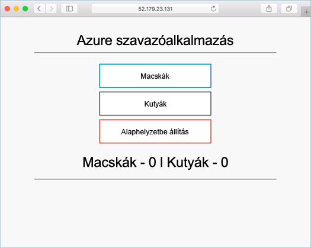

# <a name="deploy-docker-swarm-cluster"></a>Docker Swarm-fürt üzembe helyezése

Ebben a rövid útmutatóban egy Docker Swarm-fürtöt helyezünk üzembe az Azure CLI-vel. Ezután egy webes előtérrendszert és egy Redis-példányt magában foglaló többtárolós alkalmazást helyezünk üzembe és futtatunk a fürtön. Miután végeztünk ezzel, az alkalmazás elérhető lesz az interneten.

Ha nem rendelkezik Azure-előfizetéssel, mindössze néhány perc alatt létrehozhat egy [ingyenes fiókot](https://azure.microsoft.com/free/?WT.mc_id=A261C142F) a virtuális gép létrehozásának megkezdése előtt.

A rövid útmutatóhoz az Azure CLI 2.0.4-es vagy újabb verziójára lesz szükség. A verzió azonosításához futtassa a következőt: `az --version`. Ha telepíteni vagy frissíteni szeretne: [Az Azure CLI 2.0 telepítése]( /cli/azure/install-azure-cli).

## <a name="create-a-resource-group"></a>Hozzon létre egy erőforráscsoportot

Hozzon létre egy erőforráscsoportot az [az group create](/cli/azure/group#az_group_create) paranccsal. Az Azure-erőforráscsoport olyan logikai csoport, amelyben az Azure-erőforrások üzembe helyezése és kezelése zajlik.

A következő példában létrehozunk egy *myResourceGroup* nevű erőforráscsoportot a *westus* helyen.

```azurecli-interactive
az group create --name myResourceGroup --location westus
```

Kimenet:

```json
{
  "id": "/subscriptions/00000000-0000-0000-0000-000000000000/resourceGroups/myResourceGroup",
  "location": "westcentralus",
  "managedBy": null,
  "name": "myResourceGroup",
  "properties": {
    "provisioningState": "Succeeded"
  },
  "tags": null
}
```

## <a name="create-docker-swarm-cluster"></a>Docker Swarm-fürt létrehozása

Docker Swarm-fürtöt az [az acs create](/cli/azure/acs#az_acs_create) paranccsal hozhat létre az Azure Container Service-ben. 

A következő példa egy *mySwarmCluster* nevű fürtöt hoz létre egy Linux-főcsomóponttal és három Linux-ügyfélcsomóponttal.

```azurecli-interactive
az acs create --name mySwarmCluster --orchestrator-type Swarm --resource-group myResourceGroup --generate-ssh-keys
```

Egyes esetekben – például korlátozott próbaverziónál – az Azure-előfizetés korlátozott hozzáféréssel rendelkezik az Azure-erőforrásokhoz. Ha az üzembe helyezés az elérhető magok korlátozott száma miatt hiúsul meg, csökkentse az alapértelmezett ügynökök számát az `--agent-count 1` az [az acs create](/cli/azure/acs#az_acs_create) parancshoz történő hozzáadásával. 

Néhány perc múlva befejeződik a parancs végrehajtása, és visszaadja a fürttel kapcsolatos adatokat JSON formátumban.

## <a name="connect-to-the-cluster"></a>Csatlakozás a fürthöz

A rövid útmutató során szükség lesz a Docker Swarm-főkiszolgáló és a Docker-ügynökkészlet IP-címére. Futtassa az alábbi parancsot a két IP-cím lekéréséhez.


```bash
az network public-ip list --resource-group myResourceGroup --query "[*].{Name:name,IPAddress:ipAddress}" -o table
```

Kimenet:

```bash
Name                                                                 IPAddress
-------------------------------------------------------------------  -------------
swarmm-agent-ip-myswarmcluster-myresourcegroup-d5b9d4agent-66066781  52.179.23.131
swarmm-master-ip-myswarmcluster-myresourcegroup-d5b9d4mgmt-66066781  52.141.37.199
```

Hozzon létre egy SSH-alagutat a Swarm-főkiszolgáló felé. Az `IPAddress` elemet cserélje le a Swarm-főkiszolgáló IP-címére.

```bash
ssh -p 2200 -fNL 2375:localhost:2375 azureuser@IPAddress
```

Adja meg a `DOCKER_HOST` környezeti változót. Ez lehetővé teszi a Docker Swarmra irányuló Docker-parancsok futtatását anélkül, hogy meg kellene adni a gazdagép nevét.

```bash
export DOCKER_HOST=:2375
```

Most már készen áll a Docker-szolgáltatások futtatására a Docker Swarmon.


## <a name="run-the-application"></a>Az alkalmazás futtatása

Hozzon létre egy `docker-compose.yaml` nevű fájlt, és másolja az alábbi tartalmat a fájlba.

```yaml
version: '3'
services:
  azure-vote-back:
    image: redis
    container_name: azure-vote-back
    ports:
        - "6379:6379"

  azure-vote-front:
    image: microsoft/azure-vote-front:v1
    container_name: azure-vote-front
    environment:
      REDIS: azure-vote-back
    ports:
        - "80:80"
```

Futtassa az alábbi parancsot az Azure Vote-szolgáltatás létrehozásához.

```bash
docker-compose up -d
```

Kimenet:

```bash
Creating network "user_default" with the default driver
Pulling azure-vote-front (microsoft/azure-vote-front:v1)...
swarm-agent-EE873B23000005: Pulling microsoft/azure-vote-front:v1...
swarm-agent-EE873B23000004: Pulling microsoft/azure-vote-front:v1... : downloaded
Pulling azure-vote-back (redis:latest)...
swarm-agent-EE873B23000004: Pulling redis:latest... : downloaded
Creating azure-vote-front ... 
Creating azure-vote-back ... 
Creating azure-vote-front
Creating azure-vote-back ...
```

## <a name="test-the-application"></a>Az alkalmazás tesztelése

Lépjen a Swarm-ügynökkészlet IP-címére az Azure Vote-alkalmazás teszteléséhez.



## <a name="delete-cluster"></a>A fürt törlése
Ha a fürtre már nincs szükség, az [az group delete](/cli/azure/group#az_group_delete) paranccsal törölheti az erőforráscsoportot, a tárolószolgáltatást és az összes kapcsolódó erőforrást.

```azurecli-interactive
az group delete --name myResourceGroup --yes --no-wait
```

## <a name="get-the-code"></a>A kód letöltése

Ebben a rövid útmutatóban előre létrehozott tárolórendszerképekkel hoztunk létre egy Docker-szolgáltatást. A kapcsolódó alkalmazáskód, Docker-fájl és Compose-fájl a GitHubon érhető el.

[https://github.com/Azure-Samples/azure-voting-app-redis](https://github.com/Azure-Samples/azure-voting-app-redis.git)

## <a name="next-steps"></a>További lépések

Ebben a rövid útmutatóban egy Docker Swarm-fürtöt és azon egy többtárolós alkalmazást helyezett üzembe.

A Docker Swarm és a Visual Studio Team Services integrálásával kapcsolatos információk megtekintéséhez olvassa el a CI/CD, a Docker Swarm és a VSTS használatával foglalkozó cikket.

> [!div class="nextstepaction"]
> [CI/CD – Docker Swarm és VSTS](./container-service-docker-swarm-setup-ci-cd.md)