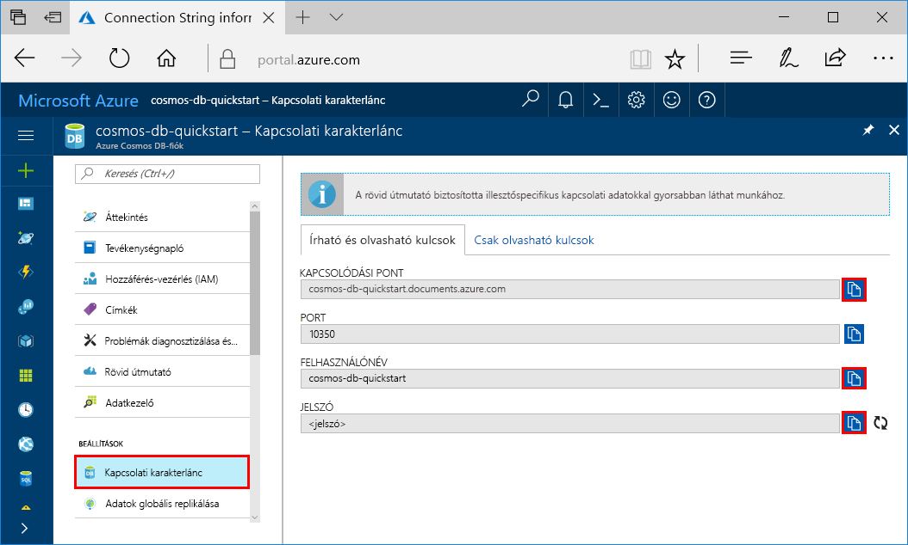
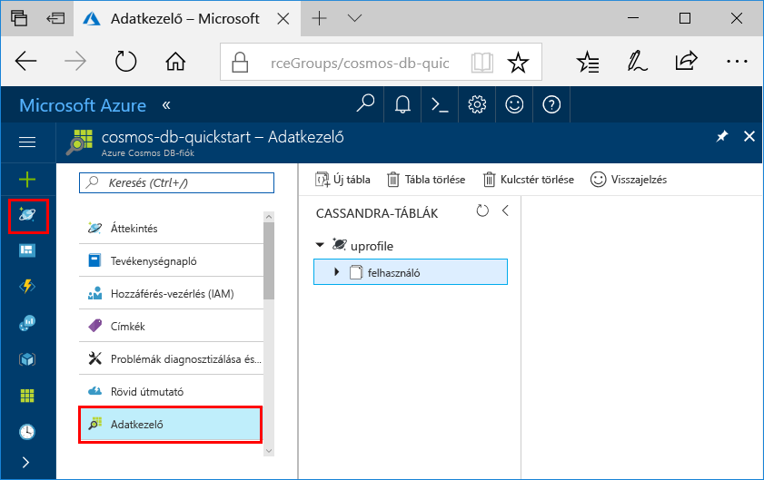

# <a name="quickstart-build-a-cassandra-app-with-net-and-azure-cosmos-db"></a>Gyors üzembe helyezés: A .NET- és az Azure Cosmos DB Cassandra alkalmazás létrehozása

A gyors üzembe helyezés bemutatja, hogyan használja a .NET- és az Azure Cosmos DB [Cassandra API](cassandra-introduction.md) egy példa a Githubról klónozásával egy profil alkalmazás elkészítésére. A gyors üzembe helyezés is bemutatja, hogyan egy Cosmos-DB Azure-fiók létrehozása a web-alapú Azure portál használatával.   

Azure Cosmos-adatbázis egy Microsoft globálisan elosztott több modellre adatbázis szolgáltatás. Gyorsan hozzon létre, és a dokumentum, a tábla, a kulcs-érték és a graph adatbázisok, amelyek kihasználhassa a globális terjesztési és a horizontális skálázhatóságot képességeket Azure Cosmos DB középpontjában lekérdezése. 

## <a name="prerequisites"></a>Előfeltételek

Az Azure Cosmos DB Cassandra API programot: a hozzáférést. Ha még nem telepítette a hozzáférés még, [feliratkozás most](https://aka.ms/cosmosdb-cassandra-signup).

Ha még nincs telepítve a Visual Studio 2017, töltse le és használja a **szabad** [Visual Studio 2017 Community Edition](https://www.visualstudio.com/downloads/). Ügyeljen arra, hogy engedélyezze az **Azure Development** használatát a Visual Studio telepítése során.

[!INCLUDE [quickstarts-free-trial-note](../../includes/quickstarts-free-trial-note.md)]Alternatív megoldásként, [Azure Cosmos DB szabad próbálja](https://azure.microsoft.com/try/cosmosdb/) díjmentesen és kötelezettségvállalás ingyenes Azure-előfizetéssel, nélkül.

Telepítés [Git](https://www.git-scm.com/) a példa klónozását.

<a id="create-account"></a>
## <a name="create-a-database-account"></a>Adatbázisfiók létrehozása

[!INCLUDE [cosmos-db-create-dbaccount-cassandra](../../includes/cosmos-db-create-dbaccount-cassandra.md)]


## <a name="clone-the-sample-application"></a>A mintaalkalmazás klónozása

Most pedig váltsunk át kódok használatára. Most klónozni egy Cassandra API-alkalmazást a Githubból, állítsa be a kapcsolati karakterláncot, és futtassa azt. Látni fogja, milyen egyszerű az adatokkal programozott módon dolgozni. 

1. Nyisson meg egy git terminálablakot, például a git bash eszközt, és használja a `cd` parancs futtatásával módosíthatja a mintaalkalmazás telepítése mappába. 

    ```bash
    cd "C:\git-samples"
    ```

2. Futtassa a következő parancsot a minta tárház klónozásához. Ezzel a paranccsal létrejön egy mintaalkalmazás példányát a számítógépen.

    ```bash
    git clone https://github.com/Azure-Samples/azure-cosmos-db-cassandra-dotnet-getting-started.git
    ```

3. Ezután nyissa meg a CassandraQuickStartSample megoldásfájlt a Visual Studióban. 

## <a name="review-the-code"></a>A kód áttekintése

Ez a lépés nem kötelező megadni. Ha most szeretné ismerni az a kód létrehozását az adatbázis-erőforrások, az alábbi kódtöredékek tekintheti meg. Kódtöredékek a rendszer az összes átveszi a `Program.cs` fájl C:\git-samples\azure-cosmos-db-cassandra-dotnet-getting-started\CassandraQuickStartSample mappába települ. Egyéb esetben ugorjon előre [frissítse a kapcsolati karakterlánc](#update-your-connection-string).

* A munkafolyamat egy Cassandra a fürt végpontja csatlakozva inicializálása. Az Azure Cosmos-adatbázis a Cassandra API csak TLSv1.2 támogatja. 

  ```csharp
   var options = new Cassandra.SSLOptions(SslProtocols.Tls12, true, ValidateServerCertificate);
   options.SetHostNameResolver((ipAddress) => CassandraContactPoint);
   Cluster cluster = Cluster.Builder().WithCredentials(UserName, Password).WithPort(CassandraPort).AddContactPoint(CassandraContactPoint).WithSSL(options).Build();
   ISession session = cluster.Connect();
   ```

* Hozzon létre egy új kulcstérértesítések használatával.

    ```csharp
    session.Execute("CREATE KEYSPACE uprofile WITH REPLICATION = { 'class' : 'NetworkTopologyStrategy', 'datacenter1' : 1 };"); 
    ```

* Új tábla létrehozása.

   ```csharp
  session.Execute("CREATE TABLE IF NOT EXISTS uprofile.user (user_id int PRIMARY KEY, user_name text, user_bcity text)");
   ```

* Helyezze be a felhasználó entitások IMapper objektum segítségével, amely kapcsolódik a uprofile kulcstérértesítések használatával új munkamenettel.

    ```csharp
    mapper.Insert<User>(new User(1, "LyubovK", "Dubai"));
    ```
    
* A lekérdezés az összes felhasználói adatok beolvasása.

    ```csharp
   foreach (User user in mapper.Fetch<User>("Select * from user"))
   {
      Console.WriteLine(user);
   }
    ```
    
 * A lekérdezés egyetlen felhasználó adatainak megszerzése.

    ```csharp
    mapper.FirstOrDefault<User>("Select * from user where user_id = ?", 3);
    ```

## <a name="update-your-connection-string"></a>A kapcsolati karakterlánc frissítése

Lépjen vissza az Azure Portalra a kapcsolati karakterlánc adataiért, majd másolja be azokat az alkalmazásba. A kapcsolati karakterlánc adatok lehetővé teszi, hogy az alkalmazás a szolgáltatott adatbázissal való kommunikációhoz.

1. Az a [Azure-portálon](http://portal.azure.com/), kattintson a **kapcsolati karakterlánc**. 

    Használja a  a felhasználónév értéket másol a képernyő jobb szélén gombjára.

    

2. Nyissa meg a Program.cs fájlra a Visual Studio 2017. 

3. Illessze be a USERNAME érték a portálon keresztül `<FILLME>` sor 13.

    A Program.cs 13 sor most hasonlóan kell kinéznie 

    `private const string UserName = "cosmos-db-quickstart";`

3. Lépjen vissza a portálra, és másolja a jelszó értékét. Illessze be a jelszó értékét a portálon keresztül `<FILLME>` sor 14.

    A Program.cs 14 sor most hasonlóan kell kinéznie 

    `private const string Password = "2Ggkr662ifxz2Mg...==";`

4. Lépjen vissza a portálra, és másolja a kapcsolattartó értéket. Illessze be az ügyfél értéket a portálon keresztül `<FILLME>` sor 15.

    A Program.cs 15 sor most hasonlóan kell kinéznie 

    `private const string CassandraContactPoint = "cosmos-db-quickstarts.documents.azure.com"; //  DnsName`

5. A Program.cs fájl mentéséhez.
    
## <a name="run-the-app"></a>Az alkalmazás futtatása

1. A Visual Studióban kattintson **eszközök** > **NuGet-Csomagkezelő** > **Csomagkezelő konzol**.

2. A parancssorba a következő paranccsal telepítse a .NET-illesztőprogram NuGet-csomagot. 

    ```cmd
    Install-Package CassandraCSharpDriver
    ```
3. Az alkalmazás futtatásához nyomja le a CTRL + F5 billentyűkombinációt. Az alkalmazás a konzolablakban jeleníti meg. 

    

    Nyomja le a CTRL + C exection a program és a konzol ablak bezárásához. 
    
    Ezután megnyithatja adatkezelő lekérdezés, módosíthatja, és ezekkel az új adatokkal az Azure portálon. 

    

## <a name="review-slas-in-the-azure-portal"></a>Az SLA-k áttekintése az Azure Portalon

[!INCLUDE [cosmosdb-tutorial-review-slas](../../includes/cosmos-db-tutorial-review-slas.md)]

## <a name="clean-up-resources"></a>Az erőforrások eltávolítása

[!INCLUDE [cosmosdb-delete-resource-group](../../includes/cosmos-db-delete-resource-group.md)]

## <a name="next-steps"></a>Következő lépések

Ebben a rövid útmutatóban megtudtuk, hogyan lehet Azure Cosmos DB-fiókot létrehozni, hogyan lehet az Adatkezelő segítségével gyűjteményt készíteni, és hogyan lehet futtatni a webalkalmazást. Most további adatokat importálhat a Cosmos DB-fiókba. 

> [!div class="nextstepaction"]
> [Azure Cosmos DB Cassandra adatok importálása](cassandra-import-data.md)
