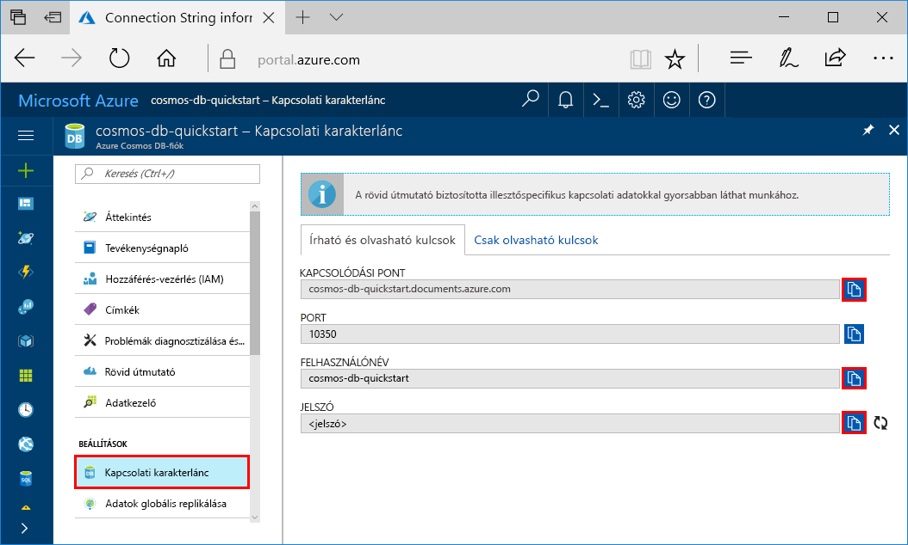
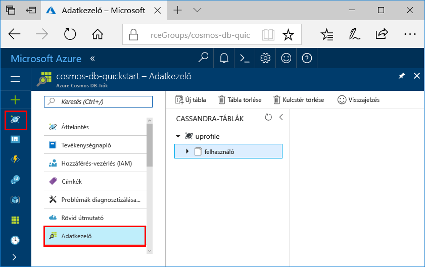

# <a name="quickstart-build-a-cassandra-app-with-python-and-azure-cosmos-db"></a>Gyors üzembe helyezés: A Python és az Azure Cosmos DB Cassandra-alkalmazás létrehozása

A gyors üzembe helyezés bemutatja, hogyan használja a Python és az Azure Cosmos DB [Cassandra API](cassandra-introduction.md) egy példa a Githubról klónozásával egy profil alkalmazás elkészítésére. A gyors üzembe helyezés is bemutatja, hogyan egy Cosmos-DB Azure-fiók létrehozása a web-alapú Azure portál használatával.

Azure Cosmos-adatbázis egy Microsoft globálisan elosztott több modellre adatbázis szolgáltatás. Gyorsan hozzon létre, és a dokumentum, a tábla, a kulcs-érték és a graph adatbázisok, amelyek kihasználhassa a globális terjesztési és a horizontális skálázhatóságot képességeket Azure Cosmos DB középpontjában lekérdezése.   

## <a name="prerequisites"></a>Előfeltételek

[!INCLUDE [quickstarts-free-trial-note](../../includes/quickstarts-free-trial-note.md)]Alternatív megoldásként, [Azure Cosmos DB szabad próbálja](https://azure.microsoft.com/try/cosmosdb/) díjmentesen és kötelezettségvállalás ingyenes Azure-előfizetéssel, nélkül.

Az Azure Cosmos DB Cassandra API programot: a hozzáférést. Ha még nem telepítette a hozzáférés még, [feliratkozás most](cassandra-introduction.md#sign-up-now).

Továbbá:
* [Python](https://www.python.org/downloads/) verzió v2.7.14
* [Git](http://git-scm.com/)
* [Az Apache Cassandra Python-illesztőprogram](https://github.com/datastax/python-driver)

## <a name="create-a-database-account"></a>Adatbázisfiók létrehozása

A dokumentum-adatbázis létrehozása előtt kell Cassandra-fiók létrehozása az Azure Cosmos DB.

[!INCLUDE [cosmos-db-create-dbaccount-cassandra](../../includes/cosmos-db-create-dbaccount-cassandra.md)]

## <a name="clone-the-sample-application"></a>A mintaalkalmazás klónozása

Most tegyük Klónozás egy Cassandra API app a githubból, állítsa be a kapcsolati karakterláncot, és futtassa azt. Ilyen egyszerű az adatokkal programozott módon dolgozni. 

1. Nyisson meg egy git terminálablakot, például a git bash eszközt, és használja a `cd` parancs futtatásával módosíthatja a mintaalkalmazás telepítése mappába. 

    ```bash
    cd "C:\git-samples"
    ```

2. Futtassa a következő parancsot a minta tárház klónozásához. Ezzel a paranccsal létrejön egy mintaalkalmazás példányát a számítógépen. 

    ```bash
    git clone https://github.com/Azure-Samples/azure-cosmos-db-cassandra-python-getting-started.git
    ```

## <a name="review-the-code"></a>A kód áttekintése

Ez a lépés nem kötelező megadni. Ha most szeretné ismerni az a kód létrehozását az adatbázis-erőforrások, az alábbi kódtöredékek tekintheti meg. Kódtöredékek a rendszer az összes átveszi a `pyquickstart.py` fájlt. Egyéb esetben ugorjon előre [frissítse a kapcsolati karakterlánc](#update-your-connection-string). 

* Felhasználónév és jelszó van beállítva a kapcsolati karakterlánc oldal használatával az Azure portálon. Az elérési úttal rendelkező lecseréli a path\to\cert a X509 tanúsítványt.

   ```python
    ssl_opts = {
            'ca_certs': 'path\to\cert',
            'ssl_version': ssl.PROTOCOL_TLSv1_2
            }
    auth_provider = PlainTextAuthProvider( username=cfg.config['username'], password=cfg.config['password'])
    cluster = Cluster([cfg.config['contactPoint']], port = cfg.config['port'], auth_provider=auth_provider, ssl_options=ssl_opts)
    session = cluster.connect()
   
   ```

* A `cluster` contactPoint adatokkal inicializálva van. A contactPoint veszi át az Azure-portálon.

    ```python
   cluster = Cluster([cfg.config['contactPoint']], port = cfg.config['port'], auth_provider=auth_provider)
    ```

* A `cluster` az Azure Cosmos DB Cassandra API csatlakozik.

    ```python
    session = cluster.connect()
    ```

* Egy új kulcstérértesítések használatával jön létre.

    ```python
   session.execute('CREATE KEYSPACE IF NOT EXISTS uprofile WITH replication = {\'class\': \'NetworkTopologyStrategy\', \'datacenter1\' : \'1\' }')
    ```

* Létre lett hozva egy új táblázat.

   ```
   session.execute('CREATE TABLE IF NOT EXISTS uprofile.user (user_id int PRIMARY KEY, user_name text, user_bcity text)');
   ```

* Kulcs/érték entitások szúrja be.

    ```Python
    insert_data = session.prepare("INSERT INTO  uprofile.user  (user_id, user_name , user_bcity) VALUES (?,?,?)")
    batch = BatchStatement()
    batch.add(insert_data, (1, 'LyubovK', 'Dubai'))
    batch.add(insert_data, (2, 'JiriK', 'Toronto'))
    batch.add(insert_data, (3, 'IvanH', 'Mumbai'))
    batch.add(insert_data, (4, 'YuliaT', 'Seattle'))
    ....
    session.execute(batch)
    ```

* A beolvasandó minden kulcsérték beolvasása.

    ```Python
    rows = session.execute('SELECT * FROM uprofile.user')
    ```  
    
* A lekérdezés egy kulcs-érték beolvasásához.

    ```Python
    
    rows = session.execute('SELECT * FROM uprofile.user where user_id=1')
    ```  

## <a name="update-your-connection-string"></a>A kapcsolati karakterlánc frissítése

Lépjen vissza az Azure Portalra a kapcsolati karakterlánc adataiért, majd másolja be azokat az alkalmazásba. Ez lehetővé teszi az alkalmazás a szolgáltatott adatbázissal való kommunikációhoz.

1. Az a [Azure-portálon](http://portal.azure.com/), kattintson a **kapcsolati karakterlánc**. 

    Használja a  a felső értéket, az ügyfél pontra másol a képernyő jobb szélén gombjára.

    

2. Nyissa meg az `config.py` fájlt. 

3. Illessze be az ügyfél értéket a portálon keresztül `<FILLME>` 10 sor.

    10 sor most hasonlóan kell kinéznie 

    `'contactPoint': 'cosmos-db-quickstarts.documents.azure.com:10350'`

4. Másolja a felhasználónév a portálon, és illessze be azt a keresztül `<FILLME>` sor 6.

    Sor 6 most hasonlóan kell kinéznie 

    `'username': 'cosmos-db-quickstart',`
    
5. A jelszó értéket másol a portálról, és illessze be azt a keresztül `<FILLME>` a 8.

    Sor 8 most hasonlóan kell kinéznie

    `'password' = '2Ggkr662ifxz2Mg==`';`

6. Mentse a config.py fájlt.
    
## <a name="use-the-x509-certificate"></a>Tanúsítvány használata a X509

1. Adja hozzá a Baltimore CyberTrust Root van szüksége, ha rendelkezik sorozatszám 02:00:00:b9 és SHA1 ujjlenyomat d4🇩🇪20:d0:5e:66:fc:53:fe:1a:50:88:2 c: 78:db:28:52:ca:e4:74. Letölthető a https://cacert.omniroot.com/bc2025.crt, helyi .cer kiterjesztésű fájlba mentése

2. Nyissa meg a pyquickstart.py, és módosítsa a "path\to\cert" úgy, hogy az új tanúsítvány mutasson.

3. Pyquickstart.py mentéséhez.

## <a name="run-the-app"></a>Az alkalmazás futtatása

1. A Terminálszolgáltatások git cd paranccsal váltson át a azure-cosmos-db-cassandra-python-getting-started mappát. 

2. Telepítse a szükséges modulokat a következő parancsok futtatásával:

    ```python
    python -m pip install cassandra-driver
    python -m pip install prettytable
    python -m pip install requests
    python -m pip install pyopenssl
    ```

2. A következő parancsot a csomópont alkalmazás indításához:

    ```
    python pyquickstart.py
    ```

3. Ellenőrizze az eredményeket a parancssorból várt módon.

    Nyomja le a CTRL + C exection a program és a konzol ablak bezárásához. 

    
    
    Ezután megnyithatja adatkezelő lekérdezés, módosíthatja, és ezekkel az új adatokkal az Azure portálon. 

    

## <a name="review-slas-in-the-azure-portal"></a>Az SLA-k áttekintése az Azure Portalon

[!INCLUDE [cosmosdb-tutorial-review-slas](../../includes/cosmos-db-tutorial-review-slas.md)]

## <a name="clean-up-resources"></a>Az erőforrások eltávolítása

[!INCLUDE [cosmosdb-delete-resource-group](../../includes/cosmos-db-delete-resource-group.md)]

## <a name="next-steps"></a>Következő lépések

Ebben a rövid útmutatóban bemutattuk, hogyan lehet Azure Cosmos DB-fiókot létrehozni, hogyan lehet az Adatkezelő segítségével gyűjteményt készíteni, és hogyan lehet futtatni az alkalmazást. Most további adatokat importálhat a Cosmos DB-fiókba. 

> [!div class="nextstepaction"]
> [Azure Cosmos DB Cassandra adatok importálása](cassandra-import-data.md)

