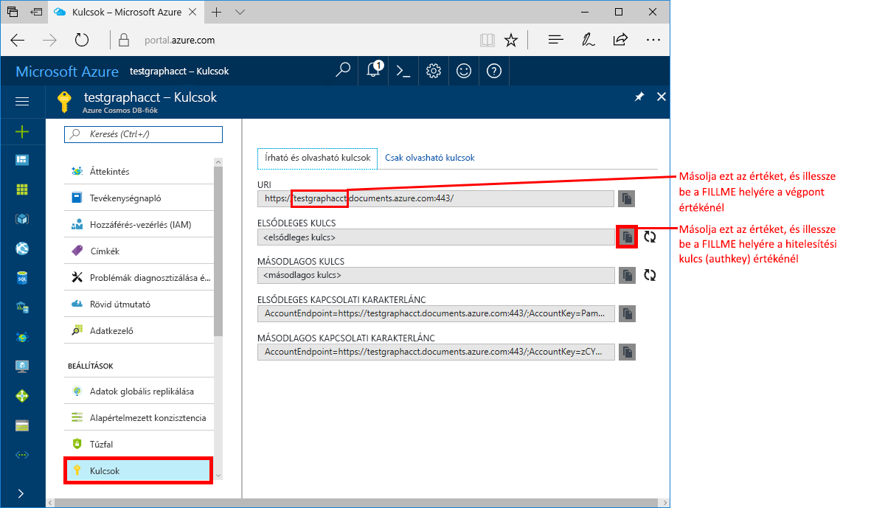

<a id="azure-cosmos-db-build-a-net-application-using-the-graph-api" class="xliff"></a>

# Azure Cosmos DB: .NET-alkalmazás létrehozása a Graph API-val

Az Azure Cosmos DB a Microsoft globálisan elosztott többmodelles adatbázis-szolgáltatása. Segítségével gyorsan létrehozhat és lekérdezhet dokumentum-, kulcs/érték és gráf típusú adatbázisokat, melyek mindegyike felhasználja az Azure Cosmos DB középpontjában álló globális elosztási és horizontális skálázhatósági képességeket. 

A bevezető bemutatja, hogyan hozhat létre az Azure Portal segítségével Azure Cosmos DB-fiókot, adatbázist és gráfot (tárolót). Ezután megtudhatja hogyan hozhat létre és futtathat egy a [Graph API](graph-sdk-dotnet.md) előzetes verziójával létrehozott konzolalkalmazást.  

<a id="prerequisites" class="xliff"></a>

## Előfeltételek

Ha nincs telepítve a Visual Studio 2017, letöltheti és használhatja az **ingyenes** [Visual Studio 2017 Community Edition](https://www.visualstudio.com/downloads/)t. Ügyeljen arra, hogy engedélyezze az **Azure Development** használatát a Visual Studio telepítése során.

[!INCLUDE [quickstarts-free-trial-note](../../includes/quickstarts-free-trial-note.md)]

<a id="create-a-database-account" class="xliff"></a>

## Adatbázisfiók létrehozása

[!INCLUDE [cosmos-db-create-dbaccount-graph](../../includes/cosmos-db-create-dbaccount-graph.md)]

<a id="add-a-graph" class="xliff"></a>

## Gráf hozzáadása

[!INCLUDE [cosmos-db-create-graph](../../includes/cosmos-db-create-graph.md)]

<a id="clone-the-sample-application" class="xliff"></a>

## A mintaalkalmazás klónozása

Most pedig klónozunk egy Graph API-alkalmazást a GitHubról, beállítjuk a kapcsolati karakterláncot, majd futtatni fogjuk az alkalmazást. Látni fogja, milyen egyszerű az adatokkal programozott módon dolgozni. 

1. Nyisson meg egy git terminálablakot, például a git bash eszközt, és a `cd` paranccsal lépjen egy munkakönyvtárba.  

2. Futtassa a következő parancsot a mintatárház klónozásához. 

    ```bash
    git clone https://github.com/Azure-Samples/azure-cosmos-db-graph-dotnet-getting-started.git
    ```

3. Ezután nyissa meg a megoldásfájlt a Visual Studióban. 

<a id="review-the-code" class="xliff"></a>

## A kód áttekintése

Tekintsük át, hogy mi történik az alkalmazásban. Nyissa meg a Program.cs fájlt: az itt található kódsorok hozzák létre az Azure Cosmos DB erőforrásokat. 

* A DocumentClient inicializálva van. Az előzetes verzióban hozzáadtunk egy gráfbővítmény API-t az Azure Cosmos DB-ügyfélhez. Jelenleg egy különálló gráfügyfélen dolgozunk, amely az Azure Cosmos DB-ügyféltől és annak erőforrásaitól függetlenül működik.

    ```csharp
    using (DocumentClient client = new DocumentClient(
        new Uri(endpoint),
        authKey,
        new ConnectionPolicy { ConnectionMode = ConnectionMode.Direct, ConnectionProtocol = Protocol.Tcp }))
    ```

* A rendszer létrehozza az új adatbázist.

    ```csharp
    Database database = await client.CreateDatabaseIfNotExistsAsync(new Database { Id = "graphdb" });
    ```

* A rendszer létrehozza az új gráfot.

    ```csharp
    DocumentCollection graph = await client.CreateDocumentCollectionIfNotExistsAsync(
        UriFactory.CreateDatabaseUri("graphdb"),
        new DocumentCollection { Id = "graph" },
        new RequestOptions { OfferThroughput = 1000 });
    ```
* A `CreateGremlinQuery` metódus használatával a program végrehajtja a Gremlin lépéssorozatot.

    ```csharp
    // The CreateGremlinQuery method extensions allow you to execute Gremlin queries and iterate
    // results asychronously
    IDocumentQuery<dynamic> query = client.CreateGremlinQuery<dynamic>(graph, "g.V().count()");
    while (query.HasMoreResults)
    {
        foreach (dynamic result in await query.ExecuteNextAsync())
        {
            Console.WriteLine($"\t {JsonConvert.SerializeObject(result)}");
        }
    }

    ```

<a id="update-your-connection-string" class="xliff"></a>

## A kapcsolati karakterlánc frissítése

Lépjen vissza az Azure Portalra a kapcsolati karakterlánc adataiért, majd másolja be azokat az alkalmazásba.

1. Az [Azure Portalon](http://portal.azure.com/) az Azure Cosmos DB-fiókban a bal oldalsávon kattintson a **kulcsok** elemre, majd kattintson az **írási/olvasási kulcsok** lehetőségre. A következő lépésben a képernyő jobb oldalán lévő másolási gombokkal másolhatja az URI-t és az elsődleges kulcsot a `App.config` fájlba.

    

2. A Visual Studio 2017-ben nyissa meg a `App.config` fájlt. 

3. Másolja ki az URI érteket a Portalról (a másolási gomb használatával), és adja meg a végpont kulcs értékeként a `App.config`-ben. 

    `<add key="Endpoint" value="FILLME.documents.azure.com:443" />`

4. Ezután másolja ki az ELSŐDLEGES KULCS értékét a Portalról és adja meg az authKey értékeként a `App.config` fájlban. 

    `<add key="AuthKey" value="FILLME" />`

Az alkalmazás frissítve lett minden olyan információval, amely az Azure Cosmos DB-vel való kommunikációhoz szükséges. 

<a id="run-the-console-app" class="xliff"></a>

## A konzolalkalmazás futtatása

1. A Visual Studióban kattintson a jobb gombbal a **GraphGetStarted** projektre a **Megoldáskezelőben**, majd kattintson a **NuGet-csomagok kezelése** elemre. 

2. A NuGet **Browse** (Tallózás) mezőjébe írja be *Microsoft.Azure.Graphs* kifejezést, és jelölje be az **Includes prerelease** (Előzetes verzió is) jelölőnégyzetet. 

3. Az eredmények közül telepítse a **Microsoft.Azure.DocumentDB** kódtárat. Ezzel telepíti az Azure Cosmos DB gráfbővítmény kódtárcsomagja és annak összes függőségét.

4. Az alkalmazás futtatásához nyomja le a CTRL + F5 billentyűkombinációt.

   A konzolablakban megjelennek a gráfhoz hozzáadandó csúcspontok és élek. Miután a parancsfájl futása befejeződött, nyomja meg kétszer az ENTER billentyűt a konzolablak bezárásához. 

<a id="browse-using-the-data-explorer" class="xliff"></a>

## Tallózás az Adatkezelővel

Ezután visszaléphet az Adatkezelőbe az Azure Portalon, ahol tallózhatja és lekérdezheti az új gráfadatokat.

* Az új adatbázis az Adatkezelőben a Gyűjtemények ablaktáblán jelenik meg. Bontsa ki a **graphdb**, **graphcoll** pontokat, és kattintson a **Gráf** lehetőségre.

    A mintaalkalmazás által létrehozott adatokat a Gráfok ablaktáblán találja.

<a id="review-slas-in-the-azure-portal" class="xliff"></a>

## Az SLA-k áttekintése az Azure Portalon

[!INCLUDE [cosmosdb-tutorial-review-slas](../../includes/cosmos-db-tutorial-review-slas.md)]

<a id="clean-up-resources" class="xliff"></a>

## Az erőforrások eltávolítása

Ha az alkalmazást már nem használja, akkor a következő lépésekkel a mintaalkalmazás által létrehozott összes erőforrást törölheti az Azure Portalon: 

1. Az Azure Portal bal oldali menüjében kattintson az **Erőforráscsoportok** lehetőségre, majd kattintson a létrehozott erőforrás nevére. 
2. Az erőforráscsoport lapján kattintson a **Törlés** elemre, írja be a törölni kívánt erőforrás nevét a szövegmezőbe, majd kattintson a **Törlés** gombra.

<a id="next-steps" class="xliff"></a>

## Következő lépések

Ebben a rövid útmutatóban bemutattuk, hogyan lehet Azure Cosmos DB-fiókot létrehozni, hogyan lehet az Adatkezelő segítségével gráfot készíteni, és hogyan lehet futtatni az alkalmazást. Most már készen áll arra, hogy a Gremlin használatával összetettebb lekérdezéseket hozzon létre és hatékony gráfbejárási logikákat implementáljon. 

> [!div class="nextstepaction"]
> [Lekérdezés a Gremlin használatával](tutorial-query-graph.md)


