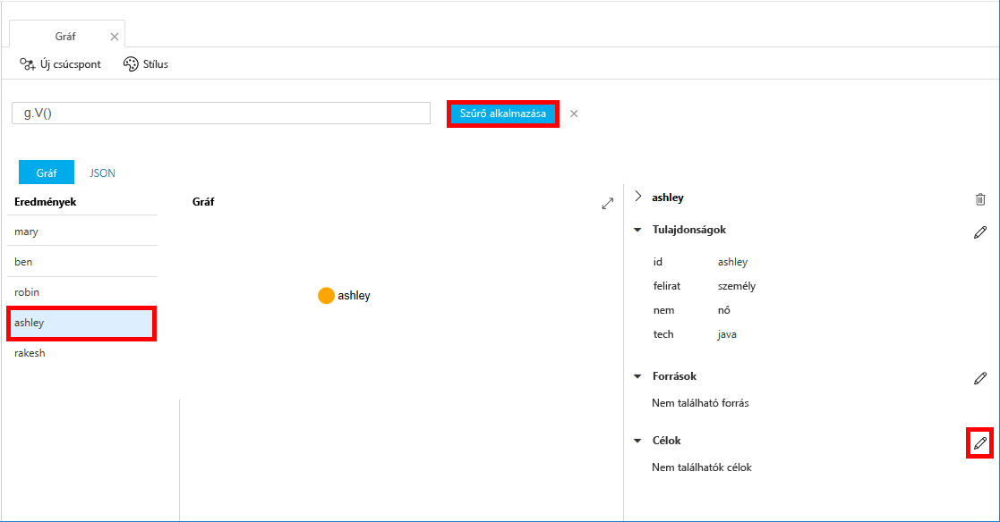
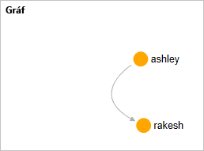

# <a name="azure-cosmos-db-create-a-graph-database-using-java-and-the-azure-portal"></a>Azure Cosmos DB: Gráfadatbázis létrehozása a Java és az Azure Portal használatával

Az Azure Cosmos DB a Microsoft globálisan elosztott többmodelles adatbázis-szolgáltatása. Segítségével gyorsan létrehozhat és lekérdezhet dokumentum-, kulcs/érték és gráf típusú adatbázisokat, melyek mindegyike felhasználja az Azure Cosmos DB középpontjában álló globális elosztási és horizontális skálázhatósági képességeket. 

Ez a rövid útmutató létrehoz egy gráfadatbázist az Azure Cosmos DB-hez készült Azure Portal-eszközök használatával. A rövid útmutató emellett bemutatja, hogyan hozhat létre gyorsan egy Java-konzolalkalmazást az OSS [Gremlin Java](https://mvnrepository.com/artifact/org.apache.tinkerpop/gremlin-driver)-illesztőprogramot használó gráfadatbázissal. A rövid útmutatóban lévő utasítások bármilyen, Java-programok futtatására alkalmas operációs rendszeren végrehajthatók. A rövid útmutató követésével megismerheti a gráferőforrások létrehozását és módosítását a felhasználói felületen vagy programozás útján. 

## <a name="prerequisites"></a>Előfeltételek

* [Java fejlesztői készlet (JDK) 1.7+](http://www.oracle.com/technetwork/java/javase/downloads/jdk8-downloads-2133151.html)
    * Ubuntu rendszeren futtassa az `apt-get install default-jdk` parancsot a JDK telepítéséhez.
    * Ügyeljen arra, hogy a JAVA_HOME környezeti változó arra a mappára mutasson, ahová a JDK telepítve lett.
* [Maven](http://maven.apache.org/download.cgi) bináris archívum [letöltése](http://maven.apache.org/install.html) és [telepítése](http://maven.apache.org/)
    * Ubuntu rendszeren futtathatja az `apt-get install maven` parancsot a Maven telepítéséhez.
* [Git](https://www.git-scm.com/)
    * Ubuntu rendszeren futtathatja a `sudo apt-get install git` parancsot a Git telepítéséhez.

[!INCLUDE [quickstarts-free-trial-note](../../includes/quickstarts-free-trial-note.md)]

## <a name="create-a-database-account"></a>Adatbázisfiók létrehozása

A gráfadatbázis létrehozásához először létre kell hoznia egy Gremlin- (Graph-) adatbázisfiókot az Azure Cosmos DB segítségével.

[!INCLUDE [cosmos-db-create-dbaccount-graph](../../includes/cosmos-db-create-dbaccount-graph.md)]

## <a name="add-a-graph"></a>Gráf hozzáadása

Az Azure Portal Adatkezelő eszközét mostantól gráfadatbázisok létrehozására is használhatja. 

1. Az Azure Portalon kattintson a bal oldali navigációs menü **Adatkezelő (előzetes verzió)** elemére. 
2. Az **Adatkezelő (előzetes verzió)** panelen kattintson az **Új gráf** lehetőségre, majd töltse ki a lapot a következő információk alapján.

    

    Beállítás|Ajánlott érték|Leírás
    ---|---|---
    Adatbázis-azonosító|sample-database|Az új adatbázis azonosítója. Az adatbázis neve 1–255 karakter hosszúságú lehet, és nem tartalmazhat `/ \ # ?` karaktereket vagy záró szóközt.
    Gráfazonosító|sample-graph|Az új gráfhoz tartozó azonosító. A gráfok nevére ugyanazok a karakterkorlátozások vonatkoznak, mint az adatbázis-azonosítókra.
    Tárkapacitás| 10 GB|Ne módosítsa az alapértelmezett értéket. Ez az adatbázis tárkapacitása.
    Teljesítmény|400 kérelemegység|Ne módosítsa az alapértelmezett értéket. Később lehetősége lesz növelni az átviteli sebességet a késés csökkentése érdekében.
    kérelemegység/m|Ki|Ne módosítsa az alapértelmezett értéket. Ha később spiky munkaterhelések kezelésére van szüksége, bekapcsolhatja a [kérelemegység/m](request-units-per-minute.md) funkciót.
    Partíciókulcs|Hagyja üresen|A rövid útmutató során hagyja üresen a Partíciókulcs mezőt.

3. Miután kitöltötte az űrlapot, kattintson az **OK** elemre.

## <a name="clone-the-sample-application"></a>A mintaalkalmazás klónozása

Most pedig klónozunk egy gráfalkalmazást a GitHubról, beállítjuk a kapcsolati karakterláncot, és futtatjuk az alkalmazást. Ilyen egyszerű az adatokkal programozott módon dolgozni. 

1. Nyisson meg egy git terminálablakot, például a git bash eszközt, és a `cd` paranccsal lépjen egy munkakönyvtárba.  

2. Futtassa a következő parancsot a minta tárház klónozásához. 

    ```bash
    git clone https://github.com/Azure-Samples/azure-cosmos-db-graph-java-getting-started.git
    ```

## <a name="review-the-code"></a>A kód áttekintése

Tekintsük át, hogy mi történik az alkalmazásban. Nyissa meg a \src\GetStarted mappában található `Program.java` fájlt, és keresse meg ezeket a kódsorokat. 

* A rendszer a Gremlin `Client` alkalmazást az `src/remote.yaml` fájlban megadott konfiguráció szerint inicializálja.

    ```java
    cluster = Cluster.build(new File("src/remote.yaml")).create();
    ...
    client = cluster.connect();
    ```

* A `client.submit` metódus használatával a program Gremlinnel kapcsolatos lépések sorozatát hajtja végre.

    ```java
    ResultSet results = client.submit(gremlin);

    CompletableFuture<List<Result>> completableFutureResults = results.all();
    List<Result> resultList = completableFutureResults.get();

    for (Result result : resultList) {
        System.out.println(result.toString());
    }
    ```

## <a name="update-your-connection-string"></a>A kapcsolati karakterlánc frissítése

1. Nyissa meg az src/remote.yaml fájlt. 

3. Adja meg a *hosts* (gazdagépek), a *username* (felhasználónév) és a *password* (jelszó) értékét az src/remote.yaml fájlban. A többi beállítást nem kell módosítani.

    Beállítás|Ajánlott érték|Leírás
    ---|---|---
    Hosts|[***.graphs.azure.com]|Tekintse meg a táblázat alatti képernyőképet. Ez az érték a Gremlin URI értéke szögletes zárójelben az Azure Portal Áttekintés oldalán a :443 / végződés nélkül.<br><br>Ez az érték a Kulcsok lapról is lekérhető az URI értékkel a https:// eltávolításával, a dokumentumok gráfokká alakításával és a :443/ végződés eltávolításával.
    Felhasználónév|/dbs/sample-database/colls/sample-graph|A `/dbs/<db>/colls/<coll>` űrlap erőforrása, ahol a `<db>` a meglévő adatbázis neve, a `<coll>` pedig a meglévő gyűjtemény neve.
    Jelszó|*Az Ön elsődleges főkulcsa*|Tekintse meg a táblázat alatti második képernyőképet. Ez az érték az Ön elsődleges kulcsa, amelyet az Azure Portal Kulcsok oldalának Elsődleges Kulcs mezőjéből kérdezhet le. Másolja az értéket a mezőtől jobbra található Másolás gombbal.

    A Hosts értékéhez másolja a **Gremlin URI** értéket az **Áttekintés** lapról. Ha a mező üres, kövesse az előző táblázat Hosts sorában található, a Gremlin URI a Kulcsok panelről való létrehozásával kapcsolatos útmutatást.


    A Password értékéhez másolja az **Elsődleges kulcs** értéket a **Kulcsok** panelről: 

## <a name="run-the-console-app"></a>A konzolalkalmazás futtatása

1. A git terminálablakában a `cd` paranccsal lépjen az azure-cosmos-db-graph-java-getting-started mappába.

2. A git terminálablakába írja be az `mvn package` parancsot a szükséges Java-csomagok telepítéséhez.

3. A git terminálablakában futtassa az `mvn exec:java -D exec.mainClass=GetStarted.Program` parancsot a Java-alkalmazás elindításához.

A terminálablakban megjelennek a gráfhoz hozzáadandó csúcspontok. Amikor a program futtatása befejeződik, lépjen vissza az Azure Portalra a webböngészőben. 

<a id="add-sample-data"></a>
## <a name="review-and-add-sample-data"></a>Áttekintés és mintaadatok hozzáadása

Ezután visszaléphet az Adatkezelőbe, és megtekintheti a gráfhoz hozzáadott csúcspontokat, valamint további adatpontokat is hozzáadhat.

1. Az Adatkezelőben bontsa ki a **sample-database**/**sample-graph** csomópontot, és kattintson a **Gráf**, majd a **Szűrő alkalmazása** lehetőségre. 

   

2. A **Találatok** listában megjelennek a gráfhoz hozzáadott új felhasználók. Ha kiválasztja a **ben** elemet, láthatja, hogy a robin elemhez kapcsolódik. A Graph-vizsgálóban szabadon mozgathatja a csúcspontokat, nagyíthat és kicsinyíthet, illetve megnövelheti a Graph-vizsgáló felületét. 

   

3. Adjunk hozzá néhány új felhasználót a gráfhoz az Adatkezelővel. Adatok a gráfhoz való hozzáadásához kattintson az **Új csúcspont** gombra.

   

4. A gráf első csúcspontjának létrehozásához adja meg a *person* címkét, majd adja meg az alábbi kulcsokat és értékeket. Egyedi tulajdonságokat hozhat létre a gráfban található minden egyes személy számára. Csak az id kulcsot kötelező megadni.

    kulcs|érték|Megjegyzések
    ----|----|----
    id|ashley|A csúcspont egyedi azonosítója. Ha nem ad meg azonosítót, a rendszer létrehoz egyet.
    gender|female| 
    tech | java | 

    > [!NOTE]
    > Ebben a rövid útmutatóban egy nem particionált gyűjteményt hozunk létre. Ha azonban a gyűjtemény létrehozásakor megad egy partíciókulcsot és particionált gyűjteményt hoz létre, minden új csúcspontban meg kell adnia kulcsként a partíciókulcsot. 

5. Kattintson az **OK** gombra. Előfordulhat, hogy ki kell terjesztenie a képernyőt a képernyő alján lévő **OK** gomb megjelenítéséhez.

6. Kattintson ismét az **Új csúcspont** lehetőségre, és adjon hozzá még egy új felhasználót. Adja meg a *person* címkét, majd adja meg az alábbi kulcsokat és értékeket:

    kulcs|érték|Megjegyzések
    ----|----|----
    id|rakesh|A csúcspont egyedi azonosítója. Ha nem ad meg azonosítót, a rendszer létrehoz egyet.
    gender|male| 
    school|MIT| 

7. Kattintson az **OK** gombra. 

8. Kattintson a **Szűrő alkalmazása** lehetőségre az alapértelmezett `g.V()` szűrővel. Most már az összes felhasználó megjelenik a **Találatok** listában. Ha további adatokat ad meg, szűrőkkel csökkentheti a találatok számát. Az Adatkezelő alapértelmezés szerint a `g.V()` lekérdezést használja a gráf összes csúcspontjának lekéréséhez, de ezt más [gráflekérdezésre](tutorial-query-graph.md) is módosíthatja, például a `g.V().count()` lekérdezésre, ha azt szeretné, hogy a rendszer JSON formátumban adja vissza a gráf csúcspontjainak számát.

9. Most már összekapcsolhatjuk a rakesh és az ashley elemet. Győződjön meg arról, hogy az **ashley** elem van kijelölve a **Találatok** listában, majd kattintson a jobb alsó sarokban, a **Célok** elem mellett lévő Szerkesztés gombra. Előfordulhat, hogy szélesebbre kell állítania az ablakot a **Tulajdonságok** terület megjelenítéséhez.

   

10. A **Cél** mezőbe írja be a *rakesh* nevet, az **Élcímke** mezőbe pedig a *knows* karakterláncot, majd jelölje be a jelölőnégyzetet.

   

11. Ezután válassza ki a **rakesh** elemet a találatok listájából. Láthatja, hogy az ashley és a rakesh elem össze van kapcsolva. 

   

    Az Adatkezelővel létrehozhat tárolt eljárásokat is, felhasználói függvényeket és a kiszolgálóoldali üzleti logikákat végrehajtó eseményindítókat, valamint szabályozhatja az átviteli sebességet. Az Adatkezelő hozzáférhetővé teszi az API-k összes beépített, programozható adatelérési funkcióját, és az Azure Portalon tárolt adataihoz is egyszerű hozzáférést biztosít.


## <a name="review-slas-in-the-azure-portal"></a>Az SLA-k áttekintése az Azure Portalon

[!INCLUDE [cosmosdb-tutorial-review-slas](../../includes/cosmos-db-tutorial-review-slas.md)]

## <a name="clean-up-resources"></a>Az erőforrások eltávolítása

Ha az alkalmazást már nem használja, akkor a következő lépésekkel a mintaalkalmazás által létrehozott összes erőforrást törölheti az Azure Portalon: 

1. Az Azure Portal bal oldali menüjében kattintson az **Erőforráscsoportok** lehetőségre, majd kattintson a létrehozott erőforrás nevére. 
2. Az erőforráscsoport lapján kattintson a **Törlés** elemre, írja be a törölni kívánt erőforrás nevét a szövegmezőbe, majd kattintson a **Törlés** gombra.

## <a name="next-steps"></a>Következő lépések

Ebben a rövid útmutatóban bemutattuk, hogyan lehet Azure Cosmos DB-fiókot létrehozni, hogyan lehet az Adatkezelő segítségével gráfot készíteni, és hogyan lehet futtatni az alkalmazást. Most már készen áll arra, hogy a Gremlin használatával összetettebb lekérdezéseket hozzon létre és hatékony gráfbejárási logikákat implementáljon. 

> [!div class="nextstepaction"]
> [Lekérdezés a Gremlin használatával](tutorial-query-graph.md)


