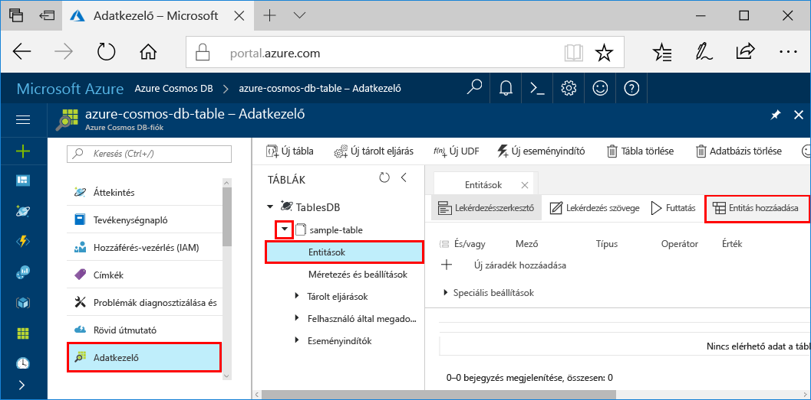
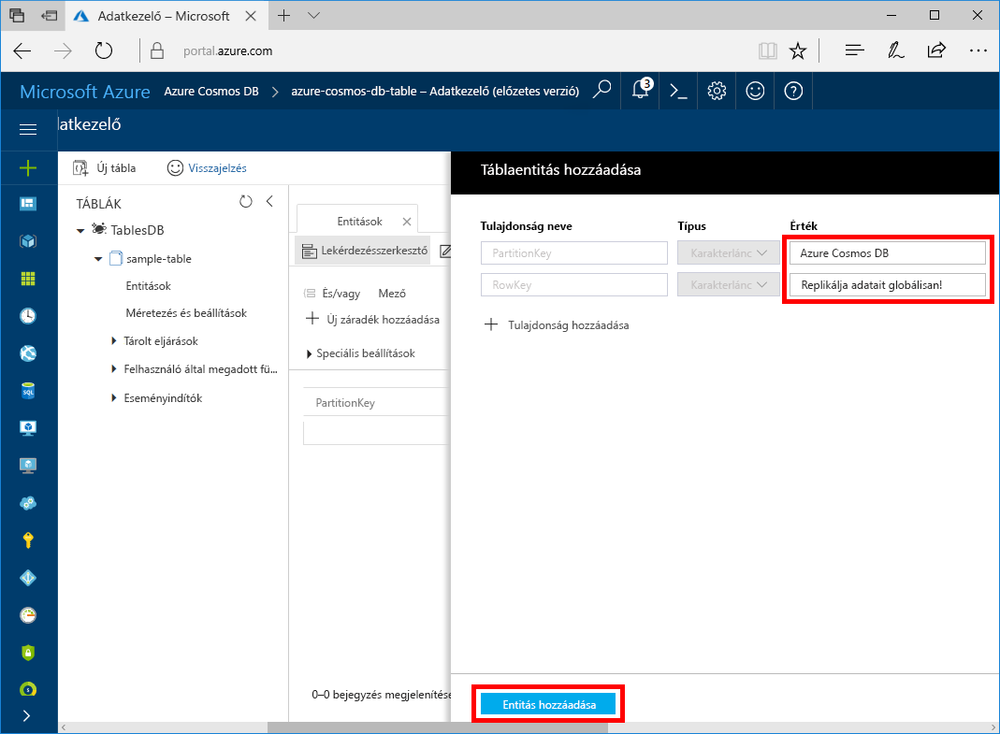

# <a name="quickstart-build-a-table-api-app-with-python-and-azure-cosmos-db"></a>Gyors üzembe helyezés: A tábla a Python és az Azure Cosmos DB API-alkalmazás létrehozása

A gyors üzembe helyezés bemutatja, hogyan használja a Python és az Azure Cosmos DB [tábla API](table-introduction.md) egy példa a Githubról klónozásával az alkalmazás elkészítésére. A gyors üzembe helyezés is bemutatja, hogyan Azure Cosmos DB-fiók létrehozása és adatok kezelővel létrehozása a táblákat és entitásokat a web-alapú Azure-portálon.

Az Azure Cosmos DB a Microsoft globálisan elosztott többmodelles adatbázis-szolgáltatása. Gyorsan hozzon létre, és a dokumentum, a kulcs/érték, a wide-oszlop és a graph adatbázisok, amelyek kihasználhassa a globális terjesztési és a horizontális skálázhatóságot képességeket Azure Cosmos DB középpontjában lekérdezése. 

## <a name="prerequisites"></a>Előfeltételek

[!INCLUDE [quickstarts-free-trial-note](../../includes/quickstarts-free-trial-note.md)]
[!INCLUDE [cosmos-db-emulator-docdb-api](../../includes/cosmos-db-emulator-docdb-api.md)]

Továbbá:

* Ha nincs telepítve a Visual Studio 2017, letöltheti és használhatja az **ingyenes** [Visual Studio 2017 Community Edition](https://www.visualstudio.com/downloads/)t. Ügyeljen arra, hogy engedélyezze az **Azure Development** használatát a Visual Studio telepítése során.
* Python Tools for Visual Studio, amely beszerezhető a [GitHubról](http://microsoft.github.io/PTVS/). Ez az oktatóanyag a Python Tools VS 2015-ös verziót használja.
* A [python.org](https://www.python.org/downloads/release/python-2712/) webhelyen elérhető Python 2.7-es verzió

## <a name="create-a-database-account"></a>Adatbázisfiók létrehozása

> [!IMPORTANT] 
> Szeretne együttműködni a általánosan elérhető tábla API SDK-k új tábla API-fiók létrehozása. Tábla API fiókjainak előzetes nem támogatottak az általánosan elérhető az SDK-k.
>

[!INCLUDE [cosmos-db-create-dbaccount-table](../../includes/cosmos-db-create-dbaccount-table.md)]

## <a name="add-a-table"></a>Tábla hozzáadása

[!INCLUDE [cosmos-db-create-table](../../includes/cosmos-db-create-table.md)]

## <a name="add-sample-data"></a>Mintaadatok hozzáadása

Az Adatkezelő segítségével adatokat adhat hozzá az új táblához.

1. Az Adatkezelőben bontsa ki a **minta tábla** pontot, és kattintson az **Entitások**, ezután pedig az **Entitás hozzáadása** lehetőségre.

   
2. Most adatok hozzáadása a PartitionKey érték mezőhöz, illetve RowKey értéket, és kattintson a **entitás hozzáadása**.

   
  
    Most már az Adatkezelővel további entitásokat is hozzá tud adni a táblához, szerkesztheti őket, és lekérdezéseket is indíthat. Az Adatkezelőben továbbá skálázhatja az átviteli sebességet, és tárolt eljárásokat, felhasználói függvényeket és triggereket adhat hozzá a táblához.

## <a name="clone-the-sample-application"></a>A mintaalkalmazás klónozása

Most pedig klónozunk egy Table-alkalmazást a GitHubról, beállítjuk a kapcsolati karakterláncot, majd futtatni fogjuk az alkalmazást. Látni fogja, milyen egyszerű az adatokkal programozott módon dolgozni. 

1. Nyisson meg egy git terminálablakot, például a git bash eszközt, és használja a `cd` parancs futtatásával módosíthatja a mintaalkalmazás telepítése mappába. 

    ```bash
    cd "C:\git-samples"
    ```

2. Futtassa a következő parancsot a minta tárház klónozásához. Ezzel a paranccsal létrejön egy mintaalkalmazás példányát a számítógépen. 

    ```bash
    git clone https://github.com/Azure-Samples/storage-python-getting-started.git
    ```

3. Ezután nyissa meg a megoldásfájlt a Visual Studióban. 

## <a name="update-your-connection-string"></a>A kapcsolati karakterlánc frissítése

Lépjen vissza az Azure Portalra a kapcsolati karakterlánc adataiért, majd másolja be azokat az alkalmazásba. Ez lehetővé teszi az alkalmazás a szolgáltatott adatbázissal való kommunikációhoz. 

1. Az a [Azure-portálon](http://portal.azure.com/), kattintson a **kapcsolati karakterlánc**. 

    

2. Másolja a fiók neve, a jobb oldalon a gombra kattintva.

3. Nyissa meg a config.py fájlt, és illessze be a fiók nevét a portálról sor 19 STORAGE_ACCOUNT_NAME értékét.

4. Lépjen vissza a portálra, és másolja az elsődleges kulcsot.

5. Az elsődleges kulcsot a portálról illessze be a sor 20 STORAGE_ACCOUNT_KEY értékét.

3. Mentse a config.py fájlt.

## <a name="run-the-app"></a>Az alkalmazás futtatása

1. A Visual Studióban kattintson jobb gombbal a projekt lehetőségre a **Megoldáskezelőben**, válassza ki a jelenlegi Python-környezetet, majd kattintson a jobb gombbal.

2. Válassza ki a Python-csomag telepítése, majd írja be a **azure-storage-tábla**

3. Az alkalmazás futtatásához nyomja le az F5 billentyűt. Az alkalmazás megjelenik a böngészőben. 

Lépjen vissza az Adatkezelőbe, ahol lekérdezheti, módosíthatja, és dolgozhat az új adattal. 

## <a name="review-slas-in-the-azure-portal"></a>Az SLA-k áttekintése az Azure Portalon

[!INCLUDE [cosmosdb-tutorial-review-slas](../../includes/cosmos-db-tutorial-review-slas.md)]

## <a name="clean-up-resources"></a>Az erőforrások eltávolítása

[!INCLUDE [cosmosdb-delete-resource-group](../../includes/cosmos-db-delete-resource-group.md)]

## <a name="next-steps"></a>Következő lépések

Ebben a rövid útmutatóban bemutattuk, hogyan lehet Azure Cosmos DB-fiókot létrehozni, hogyan lehet az Adatkezelő segítségével táblát készíteni, és hogyan lehet futtatni az alkalmazást.  Most már le tudja kérdezni adatait a Table API segítségével.  

> [!div class="nextstepaction"]
> [A tábla API tábla adatok importálása](table-import.md)
