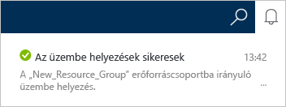
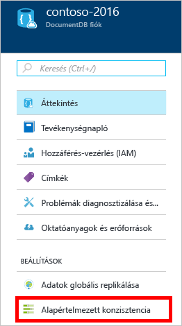
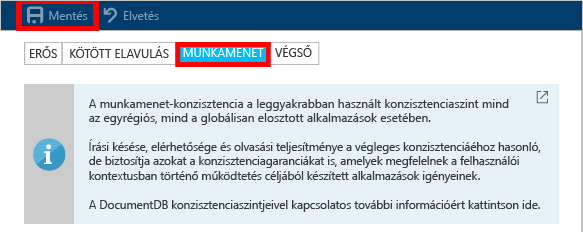

# Azure Cosmos DB NoSQL-fiók létrehozása az Azure Portal használatával
> [!div class="op_single_selector"]
> * [Azure Portal](documentdb-create-account.md)
> * [Azure CLI 1.0](documentdb-automation-resource-manager-cli-nodejs.md)
> * [Azure CLI 2.0](documentdb-automation-resource-manager-cli.md)
> * [Azure PowerShell](documentdb-manage-account-with-powershell.md)

Egy adatbázisnak a Microsoft Azure Cosmos DB szolgáltatással végzett felépítéséhez a következőkre van szükség:

* Azure-fiókkal kell rendelkeznie. Ha még nem rendelkezik fiókkal, beszerezhet egy [ingyenes Azure-fiókot](https://azure.microsoft.com/free).
* Létre kell hoznia egy Azure Cosmos DB-fiókot.  

Azure Cosmos DB-fiókot az Azure Portallal, Azure Resource Manager-sablonokkal vagy Azure parancssori felülettel (CLI-vel) hozhat létre. Ez a cikk bemutatja, hogyan hozhat létre egy Azure Cosmos DB-fiókot az Azure Portal használatával. Ha az Azure Resource Manager vagy az Azure parancssori felület használatával szeretne fiókot létrehozni: [Azure Cosmos DB-adatbázisfiók létrehozásának automatizálása](documentdb-automation-resource-manager-cli.md).

Nem ismeri még az Azure Cosmos DB szolgáltatást? Nézze meg [ezt](https://azure.microsoft.com/documentation/videos/create-documentdb-on-azure/) a Scott Hanselman által készített négyperces videót arról, hogyan végezheti el a legáltalánosabb feladatokat az online portálon.

1. Jelentkezzen be az [Azure portálra](https://portal.azure.com/).
2. A bal oldali navigációs panelen kattintson az **Új**, az **Adatbázisok**, majd az **Azure Cosmos DB** elemre.

     
3. Az **Új fiók** panelen adja meg az Azure Cosmos DB-fiók kívánt beállításait.

    

   * Az **Azonosító** mezőben adja meg az Azure Cosmos DB-fiókot azonosító nevet.  Az **azonosító** érvényesítése után egy zöld pipa jelenik meg az **Azonosító** mezőben. Az **Azonosító** mező értéke lesz az állomásnév az URI-n belül. Az **azonosító** kizárólag kisbetűket, számokat és a kötőjel (-) karaktert tartalmazhatja, és legalább 3, de legfeljebb 50 karakter lehet. Figyelje meg, hogy a rendszer hozzáfűzi a *documents.azure.com* címet a választott végpontnévhez, és így létrehozza az Azure Cosmos DB-fiók végpontját.
   * Az **NoSQL API** panelen válassza ki a programozási modellt:

     * **DocumentDB**: A DocumentDB API .NET, Java, Node.js, Python és JavaScript [SDK-kon](documentdb-sdk-dotnet.md), valamint HTTP [REST](https://msdn.microsoft.com/library/azure/dn781481.aspx) modelleken keresztül érhető el, és a DocumentDB minden funkciójához programozott hozzáférést biztosít.
     * **MongoDB**: A DocumentDB [protokollszintű támogatást](documentdb-protocol-mongodb.md) is kínál a **MongoDB** API-khoz. Ha a MongoDB API lehetőséget választja, használhatja a meglévő MongoDB SDK-kat és [eszközöket](documentdb-mongodb-mongochef.md) a DocumentDB-vel való kommunikációhoz. Meglévő MongoDB-alkalmazásait [módosíthatja](documentdb-import-data.md) a DocumentDB használatára, akár [kódmódosítás nélkül](documentdb-connect-mongodb-account.md) is, így kihasználhatja a teljes körűen felügyelt adatbázis szolgáltatás nyújtotta előnyöket, köztük a korlátlan skálázhatóságot, a globális replikációt és egyéb hasznos képességeket.
   * Az **Előfizetés** mezőben válassza ki az Azure Cosmos DB-fiókhoz használni kívánt Azure-előfizetést. Ha a fiókja csak egyetlen előfizetéssel rendelkezik, a rendszer alapértelmezés szerint azt választja ki.
   * Az **Erőforráscsoport** listából válasszon ki vagy hozzon létre egy erőforráscsoportot az Azure Cosmos DB-fiókhoz.  Alapértelmezés szerint új erőforráscsoport jön létre. További információk: [Az Azure Portal használata az Azure-erőforrások kezeléséhez](../azure-portal/resource-group-portal.md).
   * A **Hely** beállítás segítségével megadhatja a földrajzi helyet, ahol az Azure Cosmos DB-fiókot üzemeltetni szeretné.
4. Az Azure Cosmos DB-fiók beállításainak konfigurálása után kattintson a **Létrehozás** gombra. Az üzembe helyezés állapotának ellenőrzéséhez nyissa meg az értesítési központot.  

     

   
5. A létrehozás után az Azure Cosmos DB-fiók (az alapértelmezett beállításokkal) azonnal készen áll a használatra. Az Azure Cosmos DB-fiók alapértelmezett konzisztenciája a **Munkamenet**.  Az alapértelmezett konzisztenciát az erőforrásmenü **Alapértelmezett konzisztencia** elemére kattintva módosíthatja. További információ az Azure Cosmos DB által kínált konzisztenciaszintekről: [Konzisztenciaszintek az Azure Cosmos DB-ben](documentdb-consistency-levels.md).

     

     

[How to: Create an Azure Cosmos DB account]: #Howto
[Next steps]: #NextSteps

## Következő lépések
Most, hogy már rendelkezik Azure Cosmos DB-fiókkal, a következő lépés az Azure Cosmos DB-gyűjtemény és -adatbázis létrehozása.

A következő módszerekkel hozhat létre új gyűjteményt és adatbázist:

* Az Azure Portal használatával, amelyet az [Azure Cosmos DB-gyűjtemény létrehozása az Azure Portallal](documentdb-create-collection.md) című szakasz ismertet.
* Az átfogó, mintaadatokat is tartalmazó oktatóanyagokkal: [.NET](documentdb-get-started.md), [.NET MVC](documentdb-dotnet-application.md), [Java](documentdb-java-application.md), [Node.js](documentdb-nodejs-application.md) vagy [Python](documentdb-python-application.md).
* A GitHubon elérhető [.NET-](documentdb-dotnet-samples.md#database-examples), [Node.js-](documentdb-nodejs-samples.md#database-examples), vagy [Python-](documentdb-python-samples.md#database-examples) mintakódokkal.
* A [.NET](documentdb-sdk-dotnet.md), [.NET Core](documentdb-sdk-dotnet-core.md), [Node.js](documentdb-sdk-node.md), [Java](documentdb-sdk-java.md), [Python](documentdb-sdk-python.md), és [REST](https://msdn.microsoft.com/library/azure/mt489072.aspx) SDK-kkal.

Az adatbázis és a gyűjtemény létrehozása után [dokumentumokat kell hozzáadnia](documentdb-view-json-document-explorer.md) a gyűjteményekhez.

Miután dokumentumokat adott a gyűjteményhez, a [DocumentDB SQL](documentdb-sql-query.md) használatával [lekérdezéseket végezhet](documentdb-sql-query.md#ExecutingSqlQueries) a dokumentumokon. A lekérdezéseket a portálon található [Lekérdezéskezelővel](documentdb-query-collections-query-explorer.md), a [REST API-val](https://msdn.microsoft.com/library/azure/dn781481.aspx) vagy az egyik [SDK-val](documentdb-sdk-dotnet.md) végezheti el.

### Részletek
Az alábbi forrásokból többet is megtudhat az Azure Cosmos DB-ről:

* [Az Azure Cosmos DB bemutatása](../cosmos-db/introduction.md)

