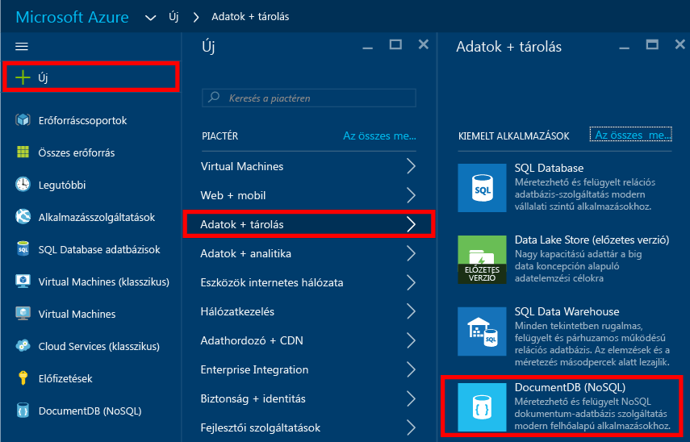
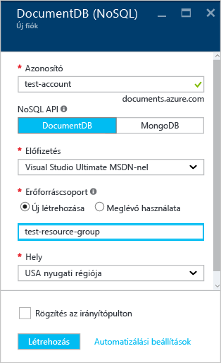

# DocumentDB NoSQL-fiók létrehozása az Azure Portal használatával
> [!div class="op_single_selector"]
> * [Azure Portal](documentdb-create-account.md)
> * [Azure parancssori felület és Azure Resource Manager](documentdb-automation-resource-manager-cli.md)
> 
> 

Egy adatbázisnak a Microsoft Azure DocumentDB szolgáltatással végzett felépítéséhez a következőkre van szükség:

* Azure-fiókkal kell rendelkeznie. Ha még nem rendelkezik fiókkal, beszerezhet egy [ingyenes Azure-fiókot](https://azure.microsoft.com/free). 
* Létre kell hoznia egy DocumentDB-fiókot.  

DocumentDB-fiókot az Azure Portallal, Azure Resource Manager-sablonokkal vagy Azure parancssori felülettel (CLI-vel) hozhat létre. Ez a cikk bemutatja, hogyan hozhat létre egy DocumentDB-fiókot az Azure Portal használatával. Ha az Azure Resource Manager vagy az Azure parancssori felület használatával szeretne fiókot létrehozni: [DocumentDB-adatbázisfiók létrehozásának automatizálása](documentdb-automation-resource-manager-cli.md).

Nem ismeri még a DocumentDB szolgáltatást? Nézze meg [ezt](https://azure.microsoft.com/documentation/videos/create-documentdb-on-azure/) a Scott Hanselman által készített négyperces videót arról, hogyan végezheti el a legáltalánosabb feladatokat az online portálon.

1. Jelentkezzen be az [Azure Portalra](https://portal.azure.com/).
2. Az ugrósávon kattintson az **Új**, majd az **Adatok + tárolás**, és végül az **Azure DocumentDB (NoSQL)** elemre.
   
     
3. Az **Új fiók** panelen adja meg a DocumentDB-fiók kívánt beállításait.
   
    
   
   * Az **Azonosító** mezőben adja meg a DocumentDB-fiókot azonosító nevet.  Az **azonosító** érvényesítése után egy zöld pipa jelenik meg az **Azonosító** mezőben. Az **Azonosító** mező értéke lesz az állomásnév az URI-n belül. Az **azonosító** kizárólag kisbetűket, számokat és a kötőjel (-) karaktert tartalmazhatja, és legalább 3, de legfeljebb 50 karakter lehet. Figyelje meg, hogy a rendszer hozzáfűzi a *documents.azure.com* címet a választott végpontnévhez, és így létrehozza a DocumentDB-fiók végpontját.
   * Az **NoSQL API** panelen válassza ki a programozási modellt:
     
     * **DocumentDB**: A DocumentDB API .NET, Java, Node.js, Python és JavaScript [SDK-kon](documentdb-sdk-dotnet.md), valamint HTTP [REST](https://msdn.microsoft.com/library/azure/dn781481.aspx) modelleken keresztül érhető el, és a DocumentDB minden funkciójához programozott hozzáférést biztosít. 
     * **MongoDB**: A DocumentDB [protokollszintű támogatást](documentdb-protocol-mongodb.md) is kínál a **MongoDB** API-khoz. Ha a MongoDB API lehetőséget választja, használhatja a meglévő MongoDB SDK-kat és [eszközöket](documentdb-mongodb-mongochef.md) a DocumentDB-vel való kommunikációhoz. Meglévő MongoDB-alkalmazásait [módosíthatja](documentdb-import-data.md) a DocumentDB használatára, akár [kódmódosítás nélkül](documentdb-connect-mongodb-account.md) is, így kihasználhatja a teljes körűen felügyelt adatbázis szolgáltatás nyújtotta előnyöket, köztük a korlátlan skálázhatóságot, a globális replikációt és egyéb hasznos képességeket.
   * Az **Előfizetés** mezőben válassza ki a DocumentDB-fiókhoz használni kívánt Azure-előfizetést. Ha a fiókja csak egyetlen előfizetéssel rendelkezik, a rendszer alapértelmezés szerint azt választja ki.
   * Az **Erőforráscsoport** területen válasszon ki vagy hozzon létre egy erőforráscsoportot a DocumentDB-fiókhoz.  Alapértelmezés szerint új erőforráscsoport jön létre. További információk: [Az Azure Portal használata az Azure-erőforrások kezeléséhez](../azure-portal/resource-group-portal.md).
   * A **Hely** beállítás segítségével megadhatja a földrajzi helyet, ahol a DocumentDB-fiókot üzemeltetni szeretné. 
4. A DocumentDB-fiók beállításainak konfigurálása után kattintson a **Létrehozás** gombra. Az üzembe helyezés állapotának ellenőrzéséhez nyissa meg az értesítési központot.  
   
     
   
   
5. A létrehozás után a DocumentDB-fiók (az alapértelmezett beállításokkal) azonnal készen áll a használatra. A DocumentDB-fiók alapértelmezett konzisztenciája a **Munkamenet**.  Az alapértelmezett konzisztenciát az erőforrásmenü **Alapértelmezett konzisztencia** elemére kattintva módosíthatja. További információ a DocumentDB által kínált konzisztenciaszintekről: [Konzisztenciaszintek a DocumentDB-ben](documentdb-consistency-levels.md).
   
     
   
     

[DocumentDB-fiók létrehozása]: #Howto
[Következő lépések]: #NextSteps
[documentdb-manage]:../articles/documentdb/documentdb-manage.md

## Következő lépések
Most, hogy már rendelkezik DocumentDB-fiókkal, a következő lépés az adatbázis létrehozása. 

A következő módszerekkel hozhat létre új adatbázist:

* Az Azure Portal használatával, amelyet a [DocumentDB-adatbázis létrehozása az Azure Portallal](documentdb-create-database.md) című szakasz ismertet.
* Az átfogó, mintaadatokat is tartalmazó oktatóanyagokkal: [.NET](documentdb-get-started.md), [.NET MVC](documentdb-dotnet-application.md), [Java](documentdb-java-application.md), [Node.js](documentdb-nodejs-application.md) vagy [Python](documentdb-python-application.md).
* A GitHubon elérhető [.NET-](documentdb-dotnet-samples.md#database-examples), [Node.js-](documentdb-nodejs-samples.md#database-examples), vagy [Python-](documentdb-python-samples.md#database-examples) mintakódokkal.
* A [.NET](documentdb-sdk-dotnet.md), [Node.js](documentdb-sdk-node.md), [Java](documentdb-sdk-java.md), [Python](documentdb-sdk-python.md), és [REST](https://msdn.microsoft.com/library/azure/mt489072.aspx) SDK-kkal.

Az adatbázis létrehozása után [egy vagy több gyűjteményt kell hozzáadnia](documentdb-create-collection.md) az adatbázishoz, majd [dokumentumokat kell hozzáadnia](documentdb-view-json-document-explorer.md) a gyűjteményekhez.

Miután dokumentumokat adott a gyűjteményhez, a [DocumentDB SQL](documentdb-sql-query.md) használatával [lekérdezéseket végezhet](documentdb-sql-query.md#executing-queries) a dokumentumokon. A lekérdezéseket a portálon található [Lekérdezéskezelővel](documentdb-query-collections-query-explorer.md), a [REST API-val](https://msdn.microsoft.com/library/azure/dn781481.aspx) vagy az egyik [SDK-val](documentdb-sdk-dotnet.md) végezheti el.

### További információ
Az alábbi forrásokból többet is megtudhat a DocumentDB-ről:

* [DocumentDB képzési terv](https://azure.microsoft.com/documentation/learning-paths/documentdb/)
* [DocumentDB hierarchikus erőforrásmodell és fogalmak](documentdb-resources.md)

<!--HONumber=Oct16_HO1-->

