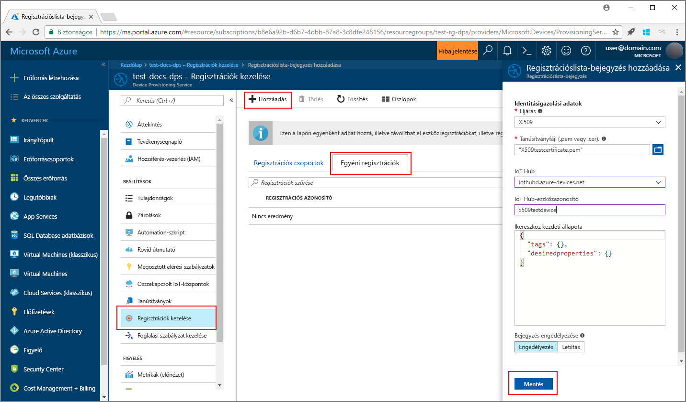

# <a name="create-and-provision-an-x509-simulated-device-using-iot-hub-device-provisioning-service-preview"></a>Szimulált X.509-eszköz létrehozása és kiépítése az IoT Hub eszközkiépítési szolgáltatással (előzetes verzió)
> [!div class="op_single_selector"]
> * [TPM](quick-create-simulated-device.md)
> * [X.509](quick-create-simulated-device-x509.md)

Ezek a lépések bemutatják, hogyan hozhat létre szimulált X.509-eszközt egy Windows operációs rendszert futtató fejlesztői gépen, és hogyan használhat egy kódmintát, hogy ezt a szimulált eszközt összekösse az eszközkiépítési szolgáltatással és az IoT Hubbal. 

A folytatás előtt végezze el az [IoT Hub eszközkiépítési szolgáltatás beállítása az Azure Portallal](./quick-setup-auto-provision.md) szakasz lépéseit.

<a id="setupdevbox"></a>
## <a name="prepare-the-development-environment"></a>A fejlesztési környezet előkészítése 

1. Győződjön meg arról, hogy a Visual Studio 2015 vagy a [Visual Studio 2017](https://www.visualstudio.com/vs/) telepítve van a gépen. A Visual Studio telepítésekor engedélyezni kell az „Asztali fejlesztés C++ használatával” számítási feladatot.

2. Töltse le és telepítse a [CMake buildelési rendszert](https://cmake.org/download/).

3. Győződjön meg arról, hogy a(z) `git` telepítve van a gépen, és a parancsablakból elérhető környezeti változókhoz van adva. A [Software Freedom Conservancy's Git ügyfél eszközeiben](https://git-scm.com/download/) találja a telepíteni kívánt `git` eszközök legújabb verzióját, amely tartalmazza a **Git Bash** eszközt, azt a parancssori alkalmazást, amellyel kommunikálhat a helyi Git-adattárral. 

4. Nyisson meg egy parancssort vagy a Git Basht. Klónozza a GitHub-adattárat az eszközszimuláció kódmintájához:
    
    ```cmd/sh
    git clone https://github.com/Azure/azure-iot-sdk-c.git --recursive
    ```

5. Hozzon létre egy mappát a GitHub-adattár helyi másolatában a CMake buildelési folyamathoz. 

    ```cmd/sh
    cd azure-iot-sdk-c
    mkdir cmake
    cd cmake
    ```

6. Futtassa az alábbi parancsot az üzembe helyezési ügyfél Visual Studio-megoldásának létrehozásához.

    ```cmd/sh
    cmake -Duse_prov_client:BOOL=ON ..
    ```


## <a name="create-a-device-enrollment-entry-in-the-device-provisioning-service"></a>Eszközök beléptetése bejegyzés létrehozása az eszközkiépítési szolgáltatásban

1. Nyissa meg a *cmake* mappában létrehozott `azure_iot_sdks.sln` nevű megoldást, és építse fel azt a Visual Studióban.

2. Kattintson a jobb gombbal a **dice\_device\_enrollment** projektre, és a **Kiépítés\_Minták** mappában válassza a **Beállítás kezdőprojektként** lehetőséget. Futtassa a megoldást. A kimeneti ablakba írja be a következőt az egyéni beléptetéshez: `i`. A kimeneti ablakban megjelenik egy helyileg létrehozott X.509-tanúsítvány a szimulált eszközhöz. Másolja a vágólapra a kimenetet a *-----BEGIN CERTIFICATE-----* sortól a *-----END PUBLIC KEY-----* sorig, és ügyeljen arra, hogy a kijelölésben ez a két sor is benne legyen. 
 
3. Hozzon létre egy **_X509testcertificate.pem_** nevű fájlt a Windows rendszerű gépén, nyissa meg egy tetszőleges szövegszerkesztővel, és másolja bele a vágólapra kimásolt szöveget. Mentse a fájlt. 

4. Jelentkezzen be az Azure Portalra, a bal oldali menüben kattintson az **Összes erőforrás** gombra, és nyissa meg az eszközkiépítési szolgáltatását.

4. Az eszközkiépítési szolgáltatás összefoglalás panelén válassza a **Beléptetések kezelése** lehetőséget. Válassza az **Egyéni beléptetések** fület, és kattintson a felül lévő **Hozzáadás** gombra. 

5. A **Beléptetési listabejegyzés hozzáadása** területen adja meg a következő információkat:
    - Válassza az **X.509** elemet az identitás igazolási *Mechanizmusaként*.
    - A *Tanúsítvány .pem- vagy .cer-fájl* területen válassza ki az előző lépésben létrehozott **_X509testcertificate.pem_** tanúsítványfájlt a *Fájlkezelő* vezérlővel.
    - Ha kívánja, megadhatja az alábbi információkat is:
        - Válassza ki a kiépítési szolgáltatáshoz kapcsolódó egyik IoT hubot.
        - Adjon meg egy egyedi eszközazonosítót. Ne használjon bizalmas adatokat az eszköz elnevezésekor. 
        - Frissítse az **Eszköz kezdeti ikerállapotát** az eszköz kívánt kezdeti konfigurációjával.
    - Ha végzett, kattintson a **Mentés** gombra. 

      

   Sikeres beléptetés esetén az X.509-eszköz **riot-device-cert** azonosítóval megjelenik a *Regisztrációs azonosító* oszlopban az *Egyéni beléptetések* lapon. 


<a id="firstbootsequence"></a>
## <a name="simulate-first-boot-sequence-for-the-device"></a>Első rendszerindítás szimulálása az eszközhöz

1. Az Azure Portalon válassza ki az eszközkiépítési szolgáltatás **Áttekintés** panelét, és jegyezze fel az **_Azonosító hatóköre_** értéket.

     

2. A gépen a Visual Studióban válassza ki a **prov\_dev\_client\_sample** nevű mintaprojektet a **Kiépítés\_Minták** mappában, és nyissa meg a **prov\_dev\_client\_sample.c** nevű fájlt.

3. Rendelje az _ID Scope_ (Azonosító hatóköre) értéket a(z) `scope_id` változóhoz. 

    ```c
    static const char* scope_id = "[ID Scope]";
    ```

4. Kattintson a jobb gombbal a **prov\_dev\_client\_sample** projektre, és válassza a **Beállítás kezdőprojektként** lehetőséget. Futtassa a mintát. Figyelje meg az eszköz rendszerindítását szimuláló és az eszközkiépítési szolgáltatáshoz az IoT Hub információk lekérése érdekében kapcsolódó üzeneteket. Keresse meg azt az üzenetet, amelyik a hub sikeres regisztrációját jelzi: *Regisztrációs adatok a következő szolgáltatásból: yourhuburl!* Zárja be az ablakot, amikor a rendszer erre kéri.

5. A portálon lépjen a kiépítési szolgáltatáshoz csatolt IoT hubhoz, és nyissa meg a **Device Explorer** (Eszközkereső) panelt. Ha sikeresen kiépíti a szimulált X.509-eszközt a hubon, az eszköz azonosítója megjelenik a **Device Explorer** panelen, a hozzá tartozó *ÁLLAPOT* pedig **engedélyezett** lesz. Ha már a minta eszközalkalmazás futtatása előtt megnyitotta a panelt, akkor lehet, hogy rá kell kattintania a fenti **Frissítés** gombra. 

     

> [!NOTE]
> Ha módosította az *Eszköz kezdeti ikerállapota* alapértelmezett értékét az eszköz beléptetési bejegyzésében, az lekérheti és felhasználhatja a kívánt ikerállapotot a központból. További információ: [Eszközök ikerállapotának megismerése és használata az IoT hubon](../iot-hub/iot-hub-devguide-device-twins.md).
>


## <a name="clean-up-resources"></a>Az erőforrások eltávolítása

Ha azt tervezi, hogy folytatja az eszközügyfél minta használatát és megismerését, akkor ne törölje a rövid útmutatóban létrehozott erőforrásokat. Ha nem folytatja a munkát, akkor a következő lépésekkel törölheti a rövid útmutatóhoz létrehozott összes erőforrást.

1. Zárja be az eszközügyfél minta kimeneti ablakát a gépen.
1. Az Azure Portal bal oldali menüjében kattintson az **Összes erőforrás** lehetőségre, majd válassza ki az eszközkiépítési szolgáltatást. Az **Összes erőforrás** panel felső részén kattintson a **Törlés** elemre.  
1. Az Azure Portal bal oldali menüjében kattintson az **Összes erőforrás** lehetőségre, majd válassza ki az IoT Hubot. Az **Összes erőforrás** panel felső részén kattintson a **Törlés** elemre.  

## <a name="next-steps"></a>Következő lépések

Ebben a rövid útmutatóban szimulált X.509-eszközt hozott létre a Windows rendszerű gépén, és az IoT Hubon építette ki azt az Azure IoT Hub eszközkiépítési szolgáltatással. Ha mélyebben szeretné megismerni az eszközkiépítést, folytassa az Azure Portalon az eszközkiépítési szolgáltatás beállításának oktatóanyagával. 

> [!div class="nextstepaction"]
> [Azure IoT Hub eszközkiépítési szolgáltatás oktatóanyagai](./tutorial-set-up-cloud.md)
