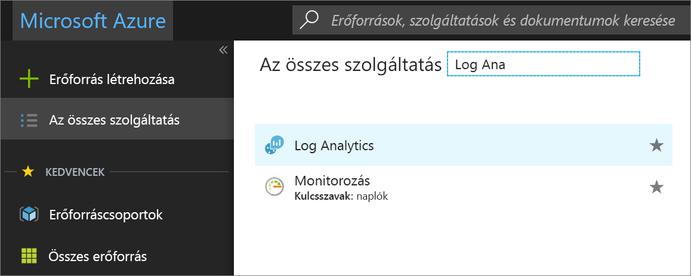
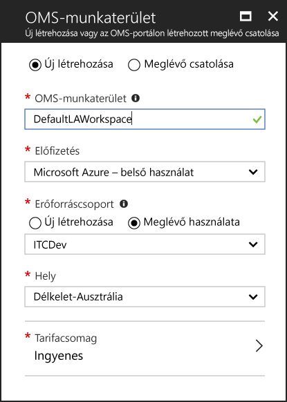
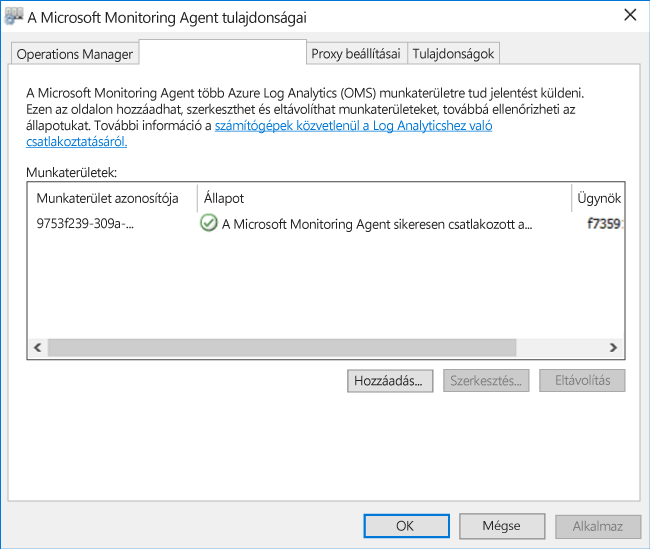
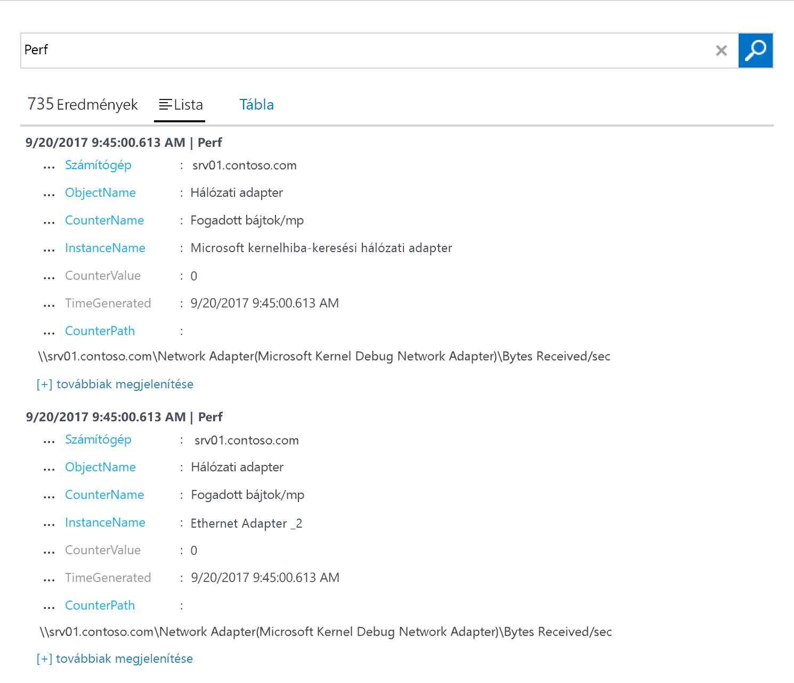

# A Windows rendszerű számítógépek a környezetében üzemeltetett adatok gyűjtése
[Az Azure Naplóelemzés](log-analytics-overview.md) tud adatokat gyűjteni közvetlenül a fizikai vagy virtuális Windows rendszerű számítógépek és egyéb erőforrásoknak a környezetben egy részletes elemzését és a korrelációs tárházba.  A gyors üzembe helyezés bemutatja, hogyan konfigurálja, és adatokat gyűjteni a Windows-számítógép néhány egyszerű lépésben.  Azure Windows virtuális gépek, a következő témakör [Azure virtuális gépek kapcsolatos adatok gyűjtéséhez](log-analytics-quick-collect-azurevm.md).  
 
Ha nem rendelkezik Azure-előfizetéssel, mindössze néhány perc alatt létrehozhat egy [ingyenes fiókot](https://azure.microsoft.com/free/?WT.mc_id=A261C142F) a virtuális gép létrehozásának megkezdése előtt.

## Jelentkezzen be Azure-portálon
Jelentkezzen be az Azure portálon, a [https://portal.azure.com](https://portal.azure.com). 

## Munkaterületek létrehozása
1. Az Azure portálon kattintson **további szolgáltatások** bal alsó sarokban található. Az erőforrások listájába írja be a **Log Analytics** kifejezést. Ahogy elkezd gépelni, a lista a beírtak alapján szűri a lehetőségeket. Válassza ki **Analytics jelentkezzen**.       
2. Kattintson a **létrehozása**, majd válassza ki a következő elemeket kell:

  * Adjon meg egy nevet az új **OMS-munkaterület**, például a *DefaultLAWorkspace*. 
  * A legördülő listából válassza ki azt az **előfizetést**, amelyikhez kapcsolódni szeretne, ha az alapértelmezett kiválasztás nem megfelelő.
  * A **erőforráscsoport**, válasszon ki egy meglévő erőforráscsoportot, amely tartalmaz egy vagy több Azure virtuális gépeken.  
  * Válassza ki a **hely** a virtuális gépek vannak telepítve.  További információkért lásd: amely [Naplóelemzési is elérhető régiók](https://azure.microsoft.com/regions/services/).
  * Három különböző választhat **tarifacsomagok** Naplóelemzési, de a gyors üzembe helyezés, válassza ki kívánja a **szabad** réteg.  Az adott szintek kapcsolatos további információkért lásd: [napló Analytics díjszabás](https://azure.microsoft.com/pricing/details/log-analytics/).

           
3. Miután megadta a szükséges adatokat a a **OMS-munkaterület** ablaktáblán kattintson a **OK**.  

Az **Értesítések** menüpontot kiválasztva nyomon követheti, hogyan ellenőrzi a rendszer az adatokat, és hogyan hozza létre a munkaterületet. 

## Munkaterületének Azonosítóját és kulcs beszerzése
A Microsoft figyelési ügynök a Windows telepítéséhez szükséges a munkaterület azonosítója és kulcsa a Naplóelemzési munkaterületet.  Ez az információ a telepítő varázsló megfelelően konfigurálni az ügynököt, és képes sikeresen kommunikálni a Naplóelemzési szolgáltatással használata szükséges.  

1. Az Azure portálon kattintson **további szolgáltatások** bal alsó sarokban található. Az erőforrások listájába írja be a **Log Analytics** kifejezést. Ahogy elkezd gépelni, a lista a beírtak alapján szűri a lehetőségeket. Válassza ki **Analytics jelentkezzen**.
2. A Naplóelemzési munkaterület listában válassza ki a *DefaultLAWorkspace* korábban létrehozott.
3. Válassza ki **speciális beállítások**.       
4. Válassza ki **csatlakoztatott források**, majd válassza ki **Windows kiszolgálók**.   
5. Az érték jobb oldalán **munkaterület azonosítója** és **elsődleges kulcs**. Másolással illessze be a kedvenc szerkesztő mindkettő.   

## A Windows-ügynök telepítése
Az alábbi lépéseket telepítése, és az ügynök a Naplóelemzési konfigurálása Azure és az Azure Government felhőben, a telepítőprogram használatával a Microsoft Monitoring Agent a számítógépen.  

1. Az a **Windows kiszolgálók** lapon, válassza ki a megfelelő **Windows-ügynök letöltése** letöltése attól függően, hogy a processzor architektúrájától, a Windows operációs rendszer verziója.
2. A telepítőprogramot az ügynök telepítése a számítógépre.
2. Az a **üdvözlő** kattintson **következő**.
3. Az a **licencfeltételeket** lapon, olvassa el a licencfeltételeket, majd kattintson **elfogadom**.
4. Az a **célmappa** lapon, módosítása vagy a megadott alapértelmezett telepítési mappát, majd kattintson **következő**.
5. Az a **ügynök telepítésének beállításai** lapon, csatlakoztassa az ügynököt az Azure Naplóelemzés (OMS), majd válassza ki **következő**.   
6. Az a **Azure Naplóelemzés** lapján tegye a következőket:
   1. Beillesztés a **munkaterület azonosítója** és **Munkaterületkulcsot (elsődleges kulcs)** korábban kimásolt.  Ha a számítógép a Naplóelemzési munkaterület Azure Government felhőben kell jelentsenek, jelölje be **Azure Amerikai Egyesült államokbeli kormányzati** a a **Azure felhőbe** legördülő listából.  
   2. Ha a számítógép szükség van a Naplóelemzési szolgáltatás proxykiszolgálón keresztül kommunikálnak, kattintson a **speciális** és URL-címét, és a proxykiszolgáló portszámát.  Ha a proxykiszolgálóhoz hitelesítés szükséges, írja be a felhasználónevet és jelszót a proxykiszolgáló hitelesítéséhez szükséges, és kattintson a **következő**.  
7. Kattintson a **következő** biztosítása a konfigurációs beállításokat befejezése után.     
8. Az a **telepítésre kész** lapon, ellenőrizze a megadott beállításokat, majd kattintson **telepítése**.
9. Az a **konfigurálása sikeresen befejeződött** kattintson **Befejezés**.

Amikor végzett, a **Microsoft-Figyelőügynök** megjelenik **Vezérlőpult**. Tekintse át a konfigurációt, és ellenőrizze, hogy az ügynök csatlakozik a szolgáltatáshoz. A csatlakozás a **Azure Naplóelemzés (OMS)** lapon, az ügynök jeleníti meg a következő üzenet: **a Microsoft Monitoring Agent sikeresen csatlakozott-e a Microsoft Operations Management Suite szolgáltatással.**   

## Esemény-és teljesítményadatokat gyűjt
A Naplóelemzési események gyűjtése a Windows-Eseménynapló és a teljesítményszámlálók, amennyit megadott a hosszabb távú elemzési és jelentéskészítési, és hajtsa végre a műveletet egy adott esemény észlelése esetén.  Kövesse az alábbi lépéseket a Windows eseménynaplót, és néhány általános teljesítményszámlálói eseményeinek gyűjtése kezdődnie konfigurálásához.  

1. Az Azure portálon kattintson **további szolgáltatások** bal alsó sarokban található. Az erőforrások listájába írja be a **Log Analytics** kifejezést. Ahogy elkezd gépelni, a lista a beírtak alapján szűri a lehetőségeket. Válassza ki **Analytics jelentkezzen**.
2. Válassza ki **speciális beállítások**.      
3. Válassza ki **adatok**, majd válassza ki **Windows-Eseménynapló**.  
4. Az Eseménynapló nevében a napló beírásával vegye fel.  Típus **rendszer** és kattintson a plusz jelre  **+** .  
5. A tábla, ellenőrizze a nyomkövetés alapjául szolgáló **hiba** és **figyelmeztetés**.   
6. Kattintson a **mentése** a konfiguráció mentéséhez, a lap tetején.
7. Válassza ki **Windows-teljesítményadatok** a Windows rendszerű számítógépeken a teljesítményszámlálók gyűjtésének engedélyezése. 
8. Amikor először konfigurálja a Windows egy új Naplóelemzési munkaterület számlálókat, lehetősége van gyorsan létrehozhat több általános jellegű számlálót. Az egyes jelölőnégyzetét szerepelnek.  .  Kattintson a **adja hozzá a kijelölt teljesítményszámlálók**.  Ezek felvétele, illetve egy második tíz gyűjtemény mintavételi időköznek az adott néven beállítás.  
9. Kattintson a **mentése** a konfiguráció mentéséhez, a lap tetején.

## Összegyűjtött adatok megtekintése
Most, hogy engedélyezte az adatok gyűjtését, lehetővé teszi, hogy egy egyszerű napló keresési például bizonyos adatai a célszámítógépen futtatni.  

1. Az Azure portál, a kijelölt munkaterületen kattintson a **naplófájl-keresési** csempére.  
2. A naplófájl-keresési ablaktáblán a lekérdezés mezőtípus `Perf` , és adja meg, vagy kattintson a Keresés gombra a lekérdezés mező jobb majd nyomja le.      A lekérdezés az alábbi ábrán például 735 teljesítmény rögzíti adott vissza.   

## Az erőforrások eltávolítása
Ha már nincs szükség, az ügynök eltávolítása a Windows-számítógépen, és a Naplóelemzési munkaterület törlése.  

Távolítsa el az ügynököt, hajtsa végre az alábbi lépéseket.

1. Nyissa meg **Vezérlőpultot**.
2. Nyissa meg **programok és szolgáltatások**.
3. A **programok és szolgáltatások**, jelölje be **Microsoft-Figyelőügynök** kattintson **Eltávolítás**.

A munkaterület törléséhez válassza ki a korábban és az erőforrások lapon kattintson a létrehozott Naplóelemzési munkaterület **törlése**.   

## Következő lépések
Most, hogy gyűjti a működési és a helyszíni Linux számítógépről teljesítményadatokat, könnyen megkezdheti felfedezése elemzése és a begyűjtött adatok intézkedést *szabad*.  

Megtudhatja, hogyan tekintheti meg és elemezheti az adatokat, hogy továbbra is az oktatóanyag.   

> [!div class="nextstepaction"]
> [Megtekintése vagy Naplóelemzési adatok elemzése](log-analytics-tutorial-viewdata.md)
