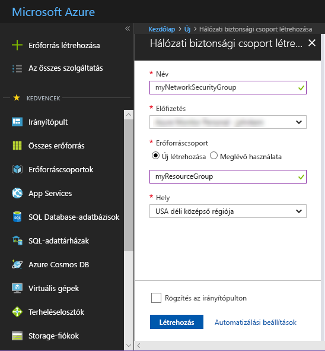
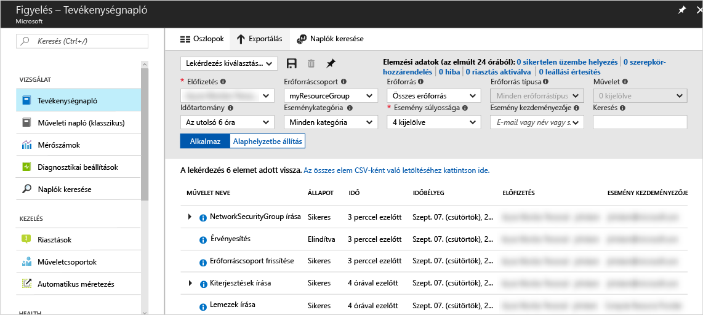
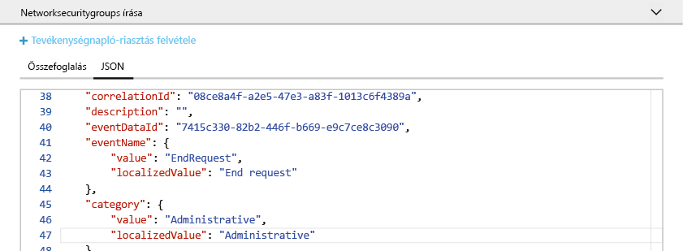
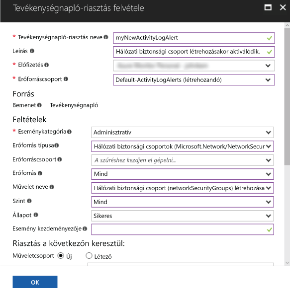
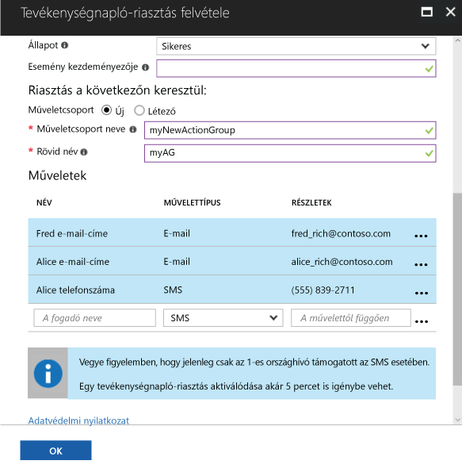

# Naplózási és az Azure-előfizetéssel kapcsolatos fontos műveletek értesítéseket

A **Azure tevékenységnapló** Azure előfizetés-szintű események előzményeit biztosítja. Kapcsolatos információkat kínál *ki* létrehozott, frissített vagy törölt *mi* erőforrások és *amikor* tevékenységük azt. Létrehozhat egy **tevékenységnapló riasztás** fogadni e-mailben, SMS vagy webhook értesítések küldése, ha egy tevékenység következik be, amely a figyelmeztetési feltételek egyeznek. A gyors üzembe helyezés lépéseit egyszerű hálózati biztonsági csoportot hoz létre, keresse meg a műveletnapló esemény megértése és majd szerzői tevékenységnapló riasztást vált értesíti, ha a hálózati biztonsági csoport létrehozása folyamatban a továbbítást.

Ha nem rendelkezik Azure-előfizetéssel, első lépésként mindössze néhány perc alatt létrehozhat egy [ingyenes](https://azure.microsoft.com/free/) fiókot.

## Jelentkezzen be az Azure portálra.

Jelentkezzen be az [Azure portálra](https://portal.azure.com/).

## Hálózati biztonsági csoport létrehozása

1. Kattintson az Azure Portal bal felső sarkában található **Új** gombra.

2. Válassza ki **hálózati**, jelölje be **hálózati biztonsági csoport**.

3. Adja meg a "myNetworkSG" a **neve** , és hozzon létre egy új erőforráscsoportot **myResourceGroup**. Kattintson a **Létrehozás** gombra.

    

## Keresse meg a tevékenység naplója a portálon

Egy esemény most már fel lett véve a műveletnapló, amely a hálózati biztonsági csoport létrehozását ismerteti. A következő utasításokat követve azonosíthatja, hogy esemény.

1. Kattintson a **figyelő** gombra a bal oldali navigációs listában található. A műveletnapló részt nyílik meg. Ebben a szakaszban található összes végrehajtott műveletekből felhasználók rendelkeznek az erőforrást az előfizetésében több tulajdonságok alapján szűrhető, mint az előzményeit a **erőforráscsoport**, **Timespan**, és  **Kategória**.

2. Az a **tevékenységnapló** területen kattintson a **erőforráscsoport** legördülő menüből válassza ki **myResourceGroup**. Módosítsa a **Timespan** a legördülő lista **elmúlt 1 óra**. Kattintson az **Alkalmaz** gombra.

    

3. Kattintson a **írási biztonsági csoportok** a táblázatban ismertetett esemény.

## Keresse meg a műveletnaplóban esemény

A következő szakasz jelenik meg a műveletet végeznie, beleértve a nevét, a Timestamp értéket, és a felhasználó vagy alkalmazás által végrehajtott azt alapvető részleteit tartalmazza.

Kattintson a **JSON** lapon, a teljes esemény részleteinek megtekintéséhez. Ez tartalmazza a módját a felhasználó vagy alkalmazás lett jogosult elvégezni a műveletet, az eseménykategóriát és szint és a művelet állapotát.

## Tevékenységnapló riasztás létrehozása

1. Kattintson a **összefoglaló** lapra való visszatéréshez az esemény összegzése.

2. Az összegzési területen megjelenő kattintson **Hozzáadás figyelmeztetés a napló**.

    

3. A szakaszban, amely akkor jelenik meg adjon a tevékenységnapló riasztás nevét és leírását.

4. A **feltételek** ügyeljen arra, hogy **eseménykategória** értéke **felügyeleti**, **erőforrástípus** értékre van állítva **hálózati biztonsági csoportok**, **műveletnév** értéke **létrehozás vagy frissítés hálózati biztonsági csoport**, **állapot** értékre van állítva  **Sikeres** és minden egyéb feltételek mezőiben vagy üres, vagy állítsa be a **összes**. A feltételek meghatározzák azon szabályokat határozza meg, hogy a riasztás kell lehet aktiválni, ha új esemény jelenik meg a műveletnaplóban.

    

5. A **riasztási keresztül** kiválasztása **új** művelet csoportban, és adja meg egy **neve** és **rövid nevét** a művelet csoport. A művelet csoport adja meg a riasztás aktiválásakor (Ha a feltételek egyeznek új esemény) végrehajtott műveletek.

6. A **műveletek** adjon hozzá legalább 1 műveleteket, adja meg a egy **neve** a művelet a **művelettípus** (például e-mail vagy SMS), és **részletek**az adott művelettől (például a webhook URL-CÍMÉT, e-mail címét vagy SMS szám).

    

7. Kattintson a **Ok** a tevékenységnapló riasztás mentése.

## A műveletnapló riasztás tesztelése

> [!NOTE]
> Teljes mértékben engedélyezve lesz tevékenységnapló riasztást körülbelül 10 percet vesz igénybe. Mielőtt teljes mértékben engedélyezve van a tevékenységnapló riasztás új események értesítések nem hoznak létre.
>
>

A riasztás teszteléséhez ismételje meg az előző szakaszban **hálózati biztonsági csoport létrehozása**, de másik nevet a hálózati biztonsági csoporthoz, és újra felhasználhatja a meglévő erőforráscsoportot. Néhány percen belül, hogy létrejött-e a hálózati biztonsági csoport egy értesítést fog kapni.

## Az erőforrások eltávolítása

Amikor már nincs szükség, törölje az erőforráscsoportot és a hálózati biztonsági csoport. Ehhez írja be a keresőmezőbe, a portál felső létrehozott erőforráscsoportot, majd kattintson a az erőforráscsoport nevét. Kattintson a csoport, amely akkor jelenik meg a **erőforrás csoport törlése** gombra, írja be a csoport nevét, és kattintson a **törlése**.

## Következő lépések

A gyors üzembe helyezési tevékenységnapló esemény létrehozásához műveletet, és hozza létre a tevékenységnapló riasztást vált értesíti, ha ehhez a művelethez újra a jövőben. Majd tesztelni a riasztás által újra, hogy a művelet végrehajtása. Azure lehetővé teszi a rendelkezésre álló tevékenységnapló események az elmúlt 90 nap. Ha szeretné megőrizni az események 90 napnál hosszabb, próbálkozzon a tevékenységnapló adatok mellett a figyelt adatok archiválása.

> [!div class="nextstepaction"]
> [Megfigyelési adatok archiválása](./monitor-tutorial-archive-monitoring-data.md)
