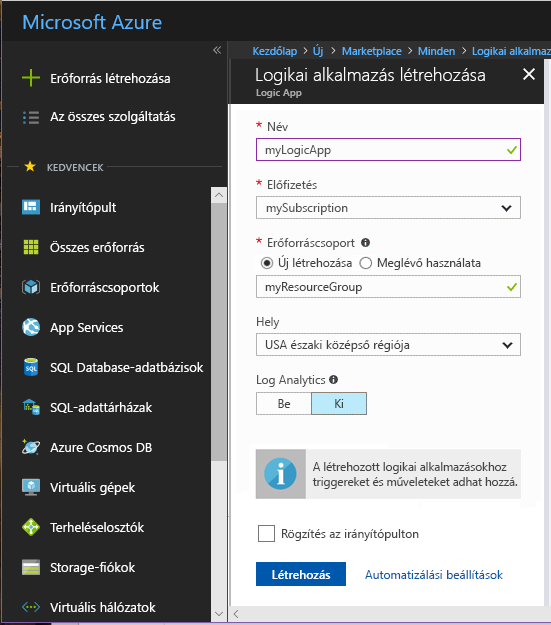
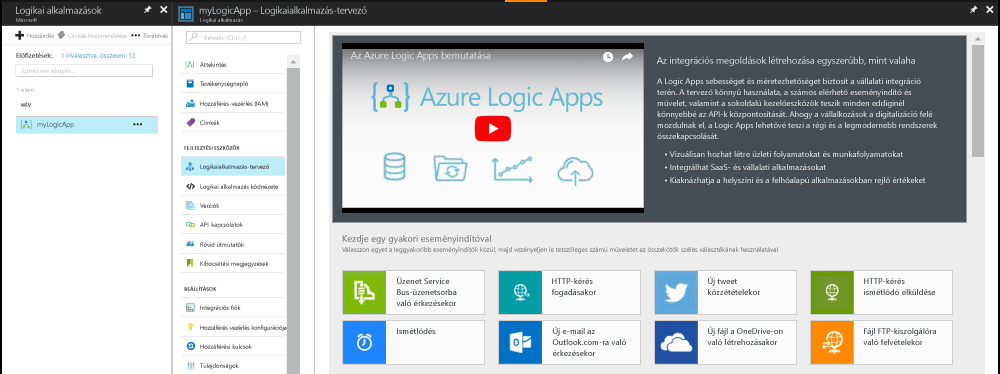
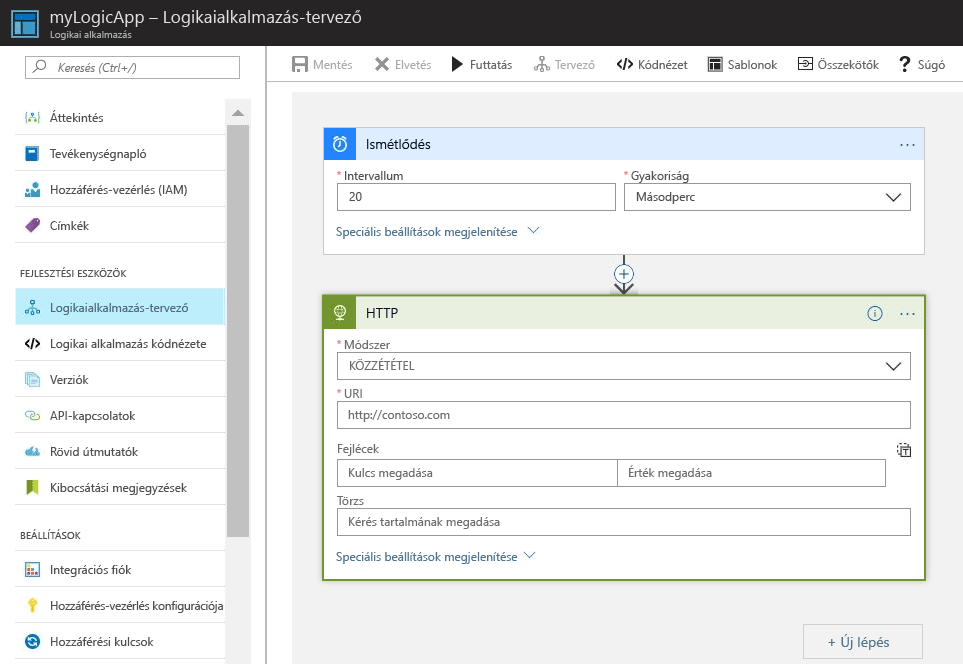
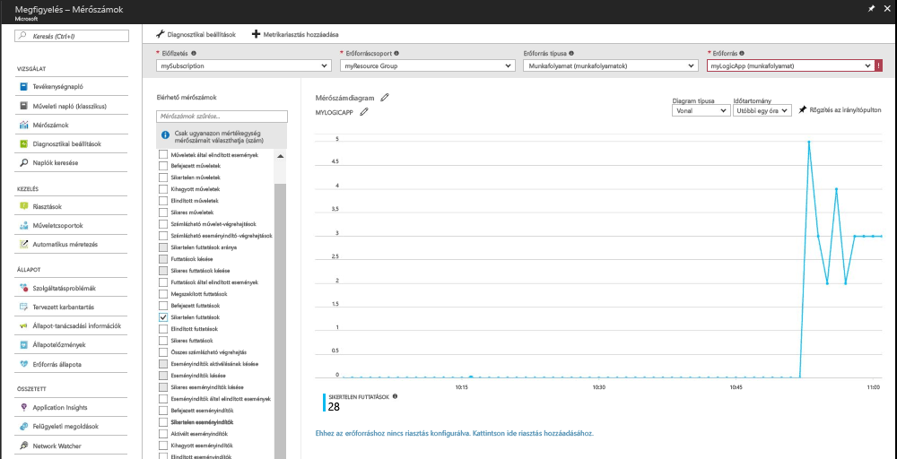
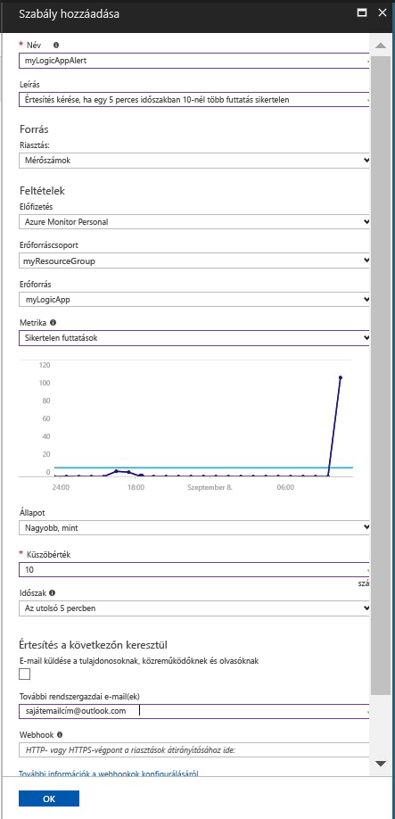

# Értesítés kérése, ha egy metrikaérték megfelel egy feltételnek

Az Azure Monitor számos Azure-erőforrás számára tesz elérhetővé metrikákat. Ezek a metrikák az említett erőforrások teljesítményét és állapotát mutatják. A metrikaértékek számos esetben jelezhetik, ha gond van egy erőforrással. Olyan metrikariasztásokat is létrehozhat, amelyek figyelik a rendellenes viselkedést, és értesítést küldenek azok előfordulásáról. Ez a rövid útmutató részletesen bemutatja egy logikai alkalmazás létrehozásának lépéseit, valamint az ahhoz kapcsolódó feladatok létrehozásának és a metrikák megjelenítésének módját. Ezt követően bemutatja a riasztások létrehozásának, illetve a logikai alkalmazás erőforrásainak metrikáihoz kapcsolódó értesítések beállításának módját.

A metrikákkal és metrikariasztásokkal kapcsolatban bővebb információt az [Azure Monitor metrikáinak áttekintésében](./monitoring-overview-metrics.md) és az [Azure Monitor riasztásainak áttekintésében](./monitoring-overview-alerts.md) olvashat. 

Ha nem rendelkezik Azure-előfizetéssel, első lépésként mindössze néhány perc alatt létrehozhat egy [ingyenes](https://azure.microsoft.com/free/) fiókot.

## Jelentkezzen be az Azure Portalra

Jelentkezzen be az [Azure Portalra](https://portal.azure.com/).

## Logikai alkalmazás létrehozása

1. Kattintson az Azure Portal bal felső sarkában található **Erőforrás létrehozása** gombra.

2. Keressen a „logikai alkalmazás” kifejezésre, majd válassza a **Logikai alkalmazás** lehetőséget. Kattintson a **Létrehozás** gombra.

3. Adja meg a logikai alkalmazás adatait az alábbi ábrán látható módon.  Használja az alapértelmezett helyet. Jelölje be a **Rögzítés az irányítópulton** lehetőséget.  Amikor végzett, kattintson a **Létrehozás** gombra. 

      

4. A logikai alkalmazásnak az irányítópulton rögzítve kell megjelennie. Kattintson a logikai alkalmazásra a megnyitásához.

5. A Logikai alkalmazás panelen válassza ki a **Logikaialkalmazás-tervező** elemet.

       

6. Állítsa be az értékeket az alábbi ábrán látható módon.

    . 

7. A tervezőben válassza ki az **Ismétlődés** eseményindítót.

8. Állítson be egy 20-as intervallumot és másodperces gyakoriságot, hogy a logikai alkalmazás 20 másodpercenként aktiválódjon.

9. Kattintson az **Új lépés** gombra, majd válassza a **Művelet hozzáadása** elemet.

10. Válassza a **HTTP** lehetőséget, majd kattintson a **HTTP-HTTP** elemre.

11. **Metódusként** válassza a POST beállítást, az **URI** értékeként pedig adja meg a kívánt webcímet.

12. Kattintson a **Save** (Mentés) gombra.

13. A logikai alkalmazás futtatási műveletei akár 5 percig is eltarthatnak.  

## A logikai alkalmazás metrikáinak megtekintése

1. Kattintson a **Figyelés** lehetőségre a bal oldali navigációs ablaktáblán.

2. Kattintson a **Metrikák** lapra, majd adja meg a logikai alkalmazás **Előfizetés**, **Erőforráscsoport**, **Erőforrástípus** és **Erőforrás** értékét.

3. A metrikák listájából válassza az **Elindított futtatások** lehetőséget.

4. Módosítsa a diagram **Időtartomány** értékét úgy, hogy az az elmúlt órára vonatkozó adatokat tartalmazza.

5. Ekkor egy diagramnak kell megjelennie, amely a logikai alkalmazás által az elmúlt órában elindított futtatásokat ábrázolja. Ha nem látja, akkor várjon legalább 5 percet az előző lépés után. Ezt követően frissítse a böngészőt. 

    

## Metrikariasztás létrehozása a logikai alkalmazáshoz

1.  A metrika panel jobb felső sarkában kattintson a **Metrikariasztás hozzáadása** gombra.

2. A metrikariasztás neve legyen „myLogicAppAlert”, és adja meg a riasztás rövid leírását.

3. A metrikariasztás **Feltétel** mezőjében állítsa be a „Nagyobb, mint” értéket, a **Küszöbérték** legyen „10”, az **Időszak** pedig „Az utolsó 5 percben”.

4. Végül a **További adminisztrátori e-mail-cím(ek)** mezőben adja meg az e-mail-címét. Ezzel a riasztással biztosíthatja, hogy minden alkalommal kapjon egy e-mailt, ha a rendszer a logikai alkalmazás több mint 10 sikertelen futtatását észleli 5 perces időtartamon belül.

    

## Fogadjon a logikai alkalmazással kapcsolatos metrikariasztási értesítéseket
1. Kis idő elteltével egy e-mailt kell kapnia a „Microsoft Azure Alerts” szolgáltatástól, amely értesíti a riasztás „aktiválásáról”.

2. Lépjen vissza a logikai alkalmazáshoz, és módosítsa az ismétlődési eseményindító intervallumának értékét 1-re, a gyakoriságot pedig állítsa „óra” értékre.

3. Néhány percen belül kapnia kell egy e-mailt a „Microsoft Azure Alerts” szolgáltatástól, amely értesíti, hogy a riasztás „megoldódott”.

## Az erőforrások eltávolítása

Az ebben a gyűjteményben lévő többi rövid útmutató erre a rövid útmutatóra épít. Ha azt tervezi, hogy az ezt követő rövid útmutatókkal vagy az oktatóanyagokkal dolgozik tovább, akkor ne törölje az ebben a rövid útmutatóban létrehozott erőforrásokat. Ha nem folytatja a munkát, akkor a következő lépésekkel törölheti az Azure Portalon a rövid útmutatóhoz létrehozott összes erőforrást.

1. Az Azure Portal bal oldali menüjében kattintson a **Figyelés** lehetőségre.

2. Kattintson a **Riasztások** lapra, keresse meg a jelen rövid útmutatóban előzőleg létrehozott riasztást, és kattintson rá.

3. A metrikariasztások panelen kattintson a **Törlés** elemre.

4. Az Azure Portal bal oldali menüjében keressen a **logikai alkalmazás** kifejezésre, majd kattintson a **Logikai alkalmazások** elemre.

5. A panelen kattintson a jelen rövid útmutatóban előzőleg létrehozott logikai alkalmazásra, majd kattintson a **Törlés** lehetőségre.

## További lépések

Ebből a rövid útmutatóból megismerhette, hogyan hozhat létre metrikariasztásokat az erőforrásaihoz. Ha bővebb információt szeretne a metrikariasztásokról, kattintással lépjen a riasztások áttekintéséhez.

> [!div class="nextstepaction"]
> [Azure Monitor-előfizetés műveleti riasztásai](./monitor-quick-audit-notify-action-in-subscription.md )
