# Ismerkedés az Azure Monitor szolgáltatással
Az Azure Monitor egy olyan platformszolgáltatás, mely egyetlen forrást kínál az Azure-erőforrások figyeléséhez. Az Azure Monitorral az egyes erőforrásoktól az Azure-ba érkező metrikákat és naplókat láthatóvá teheti, lekérdezheti, átirányíthatja, archiválhatja, illetve ezekkel különböző műveleteket is végezhet. Adatok segítségével az Azure portál használatával dolgozhat [figyelő PowerShell-parancsmagok](insights-powershell-samples.md), [platformfüggetlen parancssori felület](insights-cli-samples.md), vagy [Azure figyelő REST API-k](https://msdn.microsoft.com/library/dn931943.aspx). Ebben a cikkben sorra vesszük az Azure Monitor főbb összetevőit, és a portál segítségével mutatjuk be őket.

## Útmutatás
1. A portálon lépjen a **minden szolgáltatás** keresse meg a **figyelő** lehetőséget. A csillag ikonra kattintva adja hozzá ezt a lehetőséget a kedvencekhez, így az a bal oldali navigációs sávról mindig könnyen elérhető lesz.

    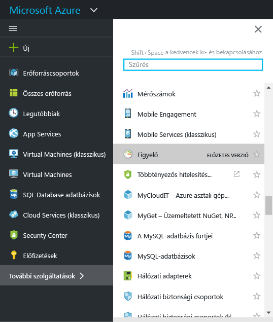
2. Kattintson a **figyelő** kattintva nyissa meg a beállítás a **figyelő** lap. Ezen a lapon összegyűjti az összes figyelési beállítások és adatok egyetlen összevont nézetben. A panel az első alkalommal a **Tevékenységnapló** területet megjelenítve nyílik meg.

    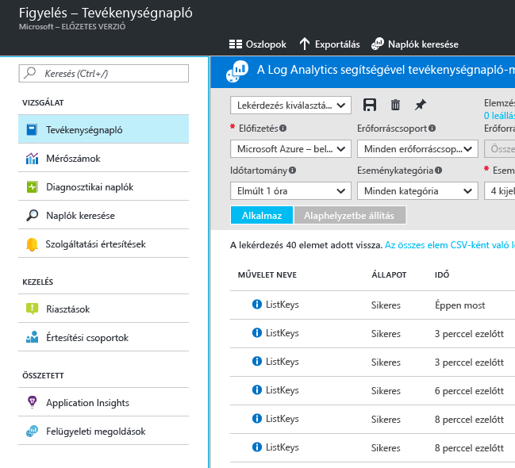

    Az Azure Monitor az adatok figyelését három fő kategóriába sorolja: ez a **tevékenységnapló**, a **metrikák** és a **diagnosztikai naplók**.
3. A **Tevékenységnapló** lehetőségre kattintva jelenítse meg a tevékenységnapló területét.

    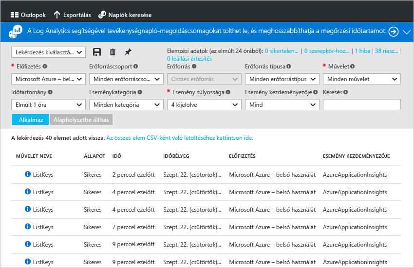

    A [**tevékenységnapló**](monitoring-overview-activity-logs.md) az előfizetéshez tartozó erőforrásokon végrehajtott összes műveletet ismerteti. A tevékenységnapló használatával az előfizetés erőforrásain végzett minden létrehozási, frissítési vagy törlési művelet esetén választ kaphat a „ki, mit és mikor” kérdésre. A tevékenységnaplóban láthatja például, hogy ki és mikor állított le egy webalkalmazást. A tevékenységnapló eseményeit tárolja a platform, és 90 napig lekérdezhetők maradnak.

    Létrehozhatja és mentheti a gyakran alkalmazott szűrőket tartalmazó lekérdezéseket, majd a legfontosabb lekérdezéseket rögzítheti a portál irányítópultján, így mindig tudni fogja, hogy előfordultak-e olyan események, amelyek megfelelnek a megadott feltételeknek.
4. Szűrje a nézetet egy adott erőforráscsoport múlt heti eseményeire szűkítve, majd kattintson a **Mentés** gombra.

    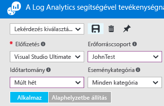
5. Most kattintson a **Rögzítés** gombra.

    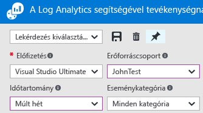

    Az útmutatóban szereplő legtöbb nézet rögzíthető az irányítópulton. Ezt kihasználva létrehozhat egy olyan információs felületet, amelyet egyetlen forrásként használhat a szolgáltatásai működési adataihoz.
6. Térjen vissza az irányítópulthoz. Láthatja, hogy a lekérdezés (és az eredmények száma) megjelenik az irányítópulton. Ez akkor hasznos, ha azt szeretné, gyorsan megtekintheti az előfizetésében nemrég történt magas-profil műveleteket, például egy új szerepkört rendelték, vagy egy virtuális gép törölve lett.

    
7. Térjen vissza a **Monitor** csempére, majd kattintson a **Metrikák** szakaszra. Először válasszon ki egy erőforrástípust a szűrés, majd válassza a legördülő lista beállítások segítségével az oldal tetején.

    

    Minden Azure-erőforrás szolgáltat [**metrikákat**](monitoring-overview-metrics.md). Ez a nézet egyetlen panelen gyűjti össze az összes metrikát, így Ön könnyen elemezheti az erőforrások működését. Emellett, olvassa el a márka [élmény diagramkészítési új mérőszám](https://aka.ms/azuremonitor/new-metrics-charts) kattintva a **metrikák (előzetes verzió)** fülre.
8. A kijelölt erőforrás az összes elérhető metrikák a lap bal oldalán jelennek meg. A metrikák kiválasztásával, illetve a diagram típusának és az időtartománynak a módosításával egyszerre több metrikát is ábrázolhat. Az adott erőforráshoz beállított összes metrikariasztást is megtekintheti.

    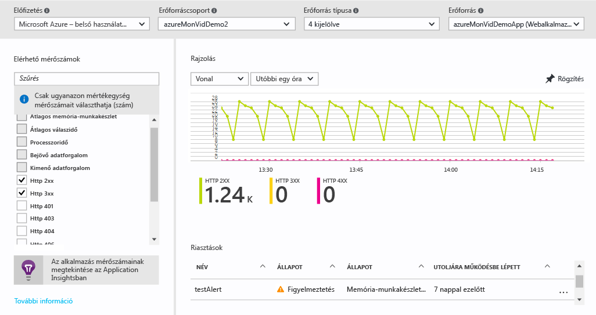

   > [!NOTE]
   > Bizonyos metrikák csak akkor érhetők el, ha engedélyezi az [Application Insights](../application-insights/app-insights-overview.md) és/vagy a Windows- vagy Linux-alapú Azure Diagnostics szolgáltatást az erőforráson.
   >
   >
9. Ha a megjelenített diagrammal elégedett, a **Rögzítés** gombbal rögzítheti az irányítópulton.
10. Lépjen vissza **figyelő** kattintson **diagnosztikai naplók**.

    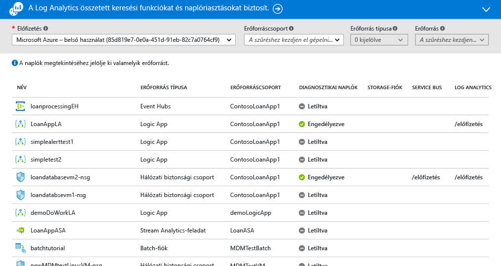

    A [**diagnosztikai naplók**](monitoring-overview-of-diagnostic-logs.md) olyan, egy-egy erőforrás *által* létrehozott naplók, amelyek az adott erőforrás műveleteire vonatkozó adatokkal szolgálnak. Például a hálózati biztonsági csoportok szabályainak számlálói, illetve a Logic Apps-munkafolyamatok naplói is a diagnosztikai naplók egy-egy típusát képezik. Ezek a naplók tárolhatók egy tárfiókban, közvetíthetők egy eseményközpontba, és/vagy elküldhetők a [Log Analytics](../log-analytics/log-analytics-overview.md) szolgáltatásba. A Log Analytics a Microsoft speciális keresésekhez és riasztásokhoz használható operatív információs terméke.

    A portálon megjelenítheti és szűrheti az előfizetés összes erőforrását annak megállapításához, hogy engedélyezve vannak-e ezekhez a diagnosztikai naplók.
11. Kattintson a diagnosztikai naplók lap az erőforráshoz. Ha a diagnosztikai naplókat egy tárfiókban tárolja, látni fogja az óránként létrehozott naplók listáját, és közvetlenül innen le is töltheti őket.

    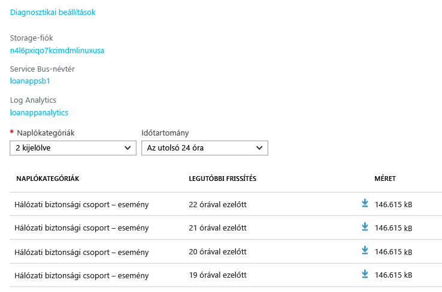

    A **Diagnosztikai beállítások** lehetőségre kattintva beállíthatja vagy módosíthatja a tárfiókba való archiválás, az Event Hubs szolgáltatásba való streaming vagy a Log Analytics munkaterületére való küldés beállításait.

    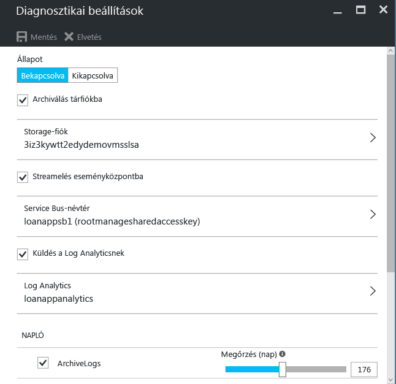

    Ha a diagnosztikai naplóknak a Log Analytics szolgáltatásba való elküldését állította be, akkor a naplók között a portál **Naplók keresése** területén kereshet.
12. Keresse meg a **riasztások** figyelő lap részében.

    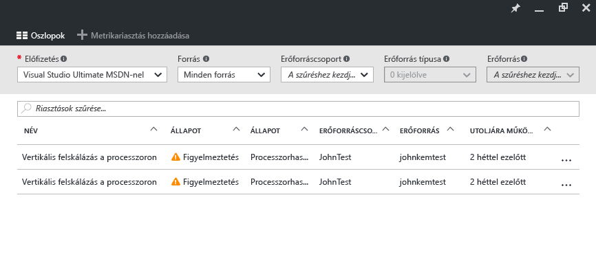

    Itt kezelheti az Azure-erőforrások összes [**riasztását**](monitoring-overview-alerts.md). Ez magában foglalja a riasztások a metrikákat, naplózási eseményeket, az Application Insights webalkalmazás-tesztek (hely) és az Application Insights proaktív diagnosztika. A riasztások küldhetnek e-mailt vagy egy HTTP POST-ot egy webhook URL-címre.
13. Kattintson az **Add metric alert** (Metrikariasztás hozzáadása) lehetőségre riasztás létrehozásához.

    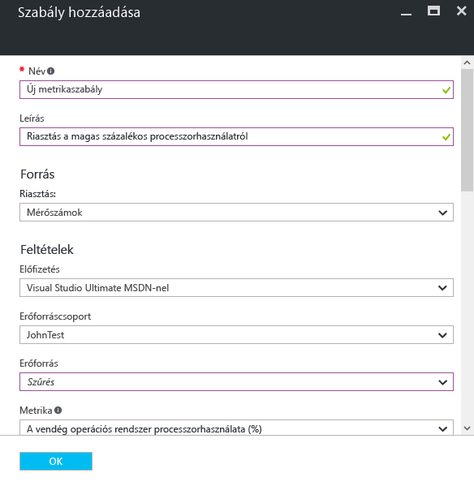

    A riasztásokat ezután az irányítópulton rögzítheti, így bármikor egyszerűen megtekinthető az állapotuk.

    Az Azure figyelő most is rendelkezik [ **közel valós idejű metrika riasztások**](https://aka.ms/azuremonitor/near-real-time-alerts)(előzetes verzió), amely a lehető percenként gyakorisággal értékelhetők!
    
14. A Monitor terület emellett [Application Insights](../application-insights/app-insights-overview.md)-alkalmazásokra és [Log Analytics](../log-analytics/log-analytics-overview.md) felügyeleti megoldásokra mutató hivatkozásokat is tartalmaz. Ezek az egyéb Microsoft-termékek szervesen az Azure Monitor szolgáltatásba vannak integrálva.
15. Ha nem használja az Application Insights vagy a Log Analytics szolgáltatást, az Azure Monitor valószínűleg jelenlegi figyelési, naplózási és riasztási termékeivel működik együtt. Partnereink teljes listájához, illetve az integrálásra vonatkozó utasításokhoz tekintse meg [partneroldalunkat](monitoring-partners.md).

Ha a fenti lépéseket követi, és az összes releváns csempét rögzíti az irányítópulton, alkalmazásairól és infrastruktúrájáról ehhez hasonló átfogó nézeteket hozhat létre:

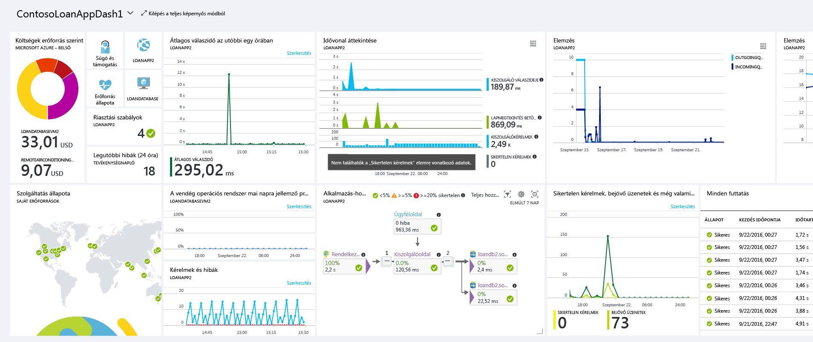

## További lépések
* Olvassa el [az Azure Monitort áttekintő](monitoring-overview.md)cikket.
