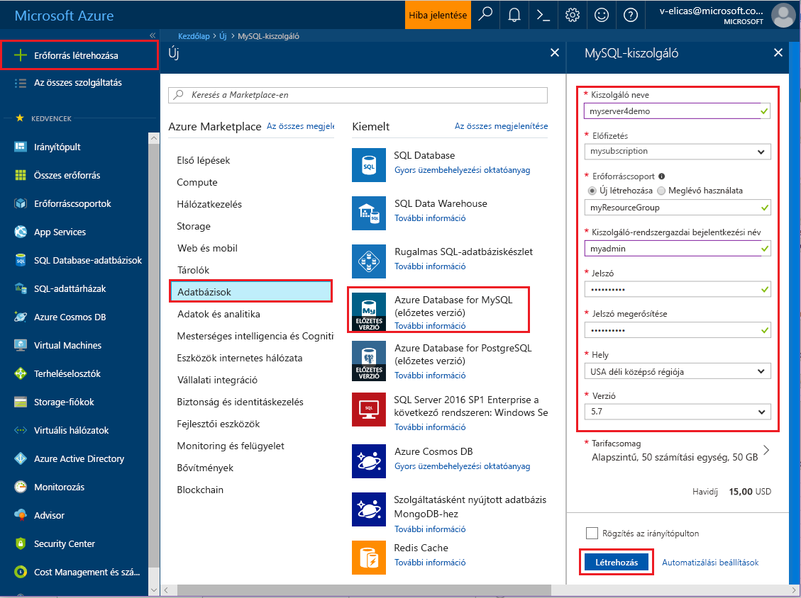
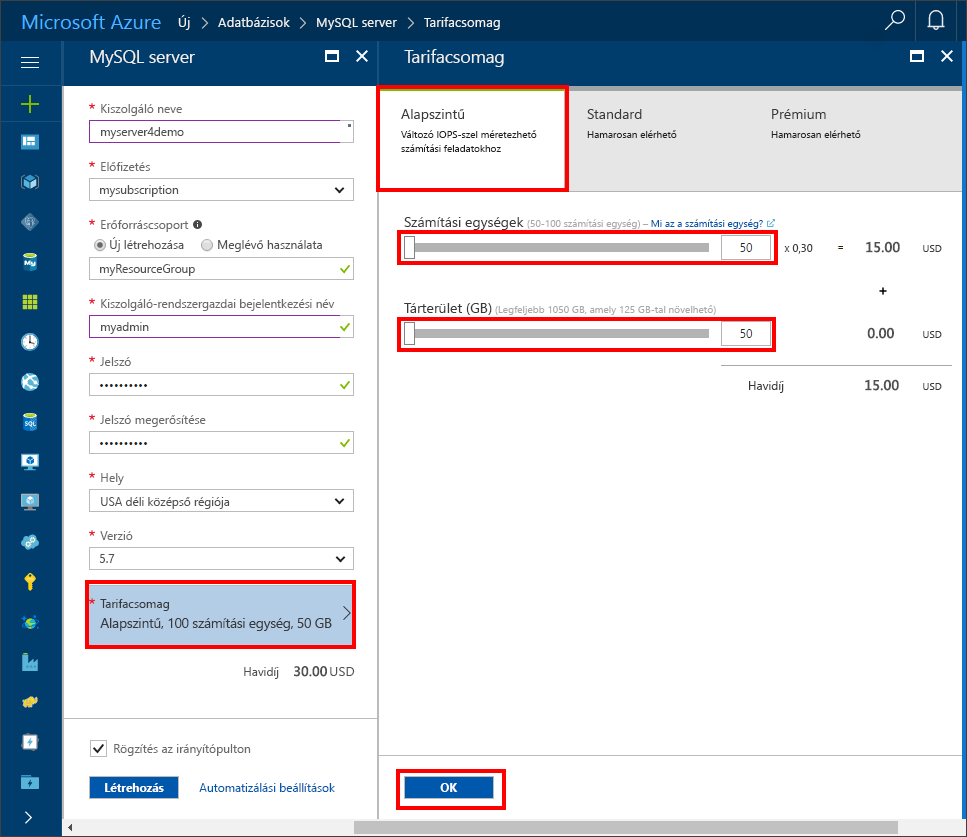
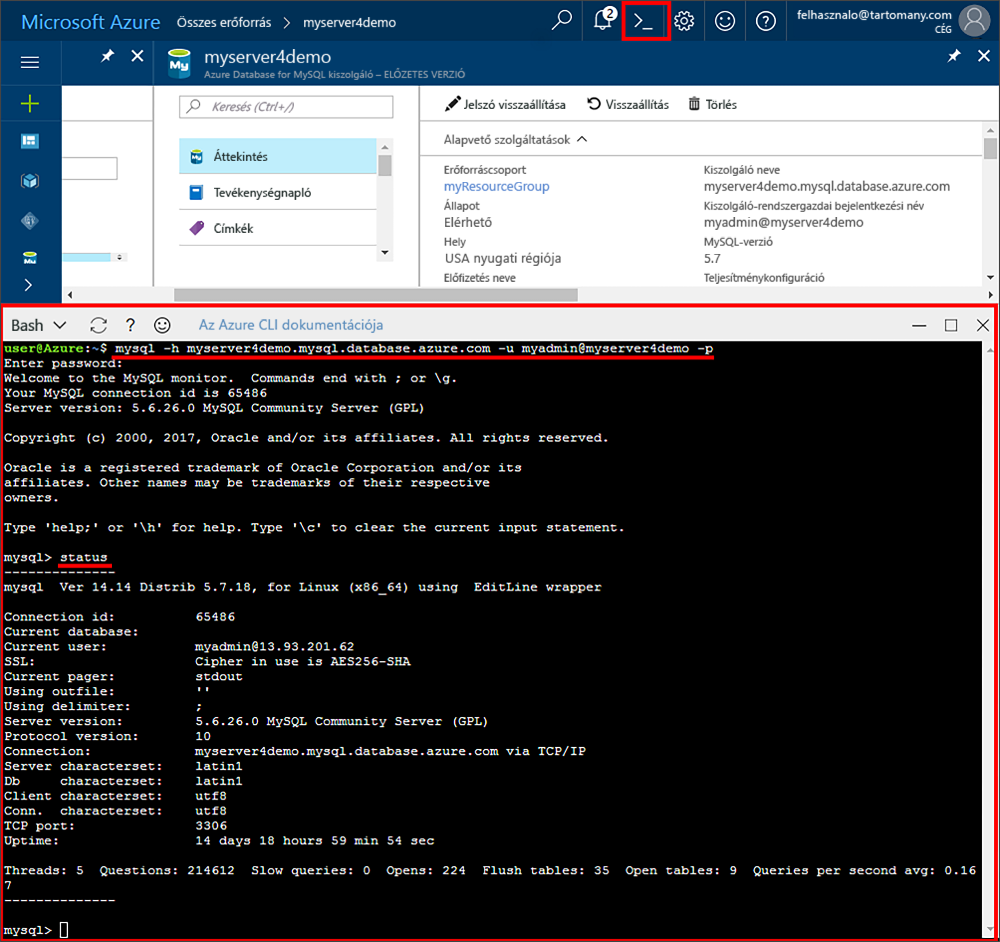

# <a name="create-an-azure-database-for-mysql-server-using-azure-portal"></a>Azure-adatbázis létrehozása MySQL-kiszolgálóhoz az Azure Portal használatával
Ez a cikk lépésről lépésre bemutatja, hogyan hozhat létre egy MySQL-kiszolgálóhoz készült Azure Database szolgáltatást az Azure Portal használatával öt perc alatt. 

Ha nem rendelkezik Azure-előfizetéssel, első lépésként mindössze néhány perc alatt létrehozhat egy [ingyenes](https://azure.microsoft.com/free/) fiókot.

## <a name="log-in-to-azure"></a>Jelentkezzen be az Azure-ba
Nyissa meg a webböngészőjét, és keresse fel a [Microsoft Azure Portalt](https://portal.azure.com/). Adja meg a hitelesítő adatait a Portalra való bejelentkezéshez. Az alapértelmezett nézet a szolgáltatási irányítópult.

## <a name="create-azure-database-for-mysql-server"></a>Azure-adatbázis létrehozása MySQL-kiszolgálóhoz
1. Kattintson az Azure Portal bal felső sarkában található **Új** gombra.

2. Az **Új** panelen válassza az **Adatbázisok** lehetőséget, majd az **Adatbázisok** panelen válassza az **Azure Database MySQL-kiszolgálóhoz** lehetőséget. Az Új oldal keresőmezőbe be is írhatja a **MySQL** szöveget, hogy gyorsan megtalálja a szolgáltatást.


3. Töltse ki az új kiszolgáló adatai űrlapot a következő információkkal az előző képen látható módon:

| **Beállítás** | **Ajánlott érték** | **Mező leírása** |
|---|---|---|
| *Kiszolgálónév* | myserver4demo  | A kiszolgálónévnek globálisan egyedinek kell lennie. |
| *Előfizetés* | mysubscription | Válassza ki előfizetését a legördülő listából. |
| *Erőforráscsoport* | myResourceGroup | Hozzon létre erőforráscsoportot, vagy használjon egy meglévőt. |
| *Kiszolgálói rendszergazdai bejelentkezés* | myadmin | Adjon meg egy fióknevet a MySQL-motor rendszergazdájának. |
| *Jelszó* |  | Állítson be erős jelszót a rendszergazdafiókhoz. |
| *Jelszó megerősítése* |  | Erősítse meg a rendszergazdafiók jelszavát. |
| *Hely* |  | Válasszon a rendelkezésre álló régiók közül. |
| *Verzió* | 5.7 | Válassza ki a legújabb verziót. |
| *Tarifacsomag* | Alapszintű, 50 számítási egység, 50 tárhely (GB)  | Válassza ki a **Tarifacsomagot**, a **Számítási egységek** számát, a GB-ban mért **Tárterületet** , majd kattintson az **OK** gombra. |
| *Rögzítés az irányítópulton* | Jelölőnégyzet | Ajánlott bejelölni a jelölőnégyzetet, hogy a kiszolgáló később könnyen megtalálható legyen |

   Kattintson a **Tarifacsomag** parancsra az új adatbázis tarifacsomagjának és teljesítményszintjének megadásához. Ehhez a rövid útmutatóhoz válassza az Alapszintű szolgáltatásszintet, 50 Számítási egységet, és a szolgáltatási keretbe foglalt 50 GB tárterületet. Ez után kattintson az **OK**gombra a tarifacsomag mentéséhez.
   
   

   Ezt követően kattintson a **Create** (Létrehozás) gombra. Egy-két percen belül már fut a felhőben egy új, a MySQL-hez készült Azure Database. Ha figyelni szeretné az üzembe helyezés folyamatát, kattintson az **Értesítések** gombra (harang ikon) az eszköztárban.

## <a name="configure-the-firewall"></a>A tűzfal konfigurálása
Mielőtt először csatlakozna a MySQL-hez készült Azure Database-hez, konfigurálja a tűzfalat, és adja hozzá az ügyfél nyilvános hálózati IP-címét (vagy IP-címtartományát) az engedélyezési listához.

1. Miután befejeződött a telepítés, kattintson az **Összes erőforrás** lehetőségre a bal oldali menüben, és írja be a **myserver4demo** nevet az újonnan létrehozott kiszolgáló megkereséséhez. Kattintson a keresési eredményekben listázott kiszolgálónévre. Megnyílik a kiszolgáló Áttekintés oldala, amely további konfigurációs lehetőségeket biztosít.

2. A kiszolgáló panelen válassza a **Kapcsolatbiztonság** elemet.

3. Kattintson az **IP-címem hozzáadása** elemre, a helyi számítógép IP-címének hozzáadásához, vagy IP-címek tartományának konfigurálásához. Ne felejtsen a **Mentés** gombra kattintani, miután létrehozta a szabályokat.
  

## <a name="get-connection-information"></a>Kapcsolatadatok lekérése
Kérje le az Azure MySQL-kiszolgáló teljes tartománynevét az Azure Portalon. Használja a teljes tartománynevet a kiszolgálóhoz való kapcsolódáshoz a **mysql.exe** parancssori eszköz segítségével.

1.  Az [Azure Portalon](https://portal.azure.com/) kattintson a **Minden erőforrás** elemre a baloldali menüben, majd kattintson az Azure-adatbázis MySQL-kiszolgálóhoz elemre.

2.  Kattintson a **Tulajdonságok** elemre. Jegyezze fel a **KISZOLGÁLÓNÉV** és a **KISZOLGÁLÓI RENDSZERGAZDAI BEJELENTKEZÉS** értékeit.
Ebben a példában a kiszolgáló neve *myserver4demo.mysql.database.azure.com*, a kiszolgáló-rendszergazdai bejelentkezési név pedig *myadmin@myserver4demo*.

## <a name="connect-to-the-server-using-mysqlexe-command-line-tool"></a>Csatlakozás a kiszolgálóhoz a mysql.exe parancssori eszköz használatával
A MySQL-hez készült Azure Database-kiszolgálóhoz a [mysql parancssori eszköz](https://dev.mysql.com/doc/refman/5.7/en/mysql.html) használatával kapcsolódhat. A mysql parancssori eszköz a böngészőben az Azure Cloud Shell használatával, a saját számítógépen pedig a helyileg telepített mysql eszközök használatával futtatható. Az Azure Cloud Shell indításához kattintson a(z) `Try It` gombra ennek a cikknek valamelyik kódblokkjában vagy az [Azure Portal](https://portal.azure.com) jobb felső eszköztárának `>_` ikonjára. 

1. Gépelje be a parancsot a csatlakozáshoz:
```azurecli-interactive
mysql -h myserver4demo.mysql.database.azure.com -u myadmin@myserver4demo -p
```

2. A kiszolgáló állapotát megvizsgálva győződjön meg róla, hogy a kapcsolat működik. A csatlakozás után gépelje be a következő parancsot a mysql > parancssorba: `status`.
```sql
status
```

   

   > [!TIP]
   > További parancsokról a [MySQL 5.7 referencia-kézikönyvének 4.5.1 fejezetében](https://dev.mysql.com/doc/refman/5.7/en/mysql.html) tájékozódhat.

3. Üres adatbázis létrehozásához gépelje be a következő parancsot a mysql > parancssorba: `CREATE DATABASE`.

   ```sql
   CREATE DATABASE quickstartdb;
   ```

   Egy MySQL-hez készült Azure Database-en belül egy vagy több adatbázist is fenntarthat. Dönthet úgy, hogy az erőforrások teljes kihasználása érdekében kiszolgálónként egy adatbázist hoz létre, vagy úgy, hogy több adatbázis létrehozásával megosztja az erőforrásokat. A létrehozható adatbázisok száma nincs korlátozva, de több adatbázis ugyanazokon a kiszolgáló-erőforrásokon osztozik.  

4. Az adatbázisok listája a mysql> parancssorba beírt `SHOW DATABASES` paranccsal érhető el.

   ```sql
   SHOW DATABASES;
   ```

## <a name="connect-to-the-server-using-the-mysql-workbench-gui-tool"></a>Csatlakozás a kiszolgálóhoz a MySQL Workbench GUI eszköz használatával
1.  Indítsa el a MySQL Workbench alkalmazást az ügyfélszámítógépen. A MySQL Workbench-et [innen](https://dev.mysql.com/downloads/workbench/) töltheti le és telepítheti.

2.  Az **Új kapcsolat létrehozása** párbeszédpanelen adja meg a következő információkat a **Paraméterek** lapon:

   

| **Beállítás** | **Ajánlott érték** | **Mező leírása** |
|---|---|---|
|   *Kapcsolat neve* | Bemutató kapcsolat| Adjon meg egy címkét a kapcsolathoz. |
| *Csatlakozási módszer* | Standard (TCP/IP) | A Standard (TCP/IP) elégséges. |
| *Állomásnév* | myserver4demo.mysql.database.azure.com | Használja a teljes kiszolgálónevet. |
| *Port* | 3306 | Használja az alapértelmezett 3306-os portot. |
| *Felhasználónév* | myadmin@myserver4demo  | Adja meg a korábban feljegyzett rendszergazda-fióknevet egy @ karakterrel és a kiszolgáló nevével. |
| *Jelszó* | az ön jelszava | A jelszó mentéséhez kattintson a Tárolás a tárolóban... gombra. |

Kattintson a **Kapcsolat tesztelése** lehetőségre, hogy tesztelje, minden paraméter helyesen lett-e konfigurálva. A kapcsolat mentéséhez kattintson az OK gombra. 

> [!NOTE]
> Alapértelmezés szerint az SSL kényszerítve van a kiszolgálón, és további konfigurációt igényel a sikeres csatlakozás érdekében. Lásd [SSL-összekapcsolhatóság konfigurálása az alkalmazásban a MySQL Azure-adatbázisához való biztonságos kapcsolódás érdekében](./howto-configure-ssl.md).  Ha ebben az útmutatóban le szeretné tiltani az SSL-t, kattintson az Azure Portal Kapcsolatbiztonság lapján letilthatja az SSL-kapcsolat kényszerítése váltógombot.

## <a name="clean-up-resources"></a>Az erőforrások eltávolítása
Távolítsa el a rövid útmutató során létrehozott összes erőforrást az [Azure-erőforráscsoport](../azure-resource-manager/resource-group-overview.md) törlésével.

> [!TIP]
> Az ebben a gyűjteményben lévő többi rövid útmutató erre a rövid útmutatóra épül. Ha azt tervezi, hogy az ezt követő rövid útmutatókkal dolgozik tovább, akkor ne törölje az ebben a rövid útmutatóban létrehozott erőforrásokat. Ha nem folytatja a munkát, akkor a következő lépésekkel törölheti az Azure Portalon a rövid útmutatóhoz létrehozott összes erőforrást.

1.  Az Azure Portal bal oldali menüjében kattintson az **Erőforráscsoportok** lehetőségre, majd kattintson a **myresourcegroup** elemre.
2.  Az erőforráscsoport oldalán kattintson a **Törlés** elemre, írja be a **myresourcegroup** szöveget a szövegmezőbe, majd kattintson a Törlés gombra.

Ha törölni szeretné az újonnan létrehozott kiszolgálót:
1.  Az Azure Portal bal oldali menüjében kattintson a PostgreSQL-kiszolgálók elemre, és keressen rá az imént létrehozott kiszolgálóra
2.  Az Áttekintés lap felső,  paneljén kattintson a Törlés gombra
3.  Erősítse meg a törölni kívánt kiszolgáló nevét, és jelenítse meg az érintett adatbázisokat. Írja be a **myserver4demo** szöveget a szövegmezőbe, és kattintson a Törlés gombra.


## <a name="next-steps"></a>Következő lépések

> [!div class="nextstepaction"]
> [Az első Azure-adatbázis MySQL-adatbázishoz megtervezése](./tutorial-design-database-using-portal.md)


