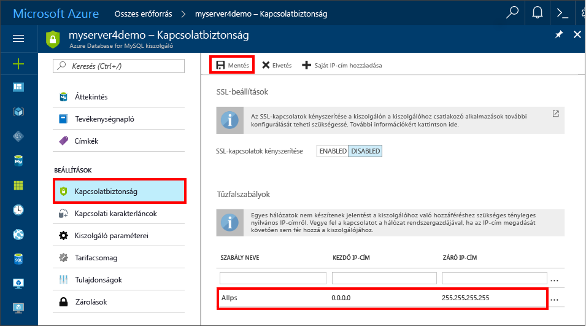

# <a name="create-an-azure-database-for-mysql-server-using-azure-portal"></a>Azure-adatbázis létrehozása MySQL-kiszolgálóhoz az Azure Portal használatával

Ez a cikk lépésről lépésre bemutatja, hogyan hozhat létre egy minta Azure-adatbázist MySQL-kiszolgálóhoz az Azure Portal használatával öt perc alatt. 

Ha nem rendelkezik Azure-előfizetéssel, első lépésként mindössze néhány perc alatt létrehozhat egy [ingyenes](https://azure.microsoft.com/free/) fiókot.

## <a name="log-in-to-azure"></a>Jelentkezzen be az Azure-ba
Nyissa meg a webböngészőjét, és keresse fel a [Microsoft Azure Portalt](https://portal.azure.com/). Adja meg a hitelesítő adatait a Portalra való bejelentkezéshez. Az alapértelmezett nézet a szolgáltatási irányítópult.


## <a name="create-azure-database-for-mysql-server"></a>Azure-adatbázis létrehozása MySQL-kiszolgálóhoz

1. Navigáljon az **Adatbázisok** > **MySQL** elemhez. Ha nem találja az Azure-adatbázis MySQL-kiszolgálóhoz elemet az **Adatbázisok** kategória alatt, kattintson az **Összes megtekintése** lehetőségre az összes elérhető adatbázis-szolgáltatás megjelenítéséhez. A keresőmezőbe írja be a **MySQL** szöveget, hogy gyorsan megtalálja a szolgáltatást.


2. Kattintson a **MySQL** ikonra, majd a **Létrehozás** elemre.
A példánkhoz töltse ki az Azure-adatbázis MySQL-hez oldalt a következő információkkal:

| **Űrlapmező** | **Mező leírása** |
|----------------|-----------------------|
| *Kiszolgálónév* | mysqlserver4demo (a kiszolgáló neve globálisan egyedi) |
| *Előfizetés* | MySQLaaS (válassza ki a legördülő listából) |
| *Erőforráscsoport* | myresource (hozzon létre egy új erőforráscsoportot vagy használjon egy meglévőt) |
| *Kiszolgálói rendszergazdai bejelentkezés* | myadmin (állítsa be a rendszergazdafiók nevét) |
| *Jelszó* | állítsa be a rendszergazdafiók jelszavát |
| *Jelszó megerősítése* | erősítse meg a rendszergazdafiók jelszavát |
| *Hely* | Észak-Európa (válasszon az **Észak-Európa** vagy az **USA nyugati régiója** lehetőségek közül) |
| *Verzió* | 5.6 (válassza ki a MySQL-kiszolgáló verzióját) |
| *Teljesítmény konfigurálása* | Alapszintű (válassza ki a **Teljesítményszintet**, **Számítási egységek** számát, a **Tárterületet**, majd kattintson az **OK** gombra) |


Néhány perc múlva a rendszer üzembe helyezi és futtatja az Azure-adatbázist MySQL-kiszolgálóhoz. Ha figyelni szeretné az üzembe helyezés folyamatát, kattintson az **Értesítések** gombra (harang ikon) az eszköztárban.

> [!TIP]
> Ajánlott az Azure-szolgáltatásokat ugyanabba a régióba helyezni, és az Önhöz legközelebbi helyet választani. Ezenkívül bejelölheti a **Rögzítés az irányítópulton** lehetőséget, hogy egyszerűen nyomon követhesse az üzembe helyezést.

## <a name="configure-the-firewall"></a>A tűzfal konfigurálása
Mielőtt először csatlakozna a MySQL-hez készült Azure Database-hez az ügyfélszámítógépről, konfigurálja a tűzfalat, és adja hozzá az ügyfél nyilvános hálózati IP-címét (vagy IP-címtartományát) az engedélyezési listához.

1. Kattintson az újonnan létrehozott kiszolgálóra, majd kattintson a **Beállítások** elemre.
  

2. Az **Általános** szakaszban kattintson a **Tűzfal beállítások** lehetőségre. Kattintson az **IP-címem hozzáadás** elemre, a számítógép IP-címének hozzáadásához, vagy az IP-címek tartományának konfigurálásához. Ne felejtsen a **Mentés** gombra kattintani, miután létrehozta a szabályokat.
  

## <a name="get-connection-information"></a>Kapcsolatadatok lekérése
Kérje le az Azure MySQL-kiszolgáló teljes tartománynevét az Azure Portalon. Használja a teljes tartománynevet a kiszolgálóhoz való kapcsolódáshoz a **mysql.exe** parancssori eszköz segítségével.

1.    Az [Azure Portalon](https://portal.azure.com/) kattintson a **Minden erőforrás** elemre a baloldali menüben, majd kattintson az Azure-adatbázis MySQL-kiszolgálóhoz elemre.

2.    Kattintson a **Tulajdonságok** elemre. Jegyezze fel a **KISZOLGÁLÓNÉV** és a **KISZOLGÁLÓI RENDSZERGAZDAI BEJELENTKEZÉS** értékeit.
Ebben a példában a kiszolgáló neve *mysql4doc.database.windows.net*, a Kiszolgáló-rendszergazdai bejelentkezési név pedig *mysqladmin@mysql4doc*.

## <a name="connect-to-the-server-using-mysqlexe-command-line-tool"></a>Csatlakozás a kiszolgálóhoz a mysql.exe parancssori eszköz használatával
A MySQL-kiszolgálón belül több adatbázist is létrehozhat. A létrehozható adatbázisok száma nincs korlátozva, de több adatbázis ugyanazokon a kiszolgáló-erőforrásokon osztozik.  Ha a **mysql.exe** parancssori eszköz használatával szeretne a kiszolgálóhoz kapcsolódni, nyissa meg az **Azure Cloud Shell-t** a Portalon, és adja meg a következőt:

1. Csatlakozás a kiszolgálóhoz a **mysql** parancssori eszköz használatával:
```dos
 mysql -h mysqlserver4demo.database.windows.net -u myadmin@mysqlserver4demo -p
```

2. Kiszolgáló állapotának megtekintése:
```dos
 mysql> status
```
  

> [!TIP]
> További parancsokról a [MySQL 5.6 referencia-kézikönyvének 4.5.1 fejezetében](https://dev.mysql.com/doc/refman/5.6/en/mysql.html) tájékozódhat.

## <a name="connect-to-the-server-using-the-mysql-workbench-gui-tool"></a>Csatlakozás a kiszolgálóhoz a MySQL Workbench GUI eszköz használatával
1.    Indítsa el a MySQL Workbench alkalmazást az ügyfélszámítógépen. A MySQL Workbench-et [innen](https://dev.mysql.com/downloads/workbench/) töltheti le és telepítheti.

2.    Az **Új kapcsolat létrehozása** párbeszédpanelen adja meg a következő információkat a **Paraméterek** lapon:

| **Paraméterek** | **Leírás** |
|----------------|-----------------|
|    *Kapcsolat neve* | adja meg a kapcsolat nevét (ez bármi lehet) |
| *Csatlakozási módszer* | válassza a Standard (TCP/IP) lehetőséget |
| *Állomásnév* | mycliserver.database.windows.net (a korábban lejegyzett kiszolgálónév) |
| *Port* | 3306 |
| *Felhasználónév* | myadmin@mycliserver (a korábban lejegyzett kiszolgáló-rendszergazdai bejelentkezési név) |
| *Jelszó* | a rendszergazdafiók jelszavát a tárolóban tárolhatja |


3.    Kattintson a **Kapcsolat tesztelése** lehetőségre, hogy tesztelje, minden paraméter helyesen lett-e konfigurálva.

4.    A létrehozott kapcsolatra kattintva mos már kapcsolódhat a kiszolgálóhoz.

> Alapértelmezés szerint az SSL kényszerítve van a kiszolgálón, amely további konfigurációt igényel a sikeres csatlakozás érdekében. Lásd [SSL-összekapcsolhatóság konfigurálása az alkalmazásban a MySQL Azure-adatbázisához való biztonságos kapcsolódás érdekében](./howto-configure-ssl.md).  Ha ki szeretné kapcsolni az SSL-t ehhez a rövid útmutatóhoz, a Portalon a „Kapcsolatbiztonság” lehetőségnél kikapcsolhatja az SSL kényszerítését.

## <a name="clean-up-resources"></a>Az erőforrások eltávolítása

Ha ezekre az erőforrásokra már nincs szüksége más útmutatókhoz/oktatóanyagokhoz, az alábbiak szerint törölheti azokat:

1. Az Azure Portal baloldali menüjében kattintson az **Erőforráscsoportok** lehetőségre, majd kattintson a **myresource** elemre. 
2. Az erőforráscsoport oldalán kattintson a **Törlés** elemre, írja be a **myresource** szöveget a szövegmezőbe, majd kattintson a **Törlés** gombra.

## <a name="next-steps"></a>Következő lépések

> [!div class="nextstepaction"]
> [Az első Azure-adatbázis MySQL-adatbázishoz megtervezése](./tutorial-design-database-using-portal.md)


