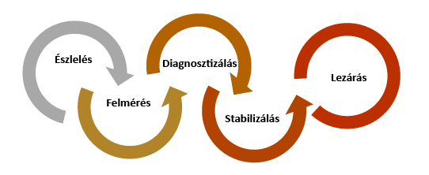
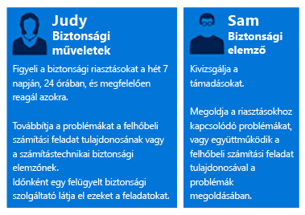
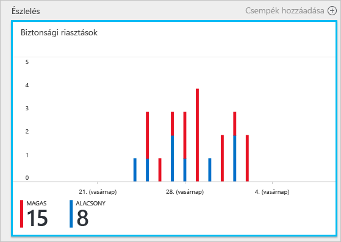
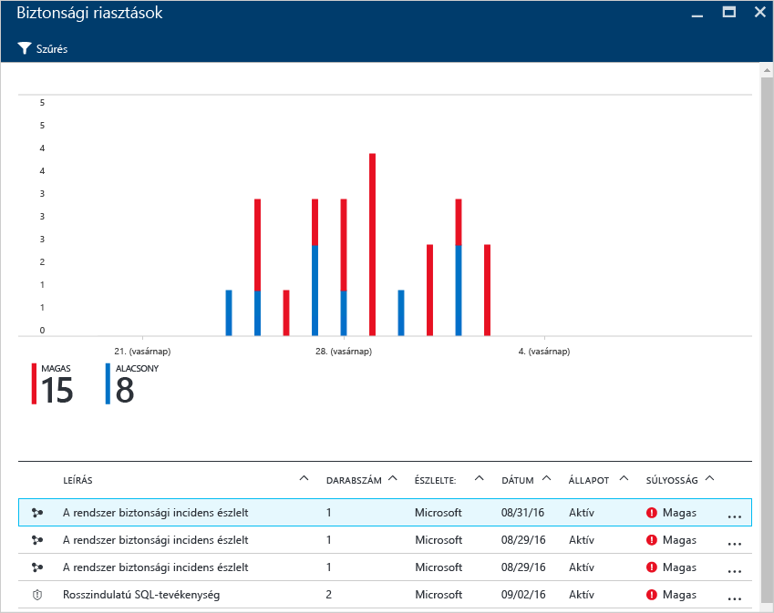
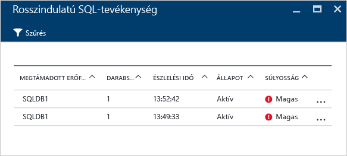
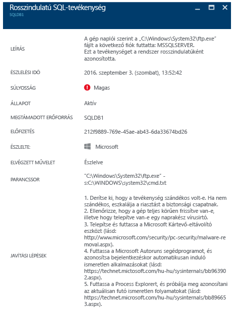

# Az Azure Security Center használata incidensek megoldásához
Sok szervezet csak akkor tanulja meg, hogyan reagáljon a biztonsági incidensekre, miután támadás érte. A költségek és a kár csökkentése érdekében fontos, hogy még a támadás megtörténése előtt legyen kész terv az incidensek megoldására. Az Azure Security Center jól használható az incidensmegoldás különböző szakaszaiban.

## Incidensmegoldás
A terv hatékonysága három alapképességtől függ: a védelmi képességtől, a fenyegetések észlelésének, illetve elhárításának képességétől. A védelem az incidensek megelőzését, az észlelés a fenyegetések korai felismerését, az elhárítás pedig a támadó kizárását és a rendszereknek az illetéktelen behatolás káros következményeinek csökkentése céljából történő helyreállítását jelenti. 

Ez a cikk a [Microsoft Azure Security Response in the Cloud](https://gallery.technet.microsoft.com/Azure-Security-Response-in-dd18c678) (A Microsoft Azure biztonsági megoldása a felhőben) című cikkben ismertetett biztonsági incidensmegoldási szakaszokat használja a következő ábrán látható módon:

A Security Center az észlelési, a felmérési és a diagnosztizálási szakaszban használható. Ismerje meg jobban az egyes szakaszokat. Az alábbiakban példát láthat arra, hogyan használható a Security Center a három kezdeti incidensmegoldási szakasz során:

* **Észlelés**: az eseményvizsgálat első jele
  * Példa: kezdeti ellenőrzése annak, hogy előfordult-e magas prioritású biztonsági riasztás a Security Center irányítópultján.
* **Felmérés**: az első vizsgálat végrehajtása a gyanús tevékenységgel kapcsolatos további információk összegyűjtéséhez.
  * Példa: további információk beszerzése a biztonsági figyelmeztetésről.
* **Diagnosztizálás**: technikai vizsgálat elvégzése, tartalmazottsági, kockázatcsökkentési és megoldási stratégiák meghatározása
  * Példa: kövesse a Security Center által az adott biztonsági riasztáshoz leírt hibaelhárítási lépéseket.

A következő forgatókönyv bemutatja, hogyan használható a Security Center a biztonsági incidensek észlelési, felmérési és diagnosztizálási/megoldási szakaszaiban.  A Security Centerben egy [biztonsági incidens](security-center-incident.md) az adott erőforráshoz tartozó összes olyan riasztás együttese, amelyek egy [támadási folyamatba](https://blogs.technet.microsoft.com/office365security/addressing-your-cxos-top-five-cloud-security-concerns/) illeszthetők. Ezek az incidensek megjelennek a [Security Alerts](security-center-managing-and-responding-alerts.md) (Biztonsági riasztások) csempén és panelen is. Az incidensek megnyitásakor megjelenik a kapcsolódó riasztások listája, amelyből további információkat kaphat az egyes riasztásokról. A Security Center is megjeleníti az önálló biztonsági riasztásokat, melyek segítségével nyomon követheti a gyanús tevékenységeket.

## Forgatókönyv
A Contoso nemrég áttelepített néhány helyi erőforrását az Azure rendszerbe, beleértve néhány virtuálisgép-alapú üzletági számítási feladatot és SQL-adatbázist. A Contoso alapvető számítógépes biztonsági incidensmegoldó csapatának (Core Computer Security Incident Response Team, CSIRT) problémái adódtak a biztonsági problémák kivizsgálásában, mivel a jelenlegi incidensmegoldási eszközeikbe nincs integrálva biztonsági intelligencia. Az integráció hiánya problémákat okoz az észlelési (túl sok hamis riasztás), illetve a felmérési és a diagnosztizálási szakasz során. Az áttelepítés részeként úgy döntöttek, hogy a probléma megoldásához igénybe veszik a Security Center segítségét. 

Az áttelepítés első fázisa az összes erőforrás előkészítése, és a Security Center által adott összes biztonsági javaslat teljesítése után befejeződött. A Contoso CSIRT a számítógépes biztonsági incidensek kezelésének központi eleme. A csapatot olyan személyek alkotják, akik biztonsági incidensek kezelésével foglalkoznak. A csapat tagjainak feladatai egyértelműen meg vannak határozva annak érdekében, hogy ne maradjon lefedetlen felelősségi terület. 

Ennél a forgatókönyvnél a Contoso CSIRT részét képező alábbi személyek szerepkörére fogunk összpontosítani:

Judit a biztonsági műveletek felelőse, és feladatai a következők:

* A biztonsági fenyegetések folyamatos figyelése és kezelése
* A problémák továbbítása szükség szerint a felhőbeli számítási feladatok tulajdonosának vagy a biztonsági elemzőnek

Sándor biztonsági elemző, és feladatai a következők:

* A támadások kivizsgálása
* A riasztások kezelése 
* Együttműködés a számítási feladatok tulajdonosaival a megoldások meghatározása és alkalmazása érdekében

Amint látja, Juditnak és Sándornak különböző feladatokat kell elvégezniük, és együtt kell működniük a Security Centertől kapott információkat megosztva. 

## Javasolt megoldás
Mivel Judit és Sándor különböző szerepkörrel rendelkezik, a Security Center különböző területeiről szerzik be a napi tevékenységükhöz szükséges információkat. Judit a napi figyeléshez a Biztonsági riasztások részt fogja használni. 

Judit a felderítési és felmérési szakaszban a biztonsági riasztásokat fogja használni. Miután Judit befejezte a kezdeti felmérést, továbbítja a problémát Sándornak, ha további vizsgálatra szükség. Ekkor Sándor a Security Center által nyújtott információk és néha más adatforrások felhasználásával tovább lép a diagnosztizálási szakaszba.

## A megoldás megvalósítása
Az alábbiakban bemutatjuk, hogyan használhatja az Azure Security Centert az incidensmegoldási forgatókönyvhöz, ezért követjük Judit lépéseit az észlelési és felmérési szakaszokban, majd megtekintjük, hogyan diagnosztizálja Sándor a problémát. 

### Az incidensmegoldás észlelési és felmérési szakaszai
Judit bejelentkezett az Azure portálra, és jelenleg a Security Center konzolján van. Napi figyelési tevékenysége részeként a következő lépések elvégzésével megkezdte a magas prioritású biztonsági riasztások áttekintését:

1. Kattintson a **Biztonsági riasztások** csempére, és nyissa meg a **Biztonsági riasztások** panelt.
    
   
   > [!NOTE]
   > Ebben az esetben Judit egy kártékony SQL-tevékenységre figyelmeztető riasztás kiértékelését készül elvégezni a fenti ábrán látható módon. 
   > 
   > 
2. Kattintson a **Kártékony SQL-tevékenység** riasztásra, és tekintse át a megtámadott erőforrásokat a **Kártékony SQL-tevékenység** panel:   lapján
   
    Ezen a panelen Judit feljegyzést készít a megtámadott erőforrásokról: hányszor fordult elő a támadás, illetve mikor észlelték.
3. Kattintson a **megtámadott erőforrásra**, hogy további információkat szerezzen a támadásról. 

Miután elolvasta a leírást, Judit meg van győződve arról, hogy ez nem hamis riasztás, és hogy az esetet továbbítania kell Sándornak.

### Az incidensmegoldás diagnosztizálási szakasza
Sándor megkapja az esetet Judittól, és elkezdi a Security Center által javasolt hibaelhárítási lépések áttekintését.

### További források
Az incidensmegoldó csapat is kihasználhatja a [Security Center Power BI](security-center-powerbi.md) képessége által nyújtott előnyöket, és megtekintheti a különböző típusú jelentéseket, amelyek a további kivizsgálás során segíthetnek a javaslatok és biztonsági riasztások megjelenítésében, elemzésében és szűrésében. A vizsgálat során a Biztonsági adatokat és eseményeket kezelő (Security Information and Event Management, SIEM) megoldást használó vállalatok a [Security Centert is integrálhatják saját megoldásukkal](security-center-integrating-alerts-with-log-integration.md). Az Azure naplói és a virtuális gép biztonsági eseményei szintén integrálhatók az [Azure naplóintegrációs eszközeivel](https://blogs.msdn.microsoft.com/azuresecurity/2016/07/21/microsoft-azure-log-integration-preview/). Ezek az adatok a Security Center által biztosított információkkal együtt felhasználhatók a támadások kivizsgálására.

## Összegzés
A szervezet számára nagyon fontos, hogy még az incidens bekövetkezte előtt összeállítsanak egy csapatot, amely pozitívan befolyásolja az incidensek kezelését. Ha a szervezet rendelkezik a megfelelő eszközökkel az erőforrások figyeléséhez, ez segítheti a csapatot abban, hogy megfelelő lépéseket tegyen a biztonsági incidensek elhárítása érdekében. A Security Center [észlelési képességei](security-center-detection-capabilities.md) segítséget nyújtanak az informatikai szakembereknek abban, hogy gyorsan reagáljanak a biztonsági incidensekre, és megoldják a biztonsági problémákat.

<!--HONumber=Sep16_HO4-->

