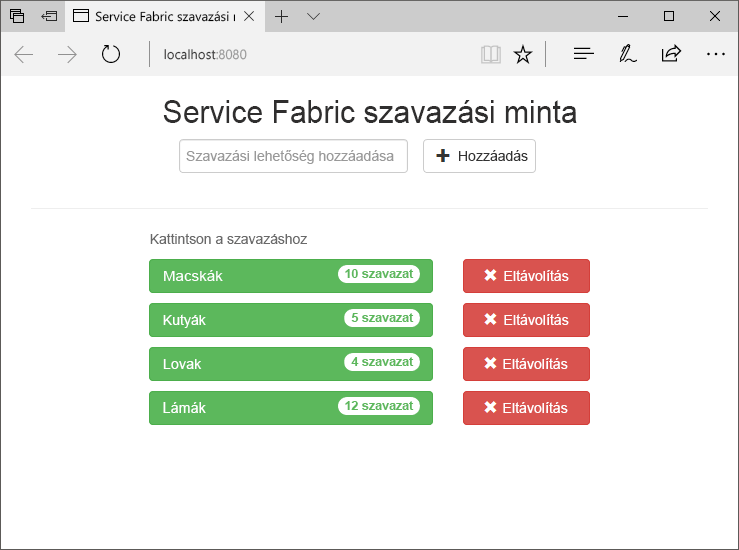
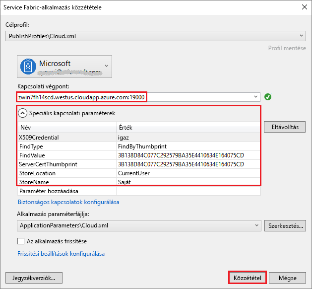

# <a name="create-a-net-service-fabric-application-in-azure"></a>.NET Service Fabric-alkalmazás létrehozása az Azure-ban
Az Azure Service Fabric egy elosztott rendszerplatform, amely skálázható és megbízható mikroszolgáltatások és tárolók üzembe helyezésére és kezelésére szolgál. 

A gyors üzembe helyezés az első Service Fabric .NET alkalmazás telepítésének módját ismerteti. Amikor végzett, hogy a szavazóalkalmazást az ASP.NET Core webes előtér-állapot-nyilvántartó háttér-szolgáltatás a fürt szavazó eredmények takarít meg, amely a.



Ezzel az alkalmazással megismerheti, hogyan:
> [!div class="checklist"]
> * Hozzon létre egy alkalmazást a .NET- és a Service Fabric
> * Az ASP.NET core használják egy előtér-webkiszolgáló
> * Az állapotalapú szolgáltatás alkalmazásadatainak tárolására
> * Az alkalmazás helyi hibakeresése
> * Telepítse központilag az alkalmazást az Azure-ban fürtre
> * Kibővített az alkalmazás több csomópont között
> * Alkalmazás a frissítéshez szükséges

## <a name="prerequisites"></a>Előfeltételek
A gyorsútmutató elvégzéséhez:
1. [Telepítse a Visual Studio 2017](https://www.visualstudio.com/) rendelkező a **Azure fejlesztési** és **ASP.NET és a webes fejlesztési** munkaterhelések.
2. [A Git telepítése](https://git-scm.com/)
3. [A Microsoft Azure Service Fabric SDK telepítése](http://www.microsoft.com/web/handlers/webpi.ashx?command=getinstallerredirect&appid=MicrosoftAzure-ServiceFabric-CoreSDK)
4. A következő parancsot a helyi Service Fabric-fürt központi telepítése a Visual Studio engedélyezése:
    ```powershell
    Set-ExecutionPolicy -ExecutionPolicy Unrestricted -Force -Scope CurrentUser
    ```

## <a name="download-the-sample"></a>A minta letöltése
Egy parancssorban a következő parancsot a helyi számítógépen, a minta app tárház klónozása.
```
git clone https://github.com/Azure-Samples/service-fabric-dotnet-quickstart
```

## <a name="run-the-application-locally"></a>Az alkalmazás helyi futtatása
Kattintson a jobb gombbal a Visual Studio ikonra a Start menüben, és válassza a **Futtatás rendszergazdaként**. Ahhoz, hogy a Hibakereső csatlakoztatása a szolgáltatások, a Visual Studio Futtatás rendszergazdaként kell.

Nyissa meg a **Voting.sln** klónozott tárház a Visual Studio-megoldáshoz.  

Alapértelmezés szerint a szavazási alkalmazás a 8080-as port figyelésére van beállítva.  Az alkalmazás port van megadva a */VotingWeb/PackageRoot/ServiceManifest.xml* fájlt.  Módosíthatja az alkalmazás port frissítésekor a **Port** attribútuma a **végpont** elemet.  Üzembe helyezését, és futtassa az alkalmazást helyileg, az alkalmazás port nyitott és elérhető a számítógépen kell lennie.  Ha megváltoztatja az alkalmazás portot, az új alkalmazás-port értékének helyettesítéséhez "8080" cikkben.

Az alkalmazás telepítéséhez, nyomja le az **F5**.

> [!NOTE]
> Az első alkalommal futtatja, és az alkalmazás központi telepítése a Visual Studio létrehozza a helyi fürthöz, a hibakereséshez. Ez a művelet eltarthat egy ideig. A fürt létrehozási állapota a Visual Studio kimeneti ablakában jelenik meg.  A kimenetben üzenet jelenik meg a "Az alkalmazás URL-címe nincs beállítva, vagy nem egy HTTP/HTTPS URL-címe, így a böngésző nem nyílik meg az alkalmazáshoz."  Ez az üzenet nem jelent hibát, de ez a böngésző fog nem automatikus indítású.

Ha a telepítés befejeződött, elindít egy böngészőt, és nyissa meg az ezen a lapon: `http://localhost:8080` – az alkalmazás előtér-webkiszolgáló.


Ezután hozzáadhat egy szavazás beállításainak, és indítsa el a szavazatok véve. Az alkalmazás fut, és az összes adatot tárol a Service Fabric-fürt egy másik adatbázist szükségessége nélkül.

## <a name="walk-through-the-voting-sample-application"></a>Végezze el a szavazó mintaalkalmazás
A szavazó alkalmazás két szolgáltatásból áll:
- Webes előtér-szolgáltatás (VotingWeb) – az ASP.NET Core webes előtér-szolgáltatás, a weblap szolgál, és tesz elérhetővé webes API-khoz a háttér-szolgáltatással való kommunikációra.
- Háttér-szolgáltatás (VotingData)-az ASP.NET Core webszolgáltatáshoz, amely közzétesz egy API-t, a megbízható szótárban az szavazattal eredmények tárolásához a lemezen maradnak.


Amikor az alkalmazás szavaz a következők történnek:
1. A JavaScript a szavazás kérést küld egy HTTP PUT-kérelmet, a a webes API-t a webes előtér-szolgáltatás.

2. A webes előtér-szolgáltatás egy proxy használatával keresse meg és a háttér-szolgáltatás egy HTTP PUT-kérelmet továbbítja.

3. A háttér-szolgáltatás időt vesz igénybe a bejövő kérelem, és tárolja a frissített eredmény megbízható szótár, amely lekérdezi a fürt több csomópontja replikálása, és a lemezen maradnak. Az alkalmazás adatokat tárolja a fürt így adatbázis szükséges.

## <a name="debug-in-visual-studio"></a>A Visual Studio hibakeresési
A Visual Studio alkalmazás nyomkövetésére használ egy helyi Service Fabric-fejlesztési fürtöt. Lehetősége van úgy, hogy adott esetben a hibakeresési felhasználói élmény. Ebben az alkalmazásban tároljuk adatok a háttér-szolgáltatásban egy megbízható szótár használatával. A Visual Studio eltávolítja az alkalmazás alapértelmezés szerint a hibakereső leállítása. Az alkalmazás eltávolítása azt eredményezi, az adatok a háttér-szolgáltatás is el kell távolítani. Az adatok között munkamenetek hibakeresés megőrizni, módosíthatja a **alkalmazás hibakeresési módban** meg tulajdonságként a **Voting** projektre a Visual Studio.

Nézze meg mi történik, a kódban, végezze el a következő lépéseket:
1. Nyissa meg a **VotesController.cs** fájlt, és állítson be egy töréspontot a webes API **Put** metódus (sor: 47) – a fájlt a Visual studióban a Solution Explorer kereshet.

2. Nyissa meg a **VoteDataController.cs** fájlt, és állítson be egy töréspontot ezen webes API **Put** metódus (sor 50).

3. Lépjen vissza a böngésző és szavazó lehetőségre, vagy adja hozzá egy új szavazó lehetőséget. A webalkalmazás első-a befejezési tartozó api-vezérlőben első töréspont kattint.
    - Ez azért, ahol a JavaScript a böngészőben egy kérést küld a webes API-vezérlőben az előtér-szolgáltatás.
    
    

    - Először a háttér-szolgáltatás URL-CÍMÉT a ReverseProxy azt összeállításához **(1)**.
    - Ezt követően nem küldeni a HTTP PUT kérés a ReverseProxy **(2)**.
    - Végül a rendszer visszaadja a már a válasz a háttér-szolgáltatásból az ügyfélnek **(3)**.

4. Nyomja le az **F5** folytatja
    - Ekkor a számítógép a töréspontot a háttér-szolgáltatásban.
    
    

    - A metódus első sorában **(1)** használjuk a `StateManager` nevű megbízható szótár felvétele, illetve `counts`.
    - A megbízható szótárban értékek minden interakció tranzakció, a használatával szükséges utasítás **(2)** hoz létre, hogy a tranzakció.
    - A tranzakció frissítjük majd a szavazó beállítás értékének a megfelelő kulcs értékét és véglegesíti a művelet **(3)**. Amikor a véglegesítési mód értéket ad vissza, az adatok frissítése a szótárban és replikálja a fürt többi tagján. Az adatok immár biztonságosan tárolja a fürt, és a háttér-szolgáltatás átveheti más csomópontokat, a rendelkezésre álló adatok továbbra is fennáll.
5. Nyomja le az **F5** folytatja

A hibakeresési munkamenetben leállításához nyomja le az **Shift + F5**.

## <a name="deploy-the-application-to-azure"></a>Az alkalmazás központi telepítése az Azure-ban
Telepítse központilag az alkalmazást, az Azure-ba, szüksége a Service Fabric-fürt, amely futtatja az alkalmazást. 

### <a name="join-a-party-cluster"></a>Csatlakozás fél fürthöz
A nyilvános fürtök ingyenes, korlátozott időtartamú Azure Service Fabric-fürtök, amelyek futtatását a Service Fabric csapata végzi, és amelyeken bárki üzembe helyezhet alkalmazásokat, és megismerkedhet a platform használatával. 

Jelentkezzen be és [csatlakozás egy Windows fürtnek](http://aka.ms/tryservicefabric). Ne feledje a **csatlakozási végpont** értéket, amely a következő lépéseket használatban van.

> [!Note]
> Alapértelmezés szerint a webes előtér-szolgáltatás figyelésére van beállítva a bejövő forgalmat a 8080-as porton. Meg nyitva a fél fürt a 8080-as porton.  Ha módosítania kell az alkalmazás port, módosítsa azt a portot a fél fürt megnyitott.
>

### <a name="deploy-the-application-using-visual-studio"></a>Telepítse központilag az alkalmazást a Visual Studio használatával
Az alkalmazást a létrehozása után telepítheti a fürtben, közvetlenül a Visual Studióból.

1. Kattintson a jobb gombbal **Voting** a Megoldáskezelőben kattintson **közzététel**. Ekkor megjelenik a Publish (Közzététel) párbeszédpanel.

    

2. Másolás a **csatlakozási végpont** az entitás fürt oldalról a **csatlakozási végpont** mezőben, majd kattintson a **közzététel**. Például: `winh1x87d1d.westus.cloudapp.azure.com:19000`.

    A fürt minden alkalmazáshoz egyedi nevet kell adni.  Entitás fürtök egy nyilvános, megosztott környezetben azonban, és előfordulhat, hogy egy meglévő alkalmazást ütközik.  Ha egy ütköző, nevezze át a Visual Studio-projektet, majd telepítse újra.

3. Nyissa meg egy böngészőt, és írja be a fürt címe foolowed által ": 8080-as ' a fürt – például az alkalmazás eléréséhez `http://winh1x87d1d.westus.cloudapp.azure.com:8080`. Meg kell jelennie az Azure-ban a fürtben futó alkalmazás.


## <a name="scale-applications-and-services-in-a-cluster"></a>Alkalmazások és szolgáltatások méretezése a fürtökben
A Service Fabric-szolgáltatások könnyen-szolgáltatásoknak a terhelés módosítására vonatkozó olyan fürtön belül lehet méretezni. A szolgáltatások méretezése a fürtben futó példányok számának módosításával történik. A szolgáltatások skálázás több módja van, használhatja a parancsfájlokat vagy parancsokat a PowerShell vagy a Service Fabric CLI (sfctl). A jelen példában használjuk Service Fabric Explorerben talál.

Service Fabric Explorer összes Service Fabric-fürt fut, és keresse meg azt a fürtök HTTP felügyeleti portra (19080), például egy böngészőből elérhető `http://winh1x87d1d.westus.cloudapp.azure.com:19080`.

A webes előtér-szolgáltatás méretezéséhez hajtsa végre a következő lépéseket:

1. Nyissa meg a Service Fabric Explorert a fürtben – például: `http://winh1x87d1d.westus.cloudapp.azure.com:19080`.
2. A három pont (három ponttal jelölt) elem mellett kattintson a **fabric: / Voting/VotingWeb** a TreeView vezérlő csomópont, és válassza **méretezési szolgáltatás**.

    

    Most már méretezheti a webes előtér-szolgáltatás példányainak számát.

3. Módosítsa a számot **2**-re, és kattintson a **Szolgáltatás méretezése** gombra.
4. Kattintson a a **fabric: / Voting/VotingWeb** csomópont a fanézetben a partíció csomópontot (GUID képviseli).

    

    Láthatja, hogy a szolgáltatás két példánya van, és a faszerkezetes nézetben látható a példányok futtassa mely csomópontok.

Ezzel az egyszerű felügyeleti eljárással megdupláztuk az előtér-szolgáltatás számára a felhasználói terhelések feldolgozásához rendelkezésre álló erőforrások mennyiségét. Fontos megérteni, hogy nincs szükség több példányra ahhoz, hogy a szolgáltatás megbízhatóan fusson. Ha egy szolgáltatás meghibásodik, a Service Fabric gondoskodik róla, hogy egy új szolgáltatáspéldány kezdjen futni a fürtben.

## <a name="perform-a-rolling-application-upgrade"></a>Alkalmazás a frissítéshez szükséges
Új frissítések az alkalmazáshoz való telepítésekor a Service Fabric bevezeti a frissítés egy biztonságos módon. Működés közbeni frissítés lehetővé teszi az állásidő nélkül hibákról kell és automatikus visszaállítási frissítése közben.

Az alkalmazás frissítéséhez tegye a következőket:

1. Nyissa meg a **Index.cshtml** fájlt a Visual Studio - kereshet a fájlt a Visual studióban a Solution Explorer.
2. Módosítsa a fejléc az oldalon szöveget – például hozzáadásával.
    ```html
        <div class="col-xs-8 col-xs-offset-2 text-center">
            <h2>Service Fabric Voting Sample v2</h2>
        </div>
    ```
3. Mentse a fájlt.
4. Kattintson a jobb gombbal **Voting** a Megoldáskezelőben kattintson **közzététel**. Ekkor megjelenik a Publish (Közzététel) párbeszédpanel.
5. Kattintson a **Manifest verzió** gombra kattintva módosíthatja a szolgáltatás és az alkalmazás verziója.
6. Verziójának módosítása a **kód** elem alatt **VotingWebPkg** "2.0.0", és kattintson a **mentése**.

    
7. Az a **Fabric-alkalmazás közzététele** párbeszédpanelt, ellenőrizze a frissítés az alkalmazás jelölőnégyzetet, majd **közzététel**.

    
8. Nyissa meg a böngészőt, és keresse meg a fürt címe 19080 - porton például `http://winh1x87d1d.westus.cloudapp.azure.com:19080`.
9. Kattintson a a **alkalmazások** csomópont a faszerkezetes nézetben, majd **folyamatban lévő frissítések** a jobb oldali ablaktáblában. Látni hogyan a verziófrissítés áthalad a frissítési tartományok a fürt meggyőződött arról, hogy minden egyes tartományhoz állapota kifogástalan, mielőtt továbblép a következő.
    

    A Service Fabric lesz frissítések biztonságos által a szolgáltatás a fürt minden egyes csomóponton a frissítés után két percet várakozik. Várja meg a teljes frissítési körülbelül nyolc percet vesz igénybe.

10. A frissítés közben továbbra is használhatja az alkalmazást. Mivel a szolgáltatás fut a fürt két példánya van, a kérelmek egy részénél kaphat az alkalmazás egy frissített verziója, míg mások továbbra is kaphat a régi verziót.

## <a name="next-steps"></a>Következő lépések
Ennek a rövid útmutatónak a segítségével megtanulta a következőket:

> [!div class="checklist"]
> * Hozzon létre egy alkalmazást a .NET- és a Service Fabric
> * Az ASP.NET core használják egy előtér-webkiszolgáló
> * Az állapotalapú szolgáltatás alkalmazásadatainak tárolására
> * Az alkalmazás helyi hibakeresése
> * Telepítse központilag az alkalmazást az Azure-ban fürtre
> * Kibővített az alkalmazás több csomópont között
> * Alkalmazás a frissítéshez szükséges

A Service Fabric és a .NET kapcsolatos további tudnivalókért tekintse meg az oktatóanyag:
> [!div class="nextstepaction"]
> [A Service Fabric .NET alkalmazás](service-fabric-tutorial-create-dotnet-app.md)