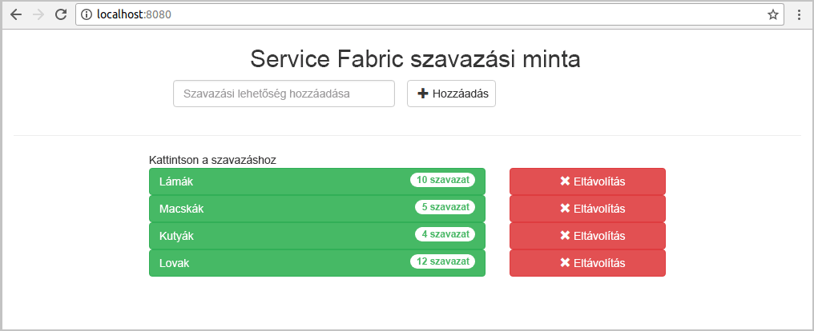
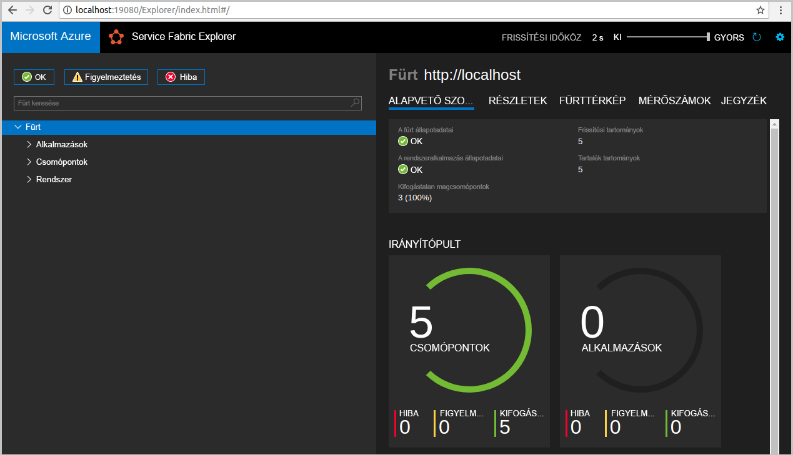
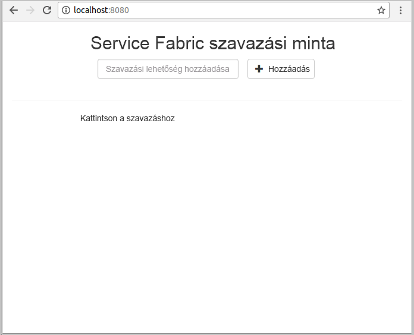
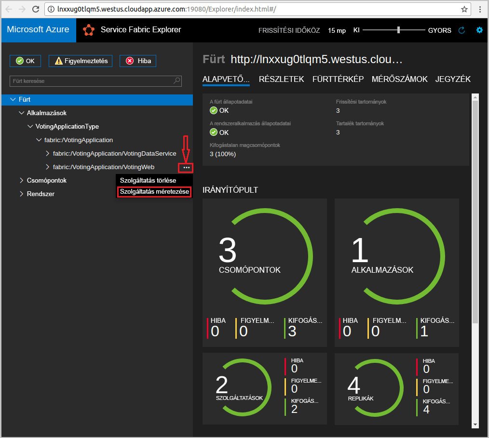

# <a name="create-a-java-application"></a>Java-alkalmazás létrehozása
Azure Service Fabric egy elosztottrendszer platform központi telepítéséhez és mikroszolgáltatások létrehozására és tárolók kezelése. 

A gyors üzembe helyezés üzembe helyezését mutatja be az első Java-alkalmazás a Service Fabric Linux fejlesztői gépen használata az Eclipse IDE. Amikor végzett, a Java webes előtér egy állapotalapú háttér-szolgáltatás a fürt szavazó eredmények menti a szavazóalkalmazást rendelkezik.



Ezen rövid útmutató segítségével megtanulhatja a következőket:

> [!div class="checklist"]
> * A Service Fabric Java-alkalmazások eszközként használható eclipse-ben
> * A helyi fürthöz az alkalmazás központi telepítése 
> * Telepítse központilag az alkalmazást az Azure-ban fürtre
> * Kibővített az alkalmazás több csomópont között

## <a name="prerequisites"></a>Előfeltételek
A gyorsútmutató elvégzéséhez:
1. [A Service Fabric SDK & Service Fabric parancssori felület (CLI) telepítése](https://docs.microsoft.com/en-us/azure/service-fabric/service-fabric-get-started-linux#installation-methods)
2. [A Git telepítése](https://git-scm.com/)
3. [Telepítse az eclipse-ben](https://www.eclipse.org/downloads/)
4. [Java-környezet beállítása](https://docs.microsoft.com/en-us/azure/service-fabric/service-fabric-get-started-linux#set-up-java-development), hogy ellenőrizze, hogy a választható lépéseket az Eclipse beépülő modul telepítése 

## <a name="download-the-sample"></a>A minta letöltése
Egy parancssorban a következő parancsot a helyi számítógépen, a minta app tárház klónozása.
```
git clone https://github.com/Azure-Samples/service-fabric-java-quickstart.git
```

## <a name="run-the-application-locally"></a>Az alkalmazás helyi futtatása
1. Indítsa el a helyi fürtön a következő parancs futtatásával:

    ```bash
    sudo /opt/microsoft/sdk/servicefabric/common/clustersetup/devclustersetup.sh
    ```
    A helyi fürt indítási hosszabb időt vesz igénybe. Annak ellenőrzéséhez, hogy a fürt teljes naprakészek, hozzáférni a Service Fabric Explorer **19080**. Az öt kifogástalan csomópontokat jelzi, hogy a helyi fürt megfelelően működik, és. 
    
    

2. Nyissa meg az eclipse-ben.
3. Kattintson a fájl -> Nyitott projektek fájlrendszerből... 
4. Kattintson a könyvtárat, és válassza ki a `Voting` könyvtárhoz, az a `service-fabric-java-quickstart` a Githubról klónozott mappa. Kattintson a Befejezés gombra. 

    
    
5. Most már rendelkezik a `Voting` a csomag Explorer az Eclipse project. 
6. Kattintson jobb gombbal a projekt, és válassza ki a **alkalmazás közzététele...**  alatt a **Service Fabric** legördülő menüből. Válasszon **PublishProfiles/Local.json** a cél-profil, és kattintson a közzététel. 

    
    
7. Nyissa meg a kedvenc webböngészőt, és hozzáférni az alkalmazáshoz való hozzáférés **8080**. 

    
    
Ezután hozzáadhat egy szavazás beállításainak, és indítsa el a szavazatok véve. Az alkalmazás fut, és az összes adatot tárol a Service Fabric-fürt egy másik adatbázist szükségessége nélkül.

## <a name="deploy-the-application-to-azure"></a>Az alkalmazás központi telepítése az Azure-ban

### <a name="set-up-your-azure-service-fabric-cluster"></a>Az Azure Service Fabric-fürt beállítása
Az alkalmazást az Azure-ban fürtre telepíti, a saját fürt létrehozása, vagy fél-fürtöt használ.

A nyilvános fürtök ingyenes, korlátozott időtartamú Azure Service Fabric-fürtök. A Service Fabric csapat, ahol bárki alkalmazások központi telepítését, és további tudnivalók a platform végzi. A nyilvános fürt eléréséhez [kövesse az alábbi utasításokat](http://aka.ms/tryservicefabric). 

További információk saját fürtök létrehozásáról: [Az első saját Service Fabric-fürt létrehozása az Azure-on](service-fabric-get-started-azure-cluster.md).

> [!Note]
> A webes előtér-szolgáltatás a 8080-as portot a bejövő forgalmat figyelő van konfigurálva. Győződjön meg róla, hogy a port nyitva van a fürtön. Az entitás-fürtöt használ, ha a port meg nyitva.
>

### <a name="deploy-the-application-using-eclipse"></a>Telepítse központilag az alkalmazást használó eclipse-ben
Most, hogy az alkalmazás és a fürt készen áll, ezután telepítheti azt a fürthöz közvetlenül az eclipse-ben.

1. Nyissa meg a **Cloud.json** a fájlt a **PublishProfiles** könyvtár, és töltse ki a `ConnectionIPOrURL` és `ConnectionPort` mezők megfelelően. Példa biztosítja: 

    ```bash
    {
         "ClusterConnectionParameters": 
         {
            "ConnectionIPOrURL": "lnxxug0tlqm5.westus.cloudapp.azure.com",
            "ConnectionPort": "19080",
            "ClientKey": "",
            "ClientCert": ""
         }
    }
    ```

2. Kattintson jobb gombbal a projekt, és válassza ki a **alkalmazás közzététele...**  alatt a **Service Fabric** legördülő menüből. Válasszon **PublishProfiles/Cloud.json** a cél-profil, és kattintson a közzététel. 

    

3. Nyissa meg a kedvenc webböngészőt, és hozzáférni az alkalmazáshoz való hozzáférés **http://\<ConnectionIPOrURL >: 8080**. 

    
    
## <a name="scale-applications-and-services-in-a-cluster"></a>Alkalmazások és szolgáltatások méretezése a fürtökben
A szolgáltatásoknak a terhelés módosítására vonatkozó olyan fürtön belül szolgáltatások is méretezhető. A szolgáltatások méretezése a fürtben futó példányok számának módosításával történik. A szolgáltatások skálázás több módja van, a parancsfájlok vagy parancsok a Service Fabric CLI (sfctl) is használhatja. A jelen példában használjuk Service Fabric Explorerben talál.

Service Fabric Explorer összes Service Fabric-fürt fut, és keresse meg azt a fürtök HTTP felügyeleti portra (19080), például egy böngészőből elérhető `http://lnxxug0tlqm5.westus.cloudapp.azure.com:19080`.

A webes előtér-szolgáltatás méretezéséhez hajtsa végre a következő lépéseket:

1. Nyissa meg a Service Fabric Explorert a fürtben – például: `http://lnxxug0tlqm5.westus.cloudapp.azure.com:19080`.
2. A három pont (három ponttal jelölt) elem mellett kattintson a **fabric: / Voting/VotingWeb** a TreeView vezérlő csomópont, és válassza **méretezési szolgáltatás**.

    

    Most már méretezheti a webes előtér-szolgáltatás példányainak számát.

3. Módosítsa a számot **2**-re, és kattintson a **Szolgáltatás méretezése** gombra.
4. Kattintson a a **fabric: / Voting/VotingWeb** csomópont a fanézetben a partíció csomópontot (GUID képviseli).

    

    Láthatja, hogy a szolgáltatás két példánya van, és a faszerkezetes nézetben látható a példányok futtassa mely csomópontok.

Ezzel az egyszerű felügyeleti eljárással megdupláztuk az előtér-szolgáltatás számára a felhasználói terhelések feldolgozásához rendelkezésre álló erőforrások mennyiségét. Fontos megérteni, hogy nincs szükség több példányra ahhoz, hogy a szolgáltatás megbízhatóan fusson. Ha egy szolgáltatás meghibásodik, a Service Fabric gondoskodik róla, hogy egy új szolgáltatáspéldány kezdjen futni a fürtben.

## <a name="next-steps"></a>Következő lépések
Ennek a rövid útmutatónak a segítségével megtanulta a következőket:

> [!div class="checklist"]
> * A Service Fabric Java-alkalmazások eszközként használható eclipse-ben
> * A helyi fürthöz Java-alkalmazások központi telepítése 
> * Java-alkalmazások az Azure-fürtre telepítése
> * Kibővített az alkalmazás több csomópont között

* További információ [hibakereső szolgáltatásának a Java használatával az eclipse-ben](service-fabric-debugging-your-application-java.md)
* További tudnivalók [a folyamatos integreation & állításra Jenkins beállítása](service-fabric-cicd-your-linux-java-application-with-jenkins.md)
* Más kivételt [Java-minták](https://github.com/Azure-Samples/service-fabric-java-getting-started)