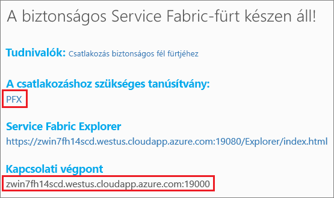
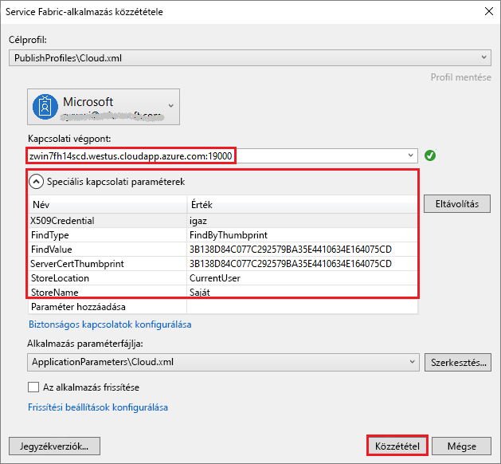

# <a name="tutorial-deploy-an-application-to-a-service-fabric-cluster-in-azure"></a>Oktatóanyag: alkalmazás üzembe helyezése egy Service Fabric-fürtön az Azure-ban
Ez az oktatóanyag a sorozat második része, amely az Azure Service Fabric-alkalmazások fürtön történő üzembe helyezésének módját ismerteti az Azure-ban.

Az oktatóanyag-sorozat második részében az alábbiakkal fog megismerkedni:
> [!div class="checklist"]
> * [.NET Service Fabric-alkalmazás létrehozása](service-fabric-tutorial-create-dotnet-app.md)
> * Az alkalmazás üzembe helyezése egy távoli fürtön
> * [A CI/CD konfigurálása a Visual Studio Team Services használatával](service-fabric-tutorial-deploy-app-with-cicd-vsts.md)
> * [Figyelés és diagnosztika beállítása az alkalmazáshoz](service-fabric-tutorial-monitoring-aspnet.md)

Ebben az oktatóanyag-sorozatban az alábbiakkal ismerkedhet meg:
> [!div class="checklist"]
> * Alkalmazás üzembe helyezése egy távoli fürtön Visual Studio használatával
> * Alkalmazás eltávolítása egy fürtről a Service Fabric Explorer használatával

## <a name="prerequisites"></a>Előfeltételek
Az oktatóanyag elkezdése előtt:
- Ha nem rendelkezik Azure-előfizetéssel, hozzon létre egy [ingyenes fiókot](https://azure.microsoft.com/free/?WT.mc_id=A261C142F).
- [Telepítse a Visual Studio 2017-et](https://www.visualstudio.com/) az **Azure-fejlesztési**, valamint az **ASP.NET- és webfejlesztési** számítási feladatokkal.
- [A Service Fabric SDK telepítése](service-fabric-get-started.md)

## <a name="download-the-voting-sample-application"></a>A mintául szolgáló szavazóalkalmazás letöltése
Ha nem hozta létre a mintául szolgáló szavazóalkalmazást [az oktatóanyag-sorozat első részében](service-fabric-tutorial-create-dotnet-app.md), akkor le is töltheti. Egy parancssori ablakban futtassa a következő parancsot a mintaalkalmazás-adattár helyi számítógépre történő klónozásához.

```
git clone https://github.com/Azure-Samples/service-fabric-dotnet-quickstart
```

## <a name="set-up-a-party-cluster"></a>Nyilvános fürt beállítása
A nyilvános fürtök ingyenes, korlátozott időtartamú Azure Service Fabric-fürtök, amelyek futtatását a Service Fabric csapata végzi, és amelyeken bárki üzembe helyezhet alkalmazásokat, és megismerkedhet a platform használatával. Méghozzá ingyenesen!

A nyilvános fürt eléréséhez keresse fel a http://aka.ms/tryservicefabric webhelyet, és kövesse a fürt eléréséhez szükséges utasításokat. A nyilvános fürtök eléréséhez Facebook- vagy GitHub-fiók szükséges.

Ha szeretné, nyilvános fürt helyett használhat saját fürtöt.  Az ASP.NET Core webes kezelőfelülete fordított proxyt használ az állapotalapú szolgáltatás háttérszolgáltatásával való kommunikációhoz.  A nyilvános fürtök és a helyi fejlesztési fürt esetében a fordított proxy alapértelmezés szerint engedélyezve van.  Ha saját fürtön helyezi üzembe a mintául szolgáló szavazóalkalmazást, [a fürtön engedélyeznie kell a fordított proxy használatát](service-fabric-reverseproxy.md#setup-and-configuration).

> [!NOTE]
> A nyilvános fürtök nem biztonságosak, ezért az alkalmazásokat és az azokban megadott adatokat mások is láthatják. Ne helyezzen üzembe semmi olyat, amit nem szeretne nyilvánosságra hozni. A részletekért olvassa át a Használati feltételeket.

Jelentkezzen be, és [csatlakozzon egy Windows-fürthöz](http://aka.ms/tryservicefabric). A **PFX** hivatkozásra kattintva töltse le a PFX-tanúsítványt a számítógépre. A tanúsítványra és a **Kapcsolati végpont** értékére a következő lépésekben szükség lesz.



Egy Windows-számítógépen telepítse a PFX-et a *CurrentUser\My* tanúsítványtárolóba.

```powershell
PS C:\mycertificates> Import-PfxCertificate -FilePath .\party-cluster-873689604-client-cert.pfx -CertStoreLocation Cert:
\CurrentUser\My


  PSParentPath: Microsoft.PowerShell.Security\Certificate::CurrentUser\My

Thumbprint                                Subject
----------                                -------
3B138D84C077C292579BA35E4410634E164075CD  CN=zwin7fh14scd.westus.cloudapp.azure.com
```


## <a name="deploy-the-app-to-the-azure"></a>Az alkalmazás üzembe helyezése az Azure-ban
Az alkalmazást a létrehozása után közvetlenül a Visual Studióból telepítheti a fürtben.

1. A Megoldáskezelőben kattintson a jobb gombbal a **Voting** (Szavazás) elemre, majd válassza a **Publish** (Közzététel) lehetőséget. 

    

2. Másolja be a **Kapcsolati végpont** értékét a nyilvános fürt lapjáról a **Connection Endpoint** (Kapcsolati végpont) mezőbe. Például: `zwin7fh14scd.westus.cloudapp.azure.com:19000`. Kattintson az **Advanced Connection Parameters** (Speciális kapcsolati paraméterek) lehetőségre, és töltse ki a következő információkat.  A *FindValue* és *ServerCertThumbprint* értékeknek egyezniük kell az előző lépésben telepített tanúsítvány ujjlenyomatával. Kattintson a **Publish** (Közzététel) gombra. 

    Miután a közzététel befejeződött, egy böngészőből kérést küldhet az alkalmazáshoz.

3. Nyissa meg a kívánt böngészőt, és adja meg a fürt címét (a kapcsolati végpontot a portra vonatkozó információk nélkül, például win1kw5649s.westus.cloudapp.azure.com).

    Ekkor ugyanannak az eredménynek kell megjelennie, mint az alkalmazás helyi futtatásakor.

    

## <a name="remove-the-application-from-a-cluster-using-service-fabric-explorer"></a>Az alkalmazás eltávolítása egy fürtről Service Fabric Explorerrel
A Service Fabric Explorer egy grafikus felhasználói felület, amely a Service Fabric-fürtök alkalmazásainak felderítésére és kezelésére szolgál.

Az alkalmazás eltávolítása a nyilvános fürtből:

1. Lépjen a Service Fabric Explorerhez a nyilvános fürt regisztrációs oldalán található hivatkozással. Például: https://win1kw5649s.westus.cloudapp.azure.com:19080/Explorer/index.html.

2. A Service Fabric Explorerben keresse meg a **fabric:/Voting** csomópontot a bal oldali fastruktúrában.

3. Kattintson az **Action** (Műveletek) gombra a jobb oldalon található **Essentials** (Alapvető szolgáltatások) ablaktáblán, és válassza a **Delete Application** (Alkalmazás törlése) lehetőséget. Erősítse meg az alkalmazáspéldány törlését. Ezzel eltávolítja a fürtön futó alkalmazáspéldányt.


## <a name="remove-the-application-type-from-a-cluster-using-service-fabric-explorer"></a>Az alkalmazástípus eltávolítása egy fürtről a Service Fabric Explorerrel
Az alkalmazások a Service Fabric-fürtön alkalmazástípusokként vannak üzembe helyezve, ezáltal a fürtön egyszerre több példány és verzió is futhat az alkalmazásból. Az alkalmazás futó példányának eltávolítását követően az üzemelő példány teljes törléséhez az alkalmazás típusa is eltávolítható.

A Service Fabric alkalmazásmodelljével kapcsolatos további információk: [Alkalmazás modellezése a Service Fabricben](service-fabric-application-model.md).

1. Keresse meg a **VotingType** csomópontot a fanézetben.

2. Kattintson az **Action** (Műveletek) gombra a jobb oldalon található **Essentials** (Alapvető szolgáltatások) ablaktáblán, és válassza az **Unprovision Type** (Típus telepítésének visszavonása) lehetőséget. Erősítse meg az alkalmazástípus telepítésének visszavonását.


Ezzel az oktatóanyag végére ért.

## <a name="next-steps"></a>További lépések
Ez az oktatóanyag bemutatta, hogyan végezheti el az alábbi műveleteket:

> [!div class="checklist"]
> * Alkalmazás üzembe helyezése egy távoli fürtön Visual Studio használatával
> * Alkalmazás eltávolítása egy fürtről a Service Fabric Explorer használatával

Folytassa a következő oktatóanyaggal:
> [!div class="nextstepaction"]
> [A folyamatos integráció beállítása a Visual Studio Team Services segítségével](service-fabric-tutorial-deploy-app-with-cicd-vsts.md)
