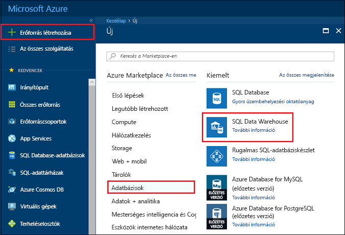
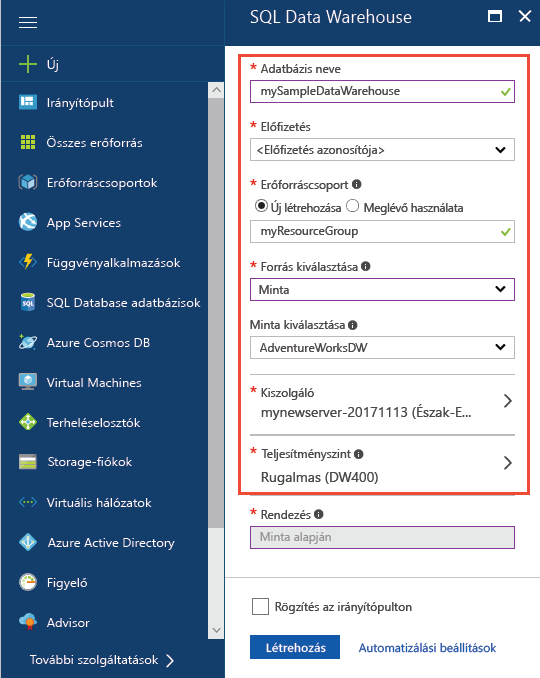
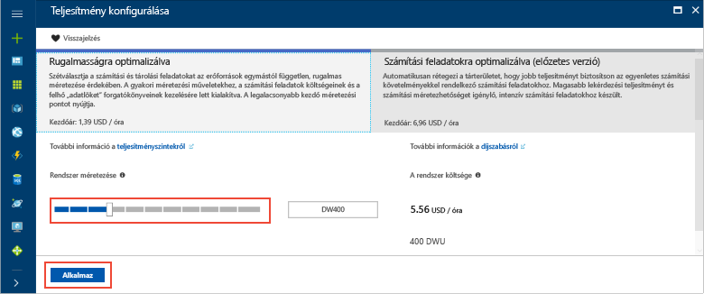
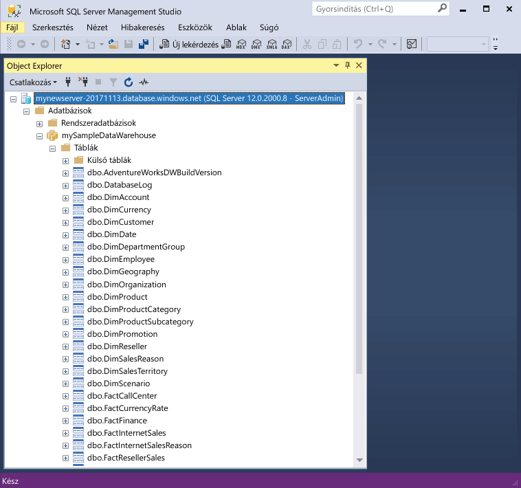
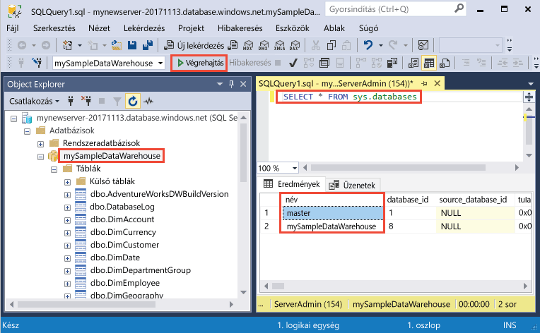
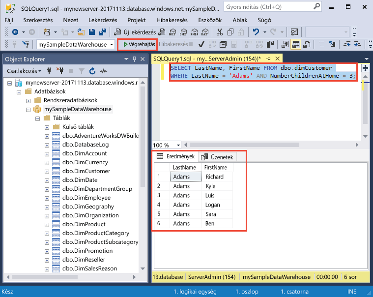

# <a name="create-an-azure-sql-data-warehouse-in-the-azure-portal"></a>Egy Azure SQL data warehouse létrehozása az Azure-portálon

A gyors üzembe helyezési útmutató az Azure SQL Data Warehouse szolgáltatással adatraktár létrehozza, és inicializálja az AdventureWorksDW-mintaadatok az. Ezt követően az adatraktár csatlakozhat, és a lekérdezés futtatása az adatok. Az oktatóprogram a [Azure-portálon](https://portal.azure.com) és [SQL Server Management Studio](/sql/ssms/download-sql-server-management-studio-ssms.md) (SSMS)

Ha nem rendelkezik Azure-előfizetéssel, első lépésként mindössze néhány perc alatt létrehozhat egy [ingyenes](https://azure.microsoft.com/free/) fiókot.

## <a name="before-you-begin"></a>Előkészületek

A gyors üzembe helyezés megkezdése előtt töltse le és telepítse a legújabb verzióját [SQL Server Management Studio](/sql/ssms/download-sql-server-management-studio-ssms.md) (SSMS).

## <a name="log-in-to-the-azure-portal"></a>Jelentkezzen be az Azure portálra.

Jelentkezzen be az [Azure portálra](https://portal.azure.com/).

## <a name="create-a-data-warehouse"></a>Adattárház létrehozása

Egy Azure SQL data warehouse létrejön egy adott csoportján [számítási erőforrásokat](performance-tiers.md). Az adatbázist a rendszer létrehoz egy [Azure erőforráscsoport](../azure-resource-manager/resource-group-overview.md) és az egy [Azure SQL logikai kiszolgálóra](../sql-database/sql-database-features.md). 

Kövesse az alábbi lépéseket az AdventureWorksDW-mintaadatok tartalmazó SQL data warehouse létrehozásához. 

1. Kattintson a **új** gomb az Azure portál bal felső sarokban.

2. Válassza ki **adatbázisok** a a **új** lapon, és válassza ki **SQL Data Warehouse** alatt **kiemelt** a a **új**lap.

    

3. Töltse ki az SQL Data Warehouse az űrlapot, a következő információkat:   

    | Beállítás | Ajánlott érték | Leírás | 
    | ------- | --------------- | ----------- | 
    | **Adatbázis neve** | mySampleDataWarehouse | Az érvényes adatbázisnevekkel kapcsolatban lásd az [adatbázis-azonosítókat](/sql/relational-databases/databases/database-identifiers) ismertető cikket. Vegye figyelembe, egy data warehouse egy adatbázis típusú.| 
    | **Előfizetés** | Az Ön előfizetése  | Az előfizetései részleteivel kapcsolatban lásd az [előfizetéseket](https://account.windowsazure.com/Subscriptions) ismertető cikket. |
    | **Erőforráscsoport** | myResourceGroup | Az érvényes erőforráscsoport-nevekkel kapcsolatban lásd az [elnevezési szabályokat és korlátozásokat](https://docs.microsoft.com/azure/architecture/best-practices/naming-conventions) ismertető cikket. |
    | **Forrás kiválasztása** | Minta | Megadja a mintaadatbázis betöltése. Vegye figyelembe, egy data warehouse adatbázis egy típust. |
    | **Minta kiválasztása** | AdventureWorksDW | Megadja az AdventureWorksDW mintaadatbázist betöltése.  |

    

4. Kattintson a **Kiszolgáló** lehetőségre új kiszolgáló létrehozásához és konfigurálásához az új adatbázis számára. Töltse ki a **új kiszolgáló űrlap** a következő információkat: 

    | Beállítás | Ajánlott érték | Leírás | 
    | ------------ | ------------------ | ------------------------------------------------- | 
    | **Kiszolgálónév** | Bármely globálisan egyedi név | Az érvényes kiszolgálónevekkel kapcsolatban lásd az [elnevezési szabályokat és korlátozásokat](https://docs.microsoft.com/azure/architecture/best-practices/naming-conventions) ismertető cikket. | 
    | **Kiszolgálói rendszergazdai bejelentkezés** | Bármely érvényes név | Az érvényes bejelentkezési nevekkel kapcsolatban lásd az [adatbázis-azonosítókat](https://docs.microsoft.com/sql/relational-databases/databases/database-identifiers) ismertető cikket.|
    | **Jelszó** | Bármely érvényes jelszó | A jelszó legalább 8 karakterből kell állnia, és az alábbiak közül hármat tartalmaznia kell: nagybetűk, kisbetűk, számok és nem alfanumerikus karakterek száma. |
    | **Hely** | Bármely érvényes hely | A régiókkal kapcsolatos információkért lásd [az Azure régióit](https://azure.microsoft.com/regions/) ismertető cikket. |

    

5. Kattintson a **Kiválasztás** gombra.

6. Kattintson a **teljesítményszinttel** -e az adatraktár rugalmasság vagy számítási van optimalizálva, és adatraktár-egységek számának megadásához. 

7. A jelen oktatóanyag esetében válassza ki a **rugalmasság optimalizálva** szolgáltatási rétegben. A csúszka alapértelmezés szerint van beállítva **DW400**.  Helyezze a felfelé és lefelé működésének ellenőrzése. 

    

8. Kattintson az **Alkalmaz** gombra.

9. Most, hogy kitöltötte az SQL Database űrlapját, kattintson a **Létrehozás** gombra az adatbázis létrehozásához. Az üzembe helyezés eltarthat néhány percig. 

    

10. Az eszköztáron kattintson az **Értesítések** parancsra az üzembe helyezési folyamat megfigyeléséhez.
    
     

## <a name="create-a-server-level-firewall-rule"></a>Kiszolgálószintű tűzfalszabály létrehozása

Az SQL Data Warehouse szolgáltatás tűzfal a kiszolgáló szintjén-, hogy a külső alkalmazások és eszközök csatlakoznak a kiszolgáló vagy a kiszolgálón lévő összes adatbázis hoz létre. Ahhoz, hogy a kapcsolat, hozzáadhat tűzfalszabályokat, amelyek az adott IP-címek kapcsolódásának engedélyezése.  Hajtsa végre az alábbi lépéseket követve létrehozhat egy [kiszolgálószintű tűzfalszabály](../sql-database/sql-database-firewall-configure.md) az ügyfél IP-cím. 

> [!NOTE]
> Az SQL Data Warehouse 1433-as porton keresztül kommunikál. Ha próbál csatlakozni a vállalati hálózaton belül, a hálózati tűzfal előfordulhat, hogy nem engedélyezett a kimenő adatforgalmat a 1433-as porton keresztül. Ebben az esetben nem tud csatlakozni az Azure SQL Database-kiszolgálóhoz, ha az informatikai részleg nem nyitja meg az 1433-as portot.
>

1. Az üzembe helyezés befejezése után kattintson az **SQL-adatbázisok** elemre a bal oldali menüben, majd kattintson a **mySampleDatabase** adatbázisra az **SQL-adatbázisok** lapon. Áttekintő lapjára jut az adatbázis nyit meg, hogy bemutatja a kiszolgáló teljesen minősített nevét (például **mynewserver-20171113.database.windows.net**) és további konfigurációs lehetőségeket. 

2. Másolja le ezt a teljes kiszolgálónevet, mert a későbbi rövid útmutatók során szüksége lesz rá a kiszolgálóhoz és az adatbázisokhoz való csatlakozáshoz. Kattintson a kiszolgáló nevére kiszolgáló beállításainak megnyitásához.

    

3. Kattintson a kiszolgáló nevét a kiszolgáló beállításainak megnyitásához.

    

5. Kattintson a **tűzfal beállításainak megjelenítése**. Megnyílik az SQL Database kiszolgálóhoz tartozó **Tűzfalbeállítások** oldal. 

    

4. Az eszköztár **Ügyfél IP-címének hozzáadása** elemére kattintva vegye fel aktuális IP-címét egy új tűzfalszabályba. A tűzfalszabály az 1433-as portot egy egyedi IP-cím vagy egy IP-címtartomány számára nyithatja meg.

5. Kattintson a **Save** (Mentés) gombra. A rendszer létrehoz egy kiszolgálószintű tűzfalszabályt az aktuális IP-címhez, és megnyitja az 1433-as portot a logikai kiszolgálón.

6. Kattintson az **OK** gombra, majd zárja be a **Tűzfalbeállítások** lapot.

Most csatlakozhat az SQL server és az adatraktárak az IP-címet használja. A kapcsolat a kiválasztott SQL Server Management Studio vagy egy másik működik. Sikeres csatlakozás esetén használja a korábban létrehozott kiszolgáló-rendszergazdai fiókkal.  

> [!IMPORTANT]
> Alapértelmezés szerint az összes Azure-szolgáltatás számára engedélyezett a hozzáférés az SQL Database tűzfalán keresztül. Kattintson a **OFF** ezen a lapon, és kattintson a **mentése** letiltása az összes Azure-szolgáltatásokhoz a tűzfalon.

## <a name="get-the-fully-qualified-server-name"></a>A kiszolgáló teljesen minősített nevét

A kiszolgáló teljesen minősített nevet az SQL server beolvasása az Azure portálon. Később szüksége lesz a teljes nevet a kiszolgálóhoz való csatlakozáskor.

1. Jelentkezzen be az [Azure portálra](https://portal.azure.com/).
2. Válassza az **SQL-adatbázisok** elemet a bal oldali menüben, majd kattintson az új adatbázisra az **SQL-adatbázisok** oldalon. 
3. Az Azure Portalon az adatbázishoz tartozó lap **Alapvető erőforrások** ablaktábláján keresse meg, majd másolja ki a **Kiszolgáló nevét**. Ebben a példában a teljesen minősített név nem mynewserver-20171113.database.windows.net. 

      

## <a name="connect-to-the-server-as-server-admin"></a>Csatlakozzon a kiszolgálóhoz, mint a kiszolgáló rendszergazdája

Ennek a szakasznak [SQL Server Management Studio](/sql/ssms/download-sql-server-management-studio-ssms.md) (SSMS) kapcsolat létrehozása az Azure SQL-kiszolgálóhoz.

1. Nyissa meg az SQL Server Management Studiót.

2. A **Connect to Server** (Kapcsolódás a kiszolgálóhoz) párbeszédpanelen adja meg a következő adatokat:

   | Beállítás       | Ajánlott érték | Leírás | 
   | ------------ | ------------------ | ------------------------------------------------- | 
   | Kiszolgáló típusa | Adatbázismotor | Ez értékének megadása kötelező. |
   | Kiszolgálónév | A teljes kiszolgálónév | A névnek kell lennie, például ehhez hasonló: **mynewserver-20171113.database.windows.net**. |
   | Authentication | SQL Server-hitelesítés | Az SQL-hitelesítés az egyetlen hitelesítési típus, amelyet ebben az oktatóanyagban konfiguráltunk. |
   | Bejelentkezés | A kiszolgálói rendszergazdai fiók | Ez az a fiók, amely a kiszolgáló létrehozásakor lett megadva. |
   | Jelszó | A kiszolgálói rendszergazdai fiók jelszava | Ezt a jelszót adta meg a kiszolgáló létrehozásakor. |

    

4. Kattintson a **Connect** (Csatlakozás) gombra. Megnyílik az Object Explorer ablak az SSMS-ben. 

5. Az Object Explorerben bontsa ki a **adatbázisok**. Majd **mySampleDatabase** az új adatbázis a objektumok megtekintéséhez.

     

## <a name="run-some-queries"></a>Egyes lekérdezések futtatása

Az SQL Data Warehouse T-SQL használja, mint a lekérdezési nyelv. Nyissa meg a lekérdezés ablakot, és néhány T-SQL-lekérdezések futtatása, használja az alábbi lépéseket.

1. Kattintson a jobb gombbal **mySampleDataWarehouse** válassza **új lekérdezés**.  Megnyílik egy új lekérdezési ablak.
2. A lekérdezési ablakban írja be a következő parancs futtatásával adatbázisok listájának megtekintéséhez.

    ```sql
    SELECT * FROM sys.databases
    ```

3. Kattintson az **Execute** (Végrehajtás) parancsra.  A lekérdezés eredményei között láthatók a két adatbázis: **fő** és **mySampleDataWarehouse**.

    

4. Tekintse meg néhány adat, a következő parancs használatával, az ügyfelek száma, amelyek három gyermekek otthoni Adams utolsó nevű. Az eredmények hat ügyfelek listában. 

    ```sql
    SELECT LastName, FirstName FROM dbo.dimCustomer
    WHERE LastName = 'Adams' AND NumberChildrenAtHome = 3;
    ```

    

## <a name="clean-up-resources"></a>Az erőforrások eltávolítása

A számítási erőforrások és az a data warehouse-bA betöltött adatok van folyamatban szó. Ezek külön-külön számlázzuk. 

- Ha meg szeretné tartani az adatokat, akkor az egérmutatót számítási használaton kívül az adatraktár. A számítási felfüggesztése csak akkor kell fizetni tárolására, és is folytathatja a számítást, amikor készen áll az adatokat.
- Ha el szeretné távolítani a jövőbeli díjak, az adatraktár törölheti. 

A lépések sorolható fel erőforrások törlése.

1. Jelentkezzen be a [Azure-portálon](https://portal.azure.com), kattintson az adatraktár a.

    

1. Számítási szüneteltethető, kattintson a **szüneteltetése** gombra. Ha az adatraktár fel van függesztve, jelennek meg a **Start** gombra.  Kattintva folytathatja a számítást, **Start**.

2. Az adatraktár, akkor nem kell fizetnie számítási és tárolási eltávolításához kattintson **törlése**.

3. Kattintson a létrehozott SQL server **mynewserver-20171113.database.windows.net** az előző ábrán, majd **törlése**.  Ügyeljen arra, mint ennek a kiszolgáló törlésével a kiszolgálóhoz hozzárendelt összes adatbázisra.

4. Távolítsa el az erőforráscsoportot, kattintson a **myResourceGroup**, és kattintson a **erőforrás csoport törlése**.


## <a name="next-steps"></a>Következő lépések

Most, hogy rendelkezik egy adatbázissal, csatlakoztathatja a kedvenc eszközeit, és lekérdezéseket hajthat végre velük. További információkért válassza ki az eszközt az alábbiak közül:

- [SQL Server Management Studio](../sql-database/sql-database-connect-query-ssms.md?toc=%2fazure%2fsql-data-warehouse%2ftoc.json)
- [Visual Studio Code](../sql-database/sql-database-connect-query-vscode.md?toc=%2fazure%2fsql-data-warehouse%2ftoc.json)
- [.NET](../sql-database/sql-database-connect-query-dotnet.md?toc=%2fazure%2fsql-data-warehouse%2ftoc.json)
- [PHP](../sql-database/sql-database-connect-query-php.md?toc=%2fazure%2fsql-data-warehouse%2ftoc.json)
- [Node.js](../sql-database/sql-database-connect-query-nodejs.md?toc=%2fazure%2fsql-data-warehouse%2ftoc.json)
- [Java](../sql-database/sql-database-connect-query-java.md?toc=%2fazure%2fsql-data-warehouse%2ftoc.json)
- [Python](../sql-database/sql-database-connect-query-python.md?toc=%2fazure%2fsql-data-warehouse%2ftoc.json)
- [Ruby](../sql-database/sql-database-connect-query-ruby.md?toc=%2fazure%2fsql-data-warehouse%2ftoc.json)