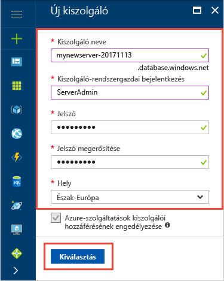
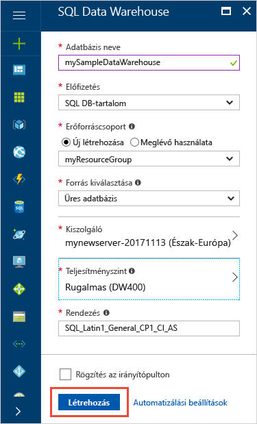
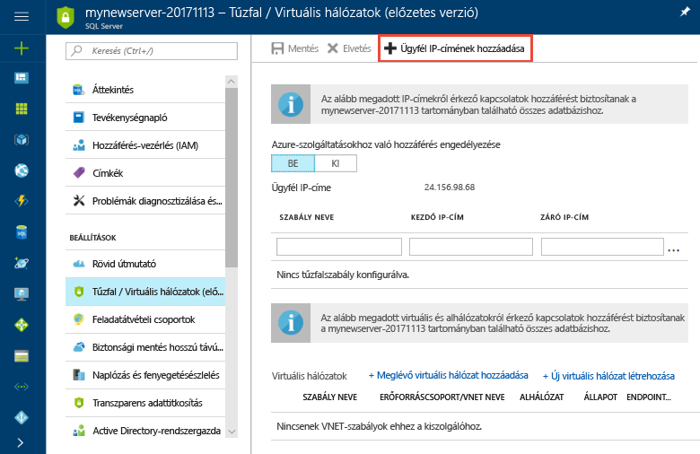
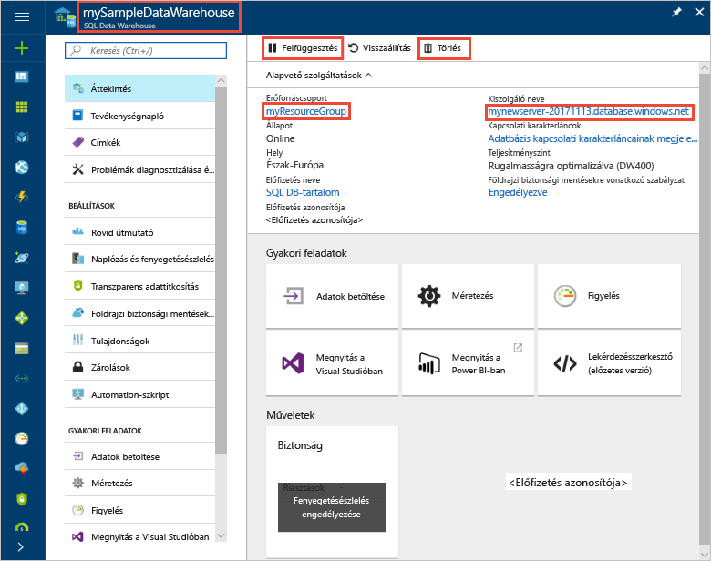

# <a name="use-polybase-to-load-data-from-azure-blob-storage-to-azure-sql-data-warehouse"></a>Adatok betöltése az Azure blob storage az Azure SQL Data Warehouse PolyBase segítségével

A PolyBase betöltése az SQL Data Warehouse-adatok beolvasása technológia normál. Ebben az oktatóanyagban a PolyBase New York Taxicab adatok betöltése az Azure blob storage az Azure SQL Data Warehouse használhatja. Az oktatóprogram a [Azure-portálon](https://portal.azure.com) és [SQL Server Management Studio](/sql/ssms/download-sql-server-management-studio-ssms.md) (SSMS) számára: 

> [!div class="checklist"]
> * A data warehouse létrehozása az Azure-portálon
> * Állítson be egy kiszolgálószintű tűzfalszabályt az Azure-portálon
> * Csatlakozás az adatraktár ssms alkalmazásával
> * Adatok betöltése a kijelölt felhasználó létrehozása
> * Az adatok külső táblák létrehozása az Azure blob storage
> * Adatok betöltése az adatraktár az az CTAS T-SQL-utasítás használatával
> * Mint azt tölt adatok állapotának megtekintése
> * Statisztikák létrehozása az újonnan betöltött adatokról

Ha nem rendelkezik Azure-előfizetéssel, [ingyenes fiók létrehozását](https://azure.microsoft.com/free/) megkezdése előtt.

## <a name="before-you-begin"></a>Előkészületek

Ez az oktatóanyag megkezdése előtt töltse le és telepítse a legújabb verzióját [SQL Server Management Studio](/sql/ssms/download-sql-server-management-studio-ssms.md) (SSMS).


## <a name="log-in-to-the-azure-portal"></a>Jelentkezzen be az Azure portálra.

Jelentkezzen be az [Azure portálra](https://portal.azure.com/).

## <a name="create-a-blank-sql-data-warehouse"></a>Üres SQL data warehouse létrehozása

Egy Azure SQL data warehouse létrejön egy adott csoportján [számítási erőforrásokat](performance-tiers.md). Az adatbázist a rendszer létrehoz egy [Azure erőforráscsoport](../azure-resource-manager/resource-group-overview.md) és az egy [Azure SQL logikai kiszolgálóra](../sql-database/sql-database-features.md). 

Kövesse az alábbi lépéseket egy üres SQL data warehouse létrehozásához. 

1. Kattintson a **új** gomb az Azure portál bal felső sarokban.

2. Válassza ki **adatbázisok** a a **új** lapon, és válassza ki **SQL Data Warehouse** alatt **kiemelt** a a **új**lap.

    

3. Töltse ki az SQL Data Warehouse az űrlapot, a következő információkat:   

   | Beállítás | Ajánlott érték | Leírás | 
   | ------- | --------------- | ----------- | 
   | **Adatbázis neve** | mySampleDataWarehouse | Az érvényes adatbázisnevekkel kapcsolatban lásd az [adatbázis-azonosítókat](/sql/relational-databases/databases/database-identifiers) ismertető cikket. | 
   | **Előfizetés** | Az Ön előfizetése  | Az előfizetései részleteivel kapcsolatban lásd az [előfizetéseket](https://account.windowsazure.com/Subscriptions) ismertető cikket. |
   | **Erőforráscsoport** | myResourceGroup | Az érvényes erőforráscsoport-nevekkel kapcsolatban lásd az [elnevezési szabályokat és korlátozásokat](https://docs.microsoft.com/azure/architecture/best-practices/naming-conventions) ismertető cikket. |
   | **Forrás kiválasztása** | Az üres adatbázis | Meghatározza, hogy egy üres adatbázis létrehozásához. Vegye figyelembe, egy data warehouse adatbázis egy típust.|

    

4. Kattintson a **Kiszolgáló** lehetőségre új kiszolgáló létrehozásához és konfigurálásához az új adatbázis számára. Töltse ki a **új kiszolgáló űrlap** a következő információkat: 

    | Beállítás | Ajánlott érték | Leírás | 
    | ------- | --------------- | ----------- |
    | **Kiszolgálónév** | Bármely globálisan egyedi név | Az érvényes kiszolgálónevekkel kapcsolatban lásd az [elnevezési szabályokat és korlátozásokat](https://docs.microsoft.com/azure/architecture/best-practices/naming-conventions) ismertető cikket. | 
    | **Kiszolgálói rendszergazdai bejelentkezés** | Bármely érvényes név | Az érvényes bejelentkezési nevekkel kapcsolatban lásd az [adatbázis-azonosítókat](https://docs.microsoft.com/sql/relational-databases/databases/database-identifiers) ismertető cikket.|
    | **Jelszó** | Bármely érvényes jelszó | A jelszó legalább 8 karakterből kell állnia, és az alábbiak közül hármat tartalmaznia kell: nagybetűk, kisbetűk, számok és nem alfanumerikus karakterek száma. |
    | **Hely** | Bármely érvényes hely | A régiókkal kapcsolatos információkért lásd [az Azure régióit](https://azure.microsoft.com/regions/) ismertető cikket. |

    

5. Kattintson a **Kiválasztás** gombra.

6. Kattintson a **teljesítményszinttel** -e az adatraktár rugalmasság vagy számítási van optimalizálva, és adatraktár-egységek számának megadásához. 

7. A jelen oktatóanyag esetében válassza ki a **rugalmasság optimalizálva** szolgáltatási rétegben. A csúszka alapértelmezés szerint van beállítva **DW400**.  Helyezze a felfelé és lefelé működésének ellenőrzése. 

    

8. Kattintson az **Alkalmaz** gombra.
9. Az SQL Data Warehouse lapon válassza a **rendezés** az üres adatbázis. A jelen oktatóanyag esetében használja az alapértelmezett értéket. Rendezések kapcsolatos további információkért lásd: [rendezések](/sql/t-sql/statements/collations.md)

11. Most, hogy kitöltötte az SQL Database űrlapját, kattintson a **Létrehozás** gombra az adatbázis létrehozásához. Az üzembe helyezés eltarthat néhány percig. 

    

12. Az eszköztáron kattintson az **Értesítések** parancsra az üzembe helyezési folyamat megfigyeléséhez.
    
     

## <a name="create-a-server-level-firewall-rule"></a>Kiszolgálószintű tűzfalszabály létrehozása

Az SQL Data Warehouse szolgáltatás tűzfal a kiszolgáló szintjén-, hogy a külső alkalmazások és eszközök csatlakoznak a kiszolgáló vagy a kiszolgálón lévő összes adatbázis hoz létre. Ahhoz, hogy a kapcsolat, hozzáadhat tűzfalszabályokat, amelyek az adott IP-címek kapcsolódásának engedélyezése.  Hajtsa végre az alábbi lépéseket követve létrehozhat egy [kiszolgálószintű tűzfalszabály](../sql-database/sql-database-firewall-configure.md) az ügyfél IP-cím. 

> [!NOTE]
> Az SQL Data Warehouse 1433-as porton keresztül kommunikál. Ha próbál csatlakozni a vállalati hálózaton belül, a hálózati tűzfal előfordulhat, hogy nem engedélyezett a kimenő adatforgalmat a 1433-as porton keresztül. Ebben az esetben nem tud csatlakozni az Azure SQL Database-kiszolgálóhoz, ha az informatikai részleg nem nyitja meg az 1433-as portot.
>

1. Az üzembe helyezés befejezése után kattintson az **SQL-adatbázisok** elemre a bal oldali menüben, majd kattintson a **mySampleDatabase** adatbázisra az **SQL-adatbázisok** lapon. Áttekintő lapjára jut az adatbázis nyit meg, hogy bemutatja a kiszolgáló teljesen minősített nevét (például **mynewserver-20171113.database.windows.net**) és további konfigurációs lehetőségeket. 

2. Másolja le ezt a teljes kiszolgálónevet, mert a későbbi rövid útmutatók során szüksége lesz rá a kiszolgálóhoz és az adatbázisokhoz való csatlakozáshoz. Kattintson a kiszolgáló nevére kiszolgáló beállításainak megnyitásához.

     

3. Kattintson a kiszolgáló nevét a kiszolgáló beállításainak megnyitásához.

     

5. Kattintson a **tűzfal beállításainak megjelenítése**. Megnyílik az SQL Database kiszolgálóhoz tartozó **Tűzfalbeállítások** oldal. 

     

4. Az eszköztár **Ügyfél IP-címének hozzáadása** elemére kattintva vegye fel aktuális IP-címét egy új tűzfalszabályba. A tűzfalszabály az 1433-as portot egy egyedi IP-cím vagy egy IP-címtartomány számára nyithatja meg.

5. Kattintson a **Save** (Mentés) gombra. A rendszer létrehoz egy kiszolgálószintű tűzfalszabályt az aktuális IP-címhez, és megnyitja az 1433-as portot a logikai kiszolgálón.

6. Kattintson az **OK** gombra, majd zárja be a **Tűzfalbeállítások** lapot.

Most csatlakozhat az SQL server és az adatraktárak az IP-címet használja. A kapcsolat a kiválasztott SQL Server Management Studio vagy egy másik működik. Sikeres csatlakozás esetén használja a korábban létrehozott kiszolgáló-rendszergazdai fiókkal.  

> [!IMPORTANT]
> Alapértelmezés szerint az összes Azure-szolgáltatás számára engedélyezett a hozzáférés az SQL Database tűzfalán keresztül. Kattintson a **OFF** ezen a lapon, és kattintson a **mentése** letiltása az összes Azure-szolgáltatásokhoz a tűzfalon.

## <a name="get-the-fully-qualified-server-name"></a>A kiszolgáló teljesen minősített nevét

A kiszolgáló teljesen minősített nevet az SQL server beolvasása az Azure portálon. Később szüksége lesz a teljes nevet a kiszolgálóhoz való csatlakozáskor.

1. Jelentkezzen be az [Azure portálra](https://portal.azure.com/).
2. Válassza az **SQL-adatbázisok** elemet a bal oldali menüben, majd kattintson az új adatbázisra az **SQL-adatbázisok** oldalon. 
3. Az Azure Portalon az adatbázishoz tartozó lap **Alapvető erőforrások** ablaktábláján keresse meg, majd másolja ki a **Kiszolgáló nevét**. Ebben a példában a teljesen minősített név nem mynewserver-20171113.database.windows.net. 

      

## <a name="connect-to-the-server-as-server-admin"></a>Csatlakozzon a kiszolgálóhoz, mint a kiszolgáló rendszergazdája

Ennek a szakasznak [SQL Server Management Studio](/sql/ssms/download-sql-server-management-studio-ssms.md) (SSMS) kapcsolat létrehozása az Azure SQL-kiszolgálóhoz.

1. Nyissa meg az SQL Server Management Studiót.

2. A **Connect to Server** (Kapcsolódás a kiszolgálóhoz) párbeszédpanelen adja meg a következő adatokat:

    | Beállítás      | Ajánlott érték | Leírás | 
    | ------------ | --------------- | ----------- | 
    | Kiszolgáló típusa | Adatbázismotor | Ez értékének megadása kötelező. |
    | Kiszolgálónév | A teljes kiszolgálónév | A névnek kell lennie, például ehhez hasonló: **mynewserver-20171113.database.windows.net**. |
    | Authentication | SQL Server-hitelesítés | Az SQL-hitelesítés az egyetlen hitelesítési típus, amelyet ebben az oktatóanyagban konfiguráltunk. |
    | Bejelentkezés | A kiszolgálói rendszergazdai fiók | Ez az a fiók, amely a kiszolgáló létrehozásakor lett megadva. |
    | Jelszó | A kiszolgálói rendszergazdai fiók jelszava | Ezt a jelszót adta meg a kiszolgáló létrehozásakor. |

    

4. Kattintson a **Connect** (Csatlakozás) gombra. Megnyílik az Object Explorer ablak az SSMS-ben. 

5. Az Object Explorerben bontsa ki a **adatbázisok**. Majd **rendszeradatbázisokban** és **fő** a objektumok megtekintéséhez a főadatbázisban.  Bontsa ki a **mySampleDatabase** az új adatbázis a objektumok megtekintéséhez.

     

## <a name="create-a-user-for-loading-data"></a>Adatok betöltése a felhasználó létrehozása

A kiszolgáló rendszergazdai fiókjának célja, hogy a felügyeleti műveleteket, és nem alkalmas a felhasználói adatok lekérdezések futtatását. Adatok betöltése általában nagy mennyiségű memóriát igényel. [Memória maximális értékeket](performance-tiers.md#memory-maximums) a következők szerint definiált [teljesítményszinttel](performance-tiers.md), és [erőforrásosztály](resource-classes-for-workload-management.md). 

Érdemes a bejelentkezési és az adatok betöltése a dedikált felhasználók létrehozásához. Majd adja hozzá a betöltés felhasználót egy [erőforrásosztály](resource-classes-for-workload-management.md) , amely lehetővé teszi, hogy a megfelelő maximális memóriafoglalást.

Mivel jelenleg kapcsolódik, a kiszolgáló rendszergazdája, bejelentkezéseket és a felhasználók is létrehozhat. Ezeket a lépéseket használhatja a bejelentkezési és a felhasználók nevű létrehozásához **LoaderRC20**. Ezután rendelje hozzá a felhasználót a **staticrc20** erőforrásosztály. 

1.  Az SSMS, kattintson a jobb gombbal **fő** legördülő menü megjelenítése, és válassza a **új lekérdezés**. Megnyílik egy új lekérdezési ablak.

    

2. A lekérdezési ablakban írja be a felhasználónevét és LoaderRC20, nevű felhasználót a saját jelszavát a "a123STRONGpassword!" és a T-SQL parancsokkal. 

    ```sql
    CREATE LOGIN LoaderRC20 WITH PASSWORD = 'a123STRONGpassword!';
    CREATE USER LoaderRC20 FOR LOGIN LoaderRC20;
    ```

3. Kattintson az **Execute** (Végrehajtás) parancsra.

4. Kattintson a jobb gombbal **mySampleDataWarehouse**, és válassza a **új lekérdezés**. Egy új lekérdezési ablak.  

    
 
5. Adja meg a következő T-SQL-parancsokat a LoaderRC20 bejelentkezési azonosítóhoz LoaderRC20 nevű adatbázis-felhasználó létrehozásához. A második sor engedélyt ad az új felhasználói vezérlő új adatraktár.  Ezek az engedélyek is hasonló, hogy a felhasználó az adatbázis tulajdonosa. A harmadik sorban a staticrc20 tagjaként ad hozzá az új felhasználó [erőforrásosztály](resource-classes-for-workload-management.md).

    ```sql
    CREATE USER LoaderRC20 FOR LOGIN LoaderRC20;
    GRANT CONTROL ON DATABASE::[mySampleDataWarehouse] to LoaderRC20;
    EXEC sp_addrolemember 'staticrc20', 'LoaderRC20';
    ```

6. Kattintson az **Execute** (Végrehajtás) parancsra.

## <a name="connect-to-the-server-as-the-loading-user"></a>A betöltés felhasználóként csatlakozzon a kiszolgálóhoz

Adatok betöltése az első lépés az, hogy LoaderRC20, bejelentkezéshez.  

1. Az Object Explorerben kattintson az **Connect** legördülő menüre, majd válassza **adatbázismotor**. A **kapcsolódás a kiszolgálóhoz** párbeszédpanel jelenik meg.

    

2. Adja meg a teljes kiszolgálónév, de ezúttal meg **LoaderRC20** a bejelentkezésként.  Adja meg a jelszót LoaderRC20.

3. Kattintson a **Connect** (Csatlakozás) gombra.

4. Ha a kapcsolat készen áll, az Object Explorer két kiszolgálói kapcsolatok jelenik meg. Kiszolgáló-rendszergazdai és MedRCLogin egy kapcsolat egy kapcsolatot.

    

## <a name="create-external-tables-for-the-sample-data"></a>A minta adatok külső táblák létrehozása

Készen áll az adatok betöltését az új data warehouse a folyamat megkezdéséhez. Az oktatóanyag bemutatja, hogyan használható [Polybase](/sql/relational-databases/polybase/polybase-guide.md) a New York Város taxi cab adatok betöltése az Azure storage-blob. Ha később szeretné megismerni az adatok Azure Blob Storage-be való áthelyezésének vagy a forrásból közvetlenül az SQL Data Warehouse-ba való betöltésének a módját, olvassa el a [betöltés áttekintését](sql-data-warehouse-overview-load.md).

Futtassa a következő SQL parancsfájlok betölteni kívánt adatok adatainak megadása. Ezen információk közé tartozik, amelyen az adatok, a tartalmát az adatokat, és a tábla definícióját, az adatok formátuma. 

1. Az előző szakaszban jelentkezett be az adatraktár LoaderRC20 szerint. Az SSMS, kattintson a jobb gombbal a LoaderRC20 kapcsolatot, és válassza ki **új lekérdezés**.  Egy új lekérdezési ablak. 

    

2. Hasonlítsa össze a lekérdezési ablakban az előző lemezképre.  Győződjön meg arról, az új lekérdezési ablakba LoaderRC20 futtató és a MySampleDataWarehouse adatbázis lévő lekérdezések végrehajtásához. A lekérdezési ablakban segítségével hajtsa végre a betöltés lépéseket.

3. Hozzon létre egy főkulcsot az MySampleDataWarehouse adatbázis. Adatbázisonként csak egyszer kell főkulcsot létrehoznia. 

    ```sql
    CREATE MASTER KEY;
    ```

4. Futtassa a következő [külső ADATFORRÁS létrehozása](/sql/t-sql/statements/create-external-data-source-transact-sql.md) nyilatkozatot, így a helyének meghatározása az Azure-blobot. Ez az a hely a külső taxi cab adatok.  Rendelkezik fűz hozzá a lekérdezési ablakban parancsot futtatja, jelölje ki a parancsok futtatása, és kattintson a **Execute**.

    ```sql
    CREATE EXTERNAL DATA SOURCE NYTPublic
    WITH
    (
        TYPE = Hadoop,
        LOCATION = 'wasbs://2013@nytaxiblob.blob.core.windows.net/'
    );
    ```

5. Futtassa a következő [külső FÁJLFORMÁTUM létrehozása](/sql/t-sql/statements/create-external-file-format-transact-sql.md) T-SQL-utasítás formázási jellemzőit és a külső adatokat fájl beállításait adja meg. A jelen nyilatkozat megadja a szöveg a külső adatokat tárolja, és az értékeket a cső el egymástól ("|} ') karaktert. A külső fájl Gzip tömörített. 

    ```sql
    CREATE EXTERNAL FILE FORMAT uncompressedcsv
    WITH (
        FORMAT_TYPE = DELIMITEDTEXT,
        FORMAT_OPTIONS ( 
            FIELD_TERMINATOR = ',',
            STRING_DELIMITER = '',
            DATE_FORMAT = '',
            USE_TYPE_DEFAULT = False
        )
    );
    CREATE EXTERNAL FILE FORMAT compressedcsv
    WITH ( 
        FORMAT_TYPE = DELIMITEDTEXT,
        FORMAT_OPTIONS ( FIELD_TERMINATOR = '|',
            STRING_DELIMITER = '',
        DATE_FORMAT = '',
            USE_TYPE_DEFAULT = False
        ),
        DATA_COMPRESSION = 'org.apache.hadoop.io.compress.GzipCodec'
    );
    ```

6.  Futtassa a következő [CREATE SCHEMA](/sql/t-sql/statements/create-schema-transact-sql.md) utasítás létrehozása a külső fájlformátumot sémát. A séma rendszerezésére a létrehozni kívánt külső táblák segítségével.

    ```sql
    CREATE SCHEMA ext;
    ```

7. Hozza létre a külső táblákat. A tábla az SQL Data Warehouse tárolja, de a táblák hivatkozik az Azure blob storage szolgáltatásban tárolt adatokat. A következő T-SQL parancsok futtatásával hozzon létre több külső táblát, amelyek mind a külső adatforrásban korábban meghatározott Azure-blobra mutatnak.

    ```sql
    CREATE EXTERNAL TABLE [ext].[Date] 
    (
        [DateID] int NOT NULL,
        [Date] datetime NULL,
        [DateBKey] char(10) COLLATE SQL_Latin1_General_CP1_CI_AS NULL,
        [DayOfMonth] varchar(2) COLLATE SQL_Latin1_General_CP1_CI_AS NULL,
        [DaySuffix] varchar(4) COLLATE SQL_Latin1_General_CP1_CI_AS NULL,
        [DayName] varchar(9) COLLATE SQL_Latin1_General_CP1_CI_AS NULL,
        [DayOfWeek] char(1) COLLATE SQL_Latin1_General_CP1_CI_AS NULL,
        [DayOfWeekInMonth] varchar(2) COLLATE SQL_Latin1_General_CP1_CI_AS NULL,
        [DayOfWeekInYear] varchar(2) COLLATE SQL_Latin1_General_CP1_CI_AS NULL,
        [DayOfQuarter] varchar(3) COLLATE SQL_Latin1_General_CP1_CI_AS NULL,
        [DayOfYear] varchar(3) COLLATE SQL_Latin1_General_CP1_CI_AS NULL,
        [WeekOfMonth] varchar(1) COLLATE SQL_Latin1_General_CP1_CI_AS NULL,
        [WeekOfQuarter] varchar(2) COLLATE SQL_Latin1_General_CP1_CI_AS NULL,
        [WeekOfYear] varchar(2) COLLATE SQL_Latin1_General_CP1_CI_AS NULL,
        [Month] varchar(2) COLLATE SQL_Latin1_General_CP1_CI_AS NULL,
        [MonthName] varchar(9) COLLATE SQL_Latin1_General_CP1_CI_AS NULL,
        [MonthOfQuarter] varchar(2) COLLATE SQL_Latin1_General_CP1_CI_AS NULL,
        [Quarter] char(1) COLLATE SQL_Latin1_General_CP1_CI_AS NULL,
        [QuarterName] varchar(9) COLLATE SQL_Latin1_General_CP1_CI_AS NULL,
        [Year] char(4) COLLATE SQL_Latin1_General_CP1_CI_AS NULL,
        [YearName] char(7) COLLATE SQL_Latin1_General_CP1_CI_AS NULL,
        [MonthYear] char(10) COLLATE SQL_Latin1_General_CP1_CI_AS NULL,
        [MMYYYY] char(6) COLLATE SQL_Latin1_General_CP1_CI_AS NULL,
        [FirstDayOfMonth] date NULL,
        [LastDayOfMonth] date NULL,
        [FirstDayOfQuarter] date NULL,
        [LastDayOfQuarter] date NULL,
        [FirstDayOfYear] date NULL,
        [LastDayOfYear] date NULL,
        [IsHolidayUSA] bit NULL,
        [IsWeekday] bit NULL,
        [HolidayUSA] varchar(50) COLLATE SQL_Latin1_General_CP1_CI_AS NULL
    )
    WITH
    (
        LOCATION = 'Date',
        DATA_SOURCE = NYTPublic,
        FILE_FORMAT = uncompressedcsv,
        REJECT_TYPE = value,
        REJECT_VALUE = 0
    ); 
    CREATE EXTERNAL TABLE [ext].[Geography]
    (
        [GeographyID] int NOT NULL,
        [ZipCodeBKey] varchar(10) COLLATE SQL_Latin1_General_CP1_CI_AS NOT NULL,
        [County] varchar(50) COLLATE SQL_Latin1_General_CP1_CI_AS NULL,
        [City] varchar(50) COLLATE SQL_Latin1_General_CP1_CI_AS NULL,
        [State] varchar(50) COLLATE SQL_Latin1_General_CP1_CI_AS NULL,
        [Country] varchar(50) COLLATE SQL_Latin1_General_CP1_CI_AS NULL,
        [ZipCode] varchar(50) COLLATE SQL_Latin1_General_CP1_CI_AS NULL
    )
    WITH
    (
        LOCATION = 'Geography',
        DATA_SOURCE = NYTPublic,
        FILE_FORMAT = uncompressedcsv,
        REJECT_TYPE = value,
        REJECT_VALUE = 0 
    );      
    CREATE EXTERNAL TABLE [ext].[HackneyLicense]
    (
        [HackneyLicenseID] int NOT NULL,
        [HackneyLicenseBKey] varchar(50) COLLATE SQL_Latin1_General_CP1_CI_AS NOT NULL,
        [HackneyLicenseCode] varchar(50) COLLATE SQL_Latin1_General_CP1_CI_AS NULL
    )
    WITH
    (
        LOCATION = 'HackneyLicense',
        DATA_SOURCE = NYTPublic,
        FILE_FORMAT = uncompressedcsv,
        REJECT_TYPE = value,
        REJECT_VALUE = 0
    );
    CREATE EXTERNAL TABLE [ext].[Medallion]
    (
        [MedallionID] int NOT NULL,
        [MedallionBKey] varchar(50) COLLATE SQL_Latin1_General_CP1_CI_AS NOT NULL,
        [MedallionCode] varchar(50) COLLATE SQL_Latin1_General_CP1_CI_AS NULL
    )
    WITH
    (
        LOCATION = 'Medallion',
        DATA_SOURCE = NYTPublic,
        FILE_FORMAT = uncompressedcsv,
        REJECT_TYPE = value,
        REJECT_VALUE = 0
    )
    ;  
    CREATE EXTERNAL TABLE [ext].[Time]
    (
        [TimeID] int NOT NULL,
        [TimeBKey] varchar(8) COLLATE SQL_Latin1_General_CP1_CI_AS NOT NULL,
        [HourNumber] tinyint NOT NULL,
        [MinuteNumber] tinyint NOT NULL,
        [SecondNumber] tinyint NOT NULL,
        [TimeInSecond] int NOT NULL,
        [HourlyBucket] varchar(15) COLLATE SQL_Latin1_General_CP1_CI_AS NOT NULL,
        [DayTimeBucketGroupKey] int NOT NULL,
        [DayTimeBucket] varchar(100) COLLATE SQL_Latin1_General_CP1_CI_AS NOT NULL
    )
    WITH
    (
        LOCATION = 'Time',
        DATA_SOURCE = NYTPublic,
        FILE_FORMAT = uncompressedcsv,
        REJECT_TYPE = value,
        REJECT_VALUE = 0
    );
    CREATE EXTERNAL TABLE [ext].[Trip]
    (
        [DateID] int NOT NULL,
        [MedallionID] int NOT NULL,
        [HackneyLicenseID] int NOT NULL,
        [PickupTimeID] int NOT NULL,
        [DropoffTimeID] int NOT NULL,
        [PickupGeographyID] int NULL,
        [DropoffGeographyID] int NULL,
        [PickupLatitude] float NULL,
        [PickupLongitude] float NULL,
        [PickupLatLong] varchar(50) COLLATE SQL_Latin1_General_CP1_CI_AS NULL,
        [DropoffLatitude] float NULL,
        [DropoffLongitude] float NULL,
        [DropoffLatLong] varchar(50) COLLATE SQL_Latin1_General_CP1_CI_AS NULL,
        [PassengerCount] int NULL,
        [TripDurationSeconds] int NULL,
        [TripDistanceMiles] float NULL,
        [PaymentType] varchar(50) COLLATE SQL_Latin1_General_CP1_CI_AS NULL,
        [FareAmount] money NULL,
        [SurchargeAmount] money NULL,
        [TaxAmount] money NULL,
        [TipAmount] money NULL,
        [TollsAmount] money NULL,
        [TotalAmount] money NULL
    )
    WITH
    (
        LOCATION = 'Trip2013',
        DATA_SOURCE = NYTPublic,
        FILE_FORMAT = compressedcsv,
        REJECT_TYPE = value,
        REJECT_VALUE = 0
    );
    CREATE EXTERNAL TABLE [ext].[Weather]
    (
        [DateID] int NOT NULL,
        [GeographyID] int NOT NULL,
        [PrecipitationInches] float NOT NULL,
        [AvgTemperatureFahrenheit] float NOT NULL
    )
    WITH
    (
        LOCATION = 'Weather',
        DATA_SOURCE = NYTPublic,
        FILE_FORMAT = uncompressedcsv,
        REJECT_TYPE = value,
        REJECT_VALUE = 0
    )
    ;
    ```

8. Az Object Explorerben bontsa ki az imént létrehozott külső táblák listáját mySampleDataWarehouse.

    

## <a name="load-the-data-into-your-data-warehouse"></a>Az adatok betöltése az az adatraktár

Ennek a szakasznak a külső táblák a mintaadatok betöltése az Azure Storage-Blobból SQL Data warehouse most adott meg.  

A parancsfájl használja a [létrehozása TABLE AS kiválasztása (CTAS)](/sql/t-sql/statements/create-table-as-select-azure-sql-data-warehouse.md) T-SQL-utasítást az adatok betöltése az Azure Storage-Blobból az új táblák az adatraktárban. CTAS új táblába a select utasítás eredményei alapján. Az új tábla oszlopai és adattípusai megegyeznek a kiválasztási utasítás eredményeivel. Ha a select utasítás kiválaszt egy külső táblát, az SQL Data Warehouse importálja az adatokat az adatraktárban egy relációs táblába. 

1. Futtassa a következő adatok betöltése az új táblák az adatraktárban.

    ```sql
    CREATE TABLE [dbo].[Date]
    WITH
    ( 
        DISTRIBUTION = ROUND_ROBIN,
        CLUSTERED COLUMNSTORE INDEX
    )
    AS SELECT * FROM [ext].[Date]
    OPTION (LABEL = 'CTAS : Load [dbo].[Date]')
    ;
    CREATE TABLE [dbo].[Geography]
    WITH
    ( 
        DISTRIBUTION = ROUND_ROBIN,
        CLUSTERED COLUMNSTORE INDEX
    )
    AS
    SELECT * FROM [ext].[Geography]
    OPTION (LABEL = 'CTAS : Load [dbo].[Geography]')
    ;
    CREATE TABLE [dbo].[HackneyLicense]
    WITH
    ( 
        DISTRIBUTION = ROUND_ROBIN,
        CLUSTERED COLUMNSTORE INDEX
    )
    AS SELECT * FROM [ext].[HackneyLicense]
    OPTION (LABEL = 'CTAS : Load [dbo].[HackneyLicense]')
    ;
    CREATE TABLE [dbo].[Medallion]
    WITH
    (
        DISTRIBUTION = ROUND_ROBIN,
        CLUSTERED COLUMNSTORE INDEX
    )
    AS SELECT * FROM [ext].[Medallion]
    OPTION (LABEL = 'CTAS : Load [dbo].[Medallion]')
    ;
    CREATE TABLE [dbo].[Time]
    WITH
    (
        DISTRIBUTION = ROUND_ROBIN,
        CLUSTERED COLUMNSTORE INDEX
    )
    AS SELECT * FROM [ext].[Time]
    OPTION (LABEL = 'CTAS : Load [dbo].[Time]')
    ;
    CREATE TABLE [dbo].[Weather]
    WITH
    ( 
        DISTRIBUTION = ROUND_ROBIN,
        CLUSTERED COLUMNSTORE INDEX
    )
    AS SELECT * FROM [ext].[Weather]
    OPTION (LABEL = 'CTAS : Load [dbo].[Weather]')
    ;
    CREATE TABLE [dbo].[Trip]
    WITH
    (
        DISTRIBUTION = ROUND_ROBIN,
        CLUSTERED COLUMNSTORE INDEX
    )
    AS SELECT * FROM [ext].[Trip]
    OPTION (LABEL = 'CTAS : Load [dbo].[Trip]')
    ;
    ```

2. A betöltés közben megtekintheti az adatokat. Több GB-nyi adatot tölt be és tömörít nagy teljesítményű fürtözött oszlopcentrikus indexekbe. Futtassa az alábbi lekérdezést, amely dinamikus felügyeleti nézetekkel (DMV-k) jeleníti meg a töltés állapotát. A lekérdezés elindítása után igyon egy kávét, vagy szerezzen valami rágcsálnivalót, amíg az SQL Data Warehouse keményen dolgozik.

    ```sql
    SELECT
        r.command,
        s.request_id,
        r.status,
        count(distinct input_name) as nbr_files,
        sum(s.bytes_processed)/1024/1024/1024 as gb_processed
    FROM 
        sys.dm_pdw_exec_requests r
        INNER JOIN sys.dm_pdw_dms_external_work s
        ON r.request_id = s.request_id
    WHERE
        r.[label] = 'CTAS : Load [dbo].[Date]' OR
        r.[label] = 'CTAS : Load [dbo].[Geography]' OR
        r.[label] = 'CTAS : Load [dbo].[HackneyLicense]' OR
        r.[label] = 'CTAS : Load [dbo].[Medallion]' OR
        r.[label] = 'CTAS : Load [dbo].[Time]' OR
        r.[label] = 'CTAS : Load [dbo].[Weather]' OR
        r.[label] = 'CTAS : Load [dbo].[Trip]'
    GROUP BY
        r.command,
        s.request_id,
        r.status
    ORDER BY
        nbr_files desc, 
        gb_processed desc;
    ```

3. Tekintse meg az összes rendszerlekérdezést.

    ```sql
    SELECT * FROM sys.dm_pdw_exec_requests;
    ```

4. Helyi szépen az data warehouse-bA betöltött az adatokat.

    

## <a name="create-statistics-on-newly-loaded-data"></a>Statisztika létrehozása újonnan betöltött adatokról

Az SQL Data Warehouse nem tudja automatikus létrehozni és frissíteni a statisztikákat. A lekérdezési teljesítmény eléréséhez ezért fontos statisztikákat létrehozni minden tábla minden oszlopához az első betöltéskor. Fontos a statisztikák frissítése is az adatok lényeges módosításai után.

1. Futtassa az alábbi parancsokat az oszlopokat, amelyek várhatóan az illesztésekben használt statisztika létrehozásához.

    ```sql
    CREATE STATISTICS [dbo.Date DateID stats] ON dbo.Date (DateID);
    CREATE STATISTICS [dbo.Trip DateID stats] ON dbo.Trip (DateID);
    ```

## <a name="clean-up-resources"></a>Az erőforrások eltávolítása

A számítási erőforrások és az a data warehouse-bA betöltött adatok van folyamatban szó. Ezek külön-külön számlázzuk. 

- Ha meg szeretné tartani az adatokat, akkor az egérmutatót számítási használaton kívül az adatraktár. A számítási felfüggesztése csak akkor kell fizetni tárolására, és is folytathatja a számítást, amikor készen áll az adatokat.
- Ha el szeretné távolítani a jövőbeli díjak, az adatraktár törölheti. 

A lépések sorolható fel erőforrások törlése.

1. Jelentkezzen be a [Azure-portálon](https://portal.azure.com), kattintson az adatraktár a.

    

2. Számítási szüneteltethető, kattintson a **szüneteltetése** gombra. Ha az adatraktár fel van függesztve, jelennek meg a **Start** gombra.  Kattintva folytathatja a számítást, **Start**.

3. Az adatraktár, akkor nem kell fizetnie számítási és tárolási eltávolításához kattintson **törlése**.

4. Kattintson a létrehozott SQL server **mynewserver-20171113.database.windows.net** az előző ábrán, majd **törlése**.  Ügyeljen arra, mint ennek a kiszolgáló törlésével a kiszolgálóhoz hozzárendelt összes adatbázisra.

5. Távolítsa el az erőforráscsoportot, kattintson a **myResourceGroup**, és kattintson a **erőforrás csoport törlése**.

## <a name="next-steps"></a>Következő lépések 
Ebben az oktatóprogramban megismerte data warehouse létrehozása és a felhasználó létrehozása az adatok betöltése. Az Azure Storage-Blobba tárolt adatok struktúra külső táblák létrehozása, és a PolyBase CREATE TABLE AS SELECT utasítás használatával adatok betöltése az az adatraktár. 

Ezeket a módosításokat is tette:
> [!div class="checklist"]
> * Egy data warehouse létrehozása az Azure-portálon
> * Állítson be egy kiszolgálószintű tűzfalszabályt az Azure-portálon
> * A data warehouse szolgáltatáshoz az SSMS csatlakozik
> * A kijelölt adatok betöltése a felhasználó létrehozása
> * Adatok külső táblái létrehozott Azure Storage-Blobba
> * Adatok betöltése az adatraktár az az CTAS T-SQL-utasítás használatával
> * A folyamatban lévő adatok tekinthetők, akkor betöltése
> * Az újonnan betöltött adatokról létrehozott statisztikák

Az áttelepítés – áttekintés megtudhatja, hogyan telepíthet át egy meglévő adatbázist az SQL Data Warehouse előzetes.

> [!div class="nextstepaction"]
>[Ismerje meg, hogyan telepíthet át egy meglévő adatbázist az SQL Data Warehouse](sql-data-warehouse-overview-migrate.md)
