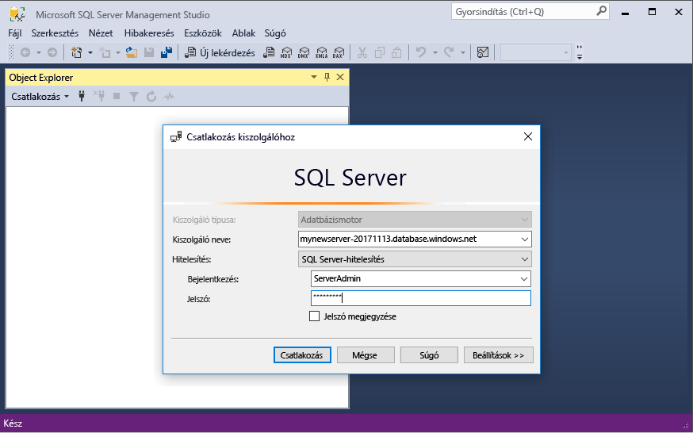

# <a name="quickstart-scale-compute-in-azure-sql-data-warehouse-using-t-sql"></a>Gyors üzembe helyezés: Méretezési számítási az Azure SQL Data Warehouse T-SQL használatával

Skála számítási az Azure SQL Data Warehouse T-SQL és az SQL Server Management Studio (SSMS) használatával. A jobb teljesítmény számítási kibővítési vagy skálája vissza számítási költségek csökkentése érdekében. 

Ha nem rendelkezik Azure-előfizetéssel, első lépésként mindössze néhány perc alatt létrehozhat egy [ingyenes](https://azure.microsoft.com/free/) fiókot.

## <a name="before-you-begin"></a>Előkészületek

Töltse le és telepítse az [SQL Server Management Studio](/sql/ssms/download-sql-server-management-studio-ssms.md) (SSMS) legújabb verzióját.

A parancs feltételezi, hogy befejeződött [gyors üzembe helyezés: hozzon létre, és csatlakozzon - portál](create-data-warehouse-portal.md). A létrehozás és csatlakozás gyors üzembe helyezés befejezése után tudja, hogyan csatlakozzon: nevű adatraktár létrehozott **mySampleDataWarehouse**, létre egy tűzfalszabályt, amely lehetővé teszi az ügyfél számára a kiszolgálón telepítve.
 
## <a name="create-a-data-warehouse"></a>Adattárház létrehozása

Használjon [gyors üzembe helyezés: hozzon létre, és csatlakozzon - portal](create-data-warehouse-portal.md) nevű data warehouse létrehozása az **mySampleDataWarehouse**. Fejezze be a gyors üzembe helyezéssel rendelkezik egy olyan tűzfalszabályt, és csatlakozni tud-e az adatraktár SQL Server Management Studio biztosításához.

## <a name="connect-to-the-server-as-server-admin"></a>Csatlakozás a kiszolgálóhoz kiszolgáló-rendszergazdaként

Ebben a részben az [SQL Server Management Studio](/sql/ssms/download-sql-server-management-studio-ssms.md) használatával építjük fel a kapcsolatot az Azure SQL-kiszolgálóval.

1. Nyissa meg az SQL Server Management Studiót.

2. A **Connect to Server** (Kapcsolódás a kiszolgálóhoz) párbeszédpanelen adja meg a következő adatokat:

   | Beállítás       | Ajánlott érték | Leírás | 
   | ------------ | ------------------ | ------------------------------------------------- | 
   | Kiszolgáló típusa | Adatbázismotor | Kötelezően megadandó érték |
   | Kiszolgálónév | A teljes kiszolgálónév | Például: **mynewserver-20171113.database.windows.net**. |
   | Hitelesítés | SQL Server-hitelesítés | Ebben az oktatóanyagban az SQL-hitelesítésen kívül más hitelesítéstípus nincs konfigurálva. |
   | Bejelentkezés | A kiszolgálói rendszergazdai fiók | Ez az a fiók, amely a kiszolgáló létrehozásakor lett megadva. |
   | Jelszó | A kiszolgálói rendszergazdai fiók jelszava | Ezt a jelszót adta meg a kiszolgáló létrehozásakor. |

    

4. Kattintson a **Connect** (Csatlakozás) gombra. Megnyílik az Object Explorer ablak az SSMS-ben. 

5. Az Object Explorerben bontsa ki a **Databases** (Adatbázisok) elemet. Ezután bontsa ki a **mySampleDatabase** csomópontot az új adatbázisban található objektumok megtekintéséhez.

     

## <a name="view-service-objective"></a>Nézet szolgáltatási cél
A szolgáltatás objektív beállítását az adatraktár adattárházegységek számát tartalmazza. 

Az adatraktár az aktuális adattárházegységek megtekintése:

1. A kapcsolat a **mynewserver-20171113.database.windows.net**, bontsa ki a **Rendszeradatbázisokban**.
2. Kattintson a jobb gombbal **fő** válassza **új lekérdezés**. Megnyílik egy új lekérdezési ablak.
3. Futtassa a következő lekérdezés futtatásával válassza ki a sys.database_service_objectives dinamikus kezelési nézetet. 

    ```sql
    SELECT
        db.name [Database]
    ,   ds.edition [Edition]
    ,   ds.service_objective [Service Objective]
    FROM
        sys.database_service_objectives ds
    JOIN
        sys.databases db ON ds.database_id = db.database_id
    WHERE 
        db.name = 'mySampleDataWarehouse'
    ```

4. A következő eredmények megjelenítése **mySampleDataWarehouse** a DW400 szolgáltatási célkitűzése van. 

    


## <a name="scale-compute"></a>Skála számítási
Az SQL Data Warehouse növelheti vagy csökkentheti a számítási erőforrásokat adattárházegységek beállításával. A [létrehozása és a Connect - portál](create-data-warehouse-portal.md) létrehozott **mySampleDataWarehouse** és 400 dwu-k inicializálása azt. Az alábbi lépéseket, állítsa be a dwu-k a **mySampleDataWarehouse**.

Adattárházegységek módosítása:

1. Kattintson a jobb gombbal **fő** válassza **új lekérdezés**.
2. Használja a [ALTER DATABASE](/sql/t-sql/statements/alter-database-azure-sql-database) T-SQL utasítást a szolgáltatási cél módosításához. Futtassa a következő lekérdezés futtatásával módosítsa a szolgáltatási cél DW300. 

```Sql
ALTER DATABASE mySampleDataWarehouse
MODIFY (SERVICE_OBJECTIVE = 'DW300')
;
```

## <a name="check-database-state"></a>Ellenőrizze az adatbázis állapota

Az adatbázis állapotának ellenőrzéséhez futtassa a következő lekérdezést, szemben a **fő** adatbázis.

```sql
SELECT name AS "Database Name", state_desc AS "Status" 
FROM sys.databases db
WHERE db.name = 'mySampleDataWarehouse'
;
```

Ez a parancs futtatásakor Online, felfüggesztése, folytatása, méretezés vagy felfüggesztett állapot értéket kell kapnia.

## <a name="check-operation-status"></a>Műveleti állapotának ellenőrzése

Az SQL Data Warehouse a különböző felügyeleti műveleteihez vonatkozó adatokat ad vissza, futtassa a következő lekérdezést a a [sys.dm_operation_status](/sql/relational-databases/system-dynamic-management-views/sys-dm-operation-status-azure-sql-database) DMV. Például adja vissza, a művelet és a művelet, amely lehet IN_PROGRESS vagy VÉGREHAJTANI az állapotát.

```sql
SELECT *
FROM
    sys.dm_operation_status
WHERE
    resource_type_desc = 'Database'
AND 
    major_resource_id = 'MySQLDW'
```


## <a name="next-steps"></a>További lépések
Most megtanulhatta, az adatraktár számítási méretezése. Ha bővebb információra van szüksége az Azure SQL Data Warehouse-zal kapcsolatban, folytassa az adatok betöltésével foglalkozó oktatóanyaggal.

> [!div class="nextstepaction"]
>[Adatok betöltése az SQL Data Warehouse-okba](load-data-from-azure-blob-storage-using-polybase.md)
