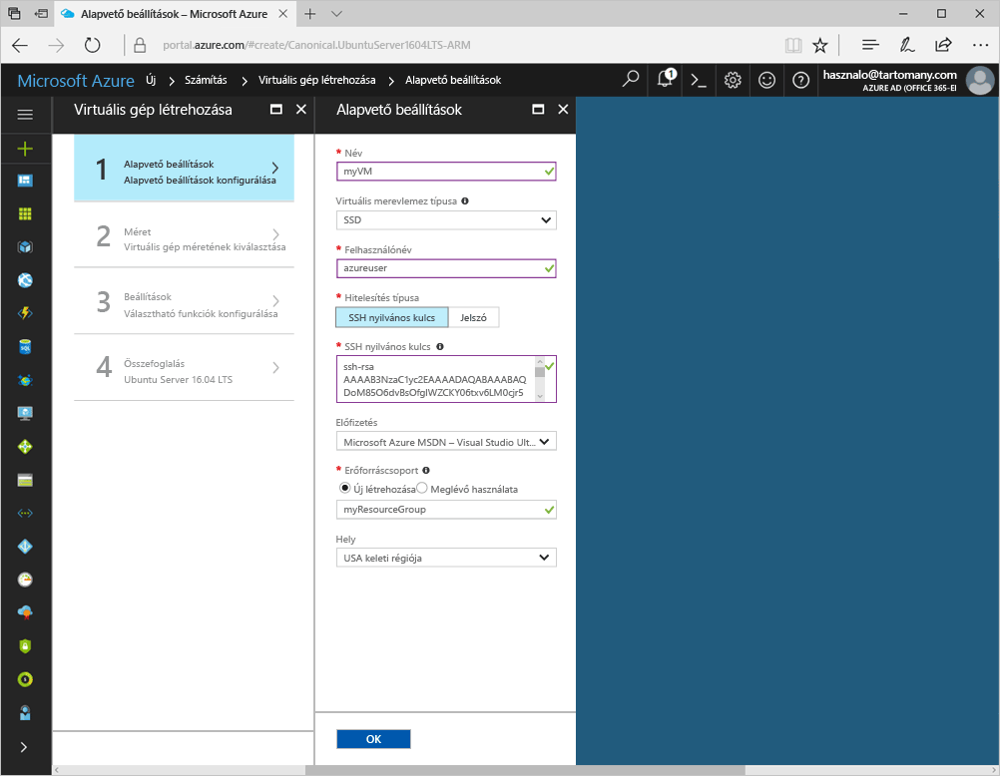

# <a name="create-a-linux-virtual-machine-with-the-azure-portal"></a>Linux virtuális gép létrehozása az Azure Portal használatával

Az Azure virtuális gépek létrehozhatók az Azure Portal segítségével. Ez a módszer egy böngészőalapú felhasználói felületet biztosít a virtuális gépek, valamint az összes kapcsolódó erőforrás létrehozásához és konfigurálásához. Ez a rövid útmutató részletesen bemutatja egy virtuális gép Azure Portalon történő létrehozását.

Ha nem rendelkezik Azure-előfizetéssel, mindössze néhány perc alatt létrehozhat egy [ingyenes fiókot](https://azure.microsoft.com/en-us/free/?WT.mc_id=A261C142F) a virtuális gép létrehozásának megkezdése előtt.

## <a name="create-ssh-key-pair"></a>SSH-kulcspár létrehozása

A gyors üzembe helyezés elvégzéséhez egy SSH-kulcspárra lesz szüksége. Ha már rendelkezik SSH-kulcspárral, kihagyhatja ezt a lépést. Ha Windows-gépet használ, kövesse az [itt](ssh-from-windows.md) található utasításokat. 

Futtassa ezt a parancsot egy Bash rendszerhéjból, és kövesse a képernyőn látható utasításokat. A parancs kimenete tartalmazza a nyilvános kulcsfájl fájlnevét. A fájl tartalmára szükség van a virtuális gép létrehozásakor.

```bash
ssh-keygen -t rsa -b 2048
```

## <a name="log-in-to-azure"></a>Jelentkezzen be az Azure-ba 

Jelentkezzen be az Azure Portalra a http://portal.azure.com webhelyen.

## <a name="create-virtual-machine"></a>Virtuális gép létrehozása

1. Kattintson az Azure Portal bal felső sarkában található **Új** gombra.

2. Válassza a **Számítás** elemet az **Új** panelen, majd válassza az **Ubuntu Server 16.04 LTS** lehetőséget a **Számítás** panelről, és kattintson a **Létrehozás** gombra.

3. Töltse ki a virtuális gép **Alapvető beállítások** űrlapját. A **Hitelesítés típusa** résznél válassza az **SSH** lehetőséget. Az **SSH nyilvános kulcs** beillesztése közben ügyeljen rá, hogy eltávolítsa a kezdő vagy záró térközt. Hozzon létre egy új **Erőforráscsoportot**. Az erőforráscsoport olyan logikai tároló, amelybe a rendszer létrehozza és együttesen kezeli az Azure-erőforrásokat. Amikor végzett, kattintson az **OK** gombra.

      

4. Válasszon méretet a virtuális gép számára. További méretek megjelenítéséhez válassza **Az összes megtekintése** lehetőséget, vagy módosítsa a **Támogatott lemeztípus** szűrőt. 

      

5. A beállítások panelen válassza a **Felügyelt lemezek használata** területen az **Igen** lehetőséget, tartsa meg az alapértelmezéseket a többi beállításnál, majd kattintson az **OK** elemre.

6. Az összegzés lapon kattintson az **OK** elemre a virtuális gép üzembe helyezésének megkezdéséhez.

7. Az üzembe helyezési állapot figyeléséhez kattintson a virtuális gépre. A virtuális gép megtalálható az Azure Portal irányítópultján, illetve a bal oldali menüben a **Virtuális gépek** elemre kattintva. A virtuális gép létrehozása után az állapot **Üzembe helyezés** értékről **Fut** értékre módosul.


## <a name="open-port-80-for-web-traffic"></a>A 80-as port megnyitása a webes adatforgalom számára 

Alapértelmezés szerint kizárólag SSH-kapcsolatok engedélyezettek az Azure-ban üzembe helyezett, Linux rendszerű virtuális gépeken. Ha ez a virtuális gép webkiszolgáló lesz, meg kell nyitnia a 80-as portot a webes forgalom számára. Ez a lépés végigvezeti a hálózati biztonsági csoportokra (NSG) vonatkozó szabály létrehozásának folyamatán, amellyel engedélyezheti a bejövő kapcsolatokat a 80-as porton.

1. A virtuális gép paneljén, az **Alapvető erőforrások** szakaszban kattintson az **Erőforráscsoport** nevére.
2. Az erőforráscsoport paneljén kattintson a **Hálózati biztonsági csoport** elemre az erőforrások listájában. Az NSG neve a virtuális gép -nsg utótaggal bővített neve legyen.
3. Kattintson a **Bejövő biztonsági szabály** fejlécre a bejövő szabályok listájának megnyitásához. A listában látnia kell egy, az RDP-re vonatkozó szabályt.
4. Kattintson a **+ Hozzáadás** gombra a **Bejövő biztonsági szabály felvétele** panel megnyitásához.
5. A **Név** mezőbe írja be az **nginx** karakterláncot. Ügyeljen rá, hogy a **Porttartomány** értéke 80, a **Művelet** értéke pedig **Engedélyezés** legyen. Kattintson az **OK** gombra.


## <a name="connect-to-virtual-machine"></a>Csatlakozás virtuális géphez

Az üzembe helyezés befejeztével hozzon létre egy SSH-kapcsolatot a virtuális géppel.

1. Kattintson a **Csatlakozás** gombra a virtuális gép paneljén. A Csatlakozás gomb megjelenít egy SSH-kapcsolati karakterláncot, amely a virtuális géphez való csatlakozásra használható.

     

2. Futtassa az alábbi parancsot egy SSH-munkamenet létrehozásához. Cserélje le a kapcsolati karakterláncot azzal, amelyet az Azure Portalról másolt ki.

```bash 
ssh <replace with IP address>
```

## <a name="install-nginx"></a>Az NGINX telepítése

Az alábbi bash-parancsfájl segítségével frissítse a csomagforrásokat, és telepítse a legújabb NGINX-csomagot. 

```bash 
#!/bin/bash

# update package source
apt-get -y update

# install NGINX
apt-get -y install nginx
```

## <a name="view-the-ngix-welcome-page"></a>Az NGINX kezdőlapjának megtekintése

Most, hogy az NGINX telepítve van, és a 80-as port meg van nyitva a virtuális gépén az internet irányából, tetszőleges böngészőt használhat az alapértelmezett NGINX-kezdőlap megtekintéséhez. Ügyeljen arra, hogy az alapértelmezett oldalt a dokumentált `publicIpAddress` használatával keresse fel. 

 
## <a name="delete-virtual-machine"></a>Virtuális gép törlése

Ha már nincs rá szükség, törölje az erőforráscsoportot, a virtuális gépet és az összes kapcsolódó erőforrást. Ehhez válassza ki az erőforráscsoportot a virtuális gép paneljéről és kattintson a **Törlés** elemre.

## <a name="next-steps"></a>Következő lépések

[Magas rendelkezésre állású virtuális gép létrehozása oktatóanyag](create-cli-complete.md?toc=%2fazure%2fvirtual-machines%2flinux%2ftoc.json)

[A virtuális gépek parancssori felületen való üzembe helyezését ismertető minták megismerése](../windows/cli-samples.md?toc=%2fazure%2fvirtual-machines%2flinux%2ftoc.json)

