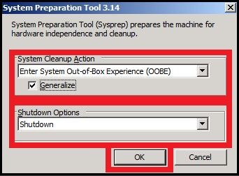

<properties
    pageTitle="擷取 Azure Windows VM 的映像 | Microsoft Azure"
    description="擷取以傳統部署模型建立之 Azure Windows 虛擬機器的映像。"
    services="virtual-machines"
    documentationCenter=""
    authors="cynthn"
    manager="timlt"
    editor="tysonn"
    tags="azure-service-management"/>

<tags
    ms.service="virtual-machines"
    ms.workload="infrastructure-services"
    ms.tgt_pltfrm="vm-windows"
    ms.devlang="na"
    ms.topic="article"
    ms.date="11/05/2015"
    ms.author="cynthn"/>

#擷取以傳統部署模型建立之 Azure Windows 虛擬機器的映像。

[AZURE.INCLUDE [learn-about-deployment-models](../../includes/learn-about-deployment-models-classic-include.md)] 資源管理員模型。

本文說明如何擷取執行 Windows 的 Azure 虛擬機器，以便用它作為映像來建立其他虛擬機器。 此映像包括作業系統磁碟和任何連結至虛擬機器的資料磁碟。 它並不包含網路組態，因此當您建立其他使用此映像的虛擬機器時，將需要設定這些組態。

Azure 會儲存在映像 **我的映像**。 這個位置與您已上傳映像的任何儲存位置相同。 如需有關映像的詳細資訊，請參閱 [有關虛擬機器的映像](virtual-machines-images.md)。

##開始之前##

這些步驟假設您已建立 Azure 虛擬機器且設定好作業系統，包括連接任何資料磁碟。 如果您還沒這麼做，請參閱下列指示：

- [從映像建立虛擬機器](virtual-machines-create-custom.md)
- [如何將資料磁碟連結至虛擬機器](storage-windows-attach-disk.md)

> [AZURE.WARNING] 此程序會在經擷取後便刪除原始的虛擬機器。 

這並不適合做為備份虛擬機器的方式。 若要執行此操作，一個可行的方法是使用 Azure Backup，可提供特定區域中的預覽功能。 如需詳細資訊，請參閱 [備份 Azure 虛擬機器](../backup/backup-azure-vms.md)。 來自認證合作夥伴的其他解決方案也可供使用。 若要了解目前可用的項目，請搜尋 Azure Marketplace。

##擷取虛擬機器

1. 在 [Azure 傳統入口網站](http://manage.windowsazure.com), ，**連接** 到虛擬機器。 如需指示，請參閱 [如何登入執行 Windows Server 的虛擬機器] []。

2.  以系統管理員身分開啟 [命令提示字元] 視窗。

3.  切換至 `%windir%\system32\sysprep` 目錄，然後執行 sysprep.exe。

4.   **系統準備工具** ] 對話方塊隨即出現。 執行下列動作：

    - 在 **系統清理動作**, ，請選取 **進入系統的全新體驗 (OOBE)** 並確定 **一般化** 已核取。 如需有關使用 Sysprep 的詳細資訊，請參閱 [如何使用 Sysprep ︰ 簡介][]。

    - 在 **關機選項**, ，請選取 **關機**。

    - 按一下 [ **確定**。

    

7.  Sysprep 關閉虛擬機器，可在 Azure 傳統入口網站中的虛擬機器的狀態變更 **已停止**。

8.  在 Azure 傳統入口網站中，按一下 [ **虛擬機器** ，然後選取您想要擷取的虛擬機器。

9.  在命令列中，按一下 [ **擷取**。

    

     **擷取虛擬機器** ] 對話方塊隨即出現。

10. 在 **映像名稱**, ，輸入新的映像的名稱。

11. 將 Windows Server 映像新增到自訂映像組合之前，必須先如前述步驗所指示，執行 Sysprep 將它一般化。 按一下 [ **我已經在虛擬機器上執行 Sysprep** 來指示您這麼做。

12. 按一下打勾記號以擷取映像。 新的映像現在會之下可取得 **映像**。

    

##後續步驟

映像已準備好用來建立虛擬機器。 若要這樣做，您將建立虛擬機器使用 **從組件庫** 功能表項目，然後選取您剛建立的映像。 如需指示，請參閱 [從映像建立虛擬機器](virtual-machines-create-custom.md)。

[How to sign in to a virtual machine running Windows Server]: virtual-machines-log-on-windows-server.md
[How to Use Sysprep: An Introduction]: http://technet.microsoft.com/library/bb457073.aspx
[Run Sysprep.exe]: ./media/virtual-machines-capture-image-windows-server/SysprepCommand.png
[Enter Sysprep.exe options]: ./media/virtual-machines-capture-image-windows-server/SysprepGeneral.png
[The virtual machine is stopped]: ./media/virtual-machines-capture-image-windows-server/SysprepStopped.png
[Capture an image of the virtual machine]: ./media/virtual-machines-capture-image-windows-server/CaptureVM.png
[Enter the image name]: ./media/virtual-machines-capture-image-windows-server/Capture.png
[Image capture successful]: ./media/virtual-machines-capture-image-windows-server/CaptureSuccess.png
[Use the captured image]: ./media/virtual-machines-capture-image-windows-server/MyImagesWindows.png

