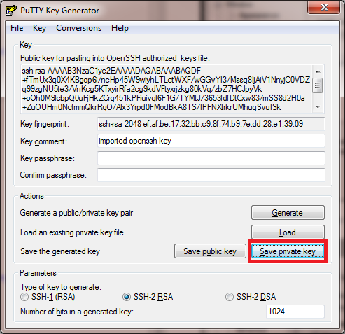

<properties 
    pageTitle="在 Windows 上使用 SSH 來連線到 Linux 虛擬機器 | Microsoft Azure" 
description="了解如何在 Windows 電腦上產生並使用 SSH 金鑰來連線到 Azure 上的 Linux 虛擬機器。" 
    services="virtual-machines" 
    documentationCenter="" 
    authors="squillace" 
    manager="timlt" 
    editor=""
    tags="azure-service-management,azure-resource-manager" />

<tags 
    ms.service="virtual-machines" 
    ms.workload="infrastructure-services" 
    ms.tgt_pltfrm="vm-linux" 
    ms.devlang="na" 
    ms.topic="article" 
    ms.date="10/05/2015" 
    ms.author="rasquill"/>

# 如何在 Azure 上搭配 Windows 使用 SSH

> [AZURE.SELECTOR]
- [Windows](../articles/virtual-machines/virtual-machines-windows-use-ssh-key.md)
- [Linux/Mac](../articles/virtual-machines/virtual-machines-linux-use-ssh-key.md)

本主題描述如何在 Windows (您用來在 Azure 上以 **ssh** 命令連接至 Linux VM) 上建立和使用 **ssh-rsa** 和 **.pem** 格式公用和私密金鑰檔案。 如果您已經建立 **.pem** 檔案，您可以使用這些檔案來建立 Linux VM (可以使用 **ssh** 來連接)。 其他數個命令使用 **SSH** 通訊協定和安全地執行工作的金鑰檔案值得注意的是 **scp** 或 [安全複製](https://en.wikipedia.org/wiki/Secure_copy), ，這可以安全地將檔案複製支援的電腦與 **SSH** 連線。

## 您需要哪些 SSH 和金鑰建立程式？

**SSH** & #8212; 或 [安全殼層](https://en.wikipedia.org/wiki/Secure_Shell) & #8212; 是加密的連接通訊協定，可允許透過非安全連線的安全登入。 它是適用於 Azure 中裝載的 Linux VM 的預設連接通訊協定，除非您設定您的 Linux VM 以啟用其他連接機制。 Windows 使用者也可以使用 **ssh** 用戶端實作，連接及管理在 Azure 中的 Linux VM，但是 Windows 電腦通常並未隨附 **ssh** 用戶端，因此您必須選擇一個。

您可以安裝的一般用戶端包括：

- [puTTY 和 puTTYgen](() http://www.chiark.greenend.org.uk/~sgtatham/putty/
- [MobaXterm](http://mobaxterm.mobatek.net/)
- [Cygwin](https://cygwin.com/)
- [Git For Windows](https://git-for-windows.github.io/), ，隨附的環境和工具

如果您想要與眾不同，您也可以試試 [新的連接埠的 * * OpenSSH * * windows 的工具組](http://blogs.msdn.com/b/powershell/archive/2015/10/19/openssh-for-windows-update.aspx)。 但是請注意，這是目前正在開發中的程式碼，您應該在用於實際執行系統之前檢閱程式碼基底。

> [AZURE.INCLUDE [learn-about-deployment-models](../../includes/learn-about-deployment-models-both-include.md)]

## 您需要建立哪些金鑰檔案？

包含用於 Azure 的基本 SSH 設定 **ssh rsa** 為 2048 位元的公用和私用金鑰組 (根據預設， **ssh-keygen** 儲存這些檔案以 **~/.ssh/id_rsa** 和 **~/.ssh/id-rsa.pub** 除非變更預設值)，以及 `.pem` 檔案會從產生 **id_rsa** 搭配傳統部署模型的傳統入口網站使用私密金鑰檔案。

以下是部署案例，以及您在每個案例中使用的檔案類型：

1. **ssh rsa** 金鑰所需的部署使用 [預覽入口網站](https://portal.azure.com), ，無論部署模型。
2. 建立使用 Vm 所需的.pem 檔案 [傳統入口網站](https://manage.windowsazure.com)。 .pem 檔案中使用的傳統部署也支援 [Azure CLI](xplat-cli-install.md)。

> [AZURE.NOTE] 如果您打算管理使用傳統部署模型部署的服務，您可能也想要建立 **.cer** 格式檔案以上傳至入口網站 - 雖然這不牽涉到 **ssh** 或連接到 Linux VM，這是本文的主題。 若要在 Linux 或 Mac 上建立這些檔案，請輸入  

## 取得 Windows 相關的 ssh-keygen 和 openssl

[本節](#What-SSH-and-key-creation-programs-do-you-need) 上述列出數個公用程式，包括 `ssh-keygen` 和 `openssl` 適用於 Windows。 以下列出一些範例：

### 使用 Msysgit

1.  下載並安裝 msysgit 從下列位置: [http://msysgit.github.com/](http://msysgit.github.com/)
2.  執行 `msys` 從安裝目錄 (範例: c:\msysgit\msys.exe)
3.  輸入 `cd bin` 切換到 `bin` 目錄

### 使用 GitHub for Windows

1.  下載並安裝 GitHub for Windows，請從下列位置: [http://windows.github.com/](http://windows.github.com/)
2.  從 [開始] 功能表 > [所有程式] > [GitHub, Inc] 執行 Git Shell

> [AZURE.NOTE] 執行時，您可能會遇到下列錯誤 `openssl` 上述命令:

            Unable to load config info from /usr/local/ssl/openssl.cnf
    
        The easiest way to resolve this is to set the `OPENSSL_CONF` environment variable. The process for setting this variable will vary depending on the shell that you have configured in Github:
    
        **Powershell:**
    
            $Env:OPENSSL_CONF="$Env:GITHUB_GIT\ssl\openssl.cnf"
    
        **CMD:**
    
            set OPENSSL_CONF=%GITHUB_GIT%\ssl\openssl.cnf
    
        **Git Bash:**
    
            export OPENSSL_CONF=$GITHUB_GIT/ssl/openssl.cnf

### 使用 Cygwin

1.  下載並安裝 Cygwin 從下列位置: [http://cygwin.com/](http://cygwin.com/)
2.  確定已安裝 OpenSSL 封裝及其所有的相依性。
3.  執行 `cygwin`

## 建立私密金鑰

1.  遵循以上的其中一組指示，以便執行 `openssl.exe`
2.  輸入以下命令：

        # openssl.exe req -x509 -nodes -days 365 -newkey rsa:2048 -keyout myPrivateKey.key -out myCert.pem

3.  畫面應該如下所示：

    

4.  回答提出的問題。
5.  它會建立兩個檔案: `myPrivateKey.key` 和 `myCert.pem`。
6.  如果您將直接使用 API，而不使用管理入口網站，請使用下列命令，將 `myCert.pem` 轉換為 `myCert.cer` (DER 編碼的 X509 憑證)：

        # openssl.exe  x509 -outform der -in myCert.pem -out myCert.cer

## 建立 Putty 的 PPK

1. 下載並安裝 Puttygen 從下列位置: [http://www.chiark.greenend.org.uk/~sgtatham/putty/download.html](http://www.chiark.greenend.org.uk/~sgtatham/putty/download.html)

2. Puttygen 可能無法讀取稍早建立的私密金鑰 (`myPrivateKey.key`)。 執行下列命令以將它轉譯成 Puttygen 可認得的 RSA 私密金鑰：

        # openssl rsa -in ./myPrivateKey.key -out myPrivateKey_rsa
        # chmod 600 ./myPrivateKey_rsa

    上述命令應會產生一個名為 myPrivateKey_rsa 的新私密金鑰。

3. 執行 `puttygen.exe`

4. 按一下功能表：[檔案] > [載入私密金鑰]

5. 找出您的私密金鑰，名稱為 `為 myPrivateKey_rsa` 上方。 您必須變更檔案篩選器來顯示 **所有檔案 (\ *。 \ *)**

6. 按一下 [開啟]****。 您將看見提示，看起來如下所示：

    

7. 按一下 [確定]****。

8. 按一下以下螢幕擷取畫面強調顯示的 [Save Private Key]****：

    

9. 將檔案儲存為 PPK。

## 使用 Putty 連線到 Linux 機器

1.  下載並安裝 putty 從下列位置: [http://www.chiark.greenend.org.uk/~sgtatham/putty/download.html](http://www.chiark.greenend.org.uk/~sgtatham/putty/download.html)
2.  執行 putty.exe
3.  使用管理入口網站的 IP 來填入主機名稱：

    

4.  選取 [Open]**** 之前，請按一下 [Connection] > [SSH] > [Auth] 索引標籤來選擇您的金鑰。 請參閱以下螢幕擷取畫面，以了解要填入的欄位：

    

5.  按一下 [開啟]**** 以連線到虛擬機器。

