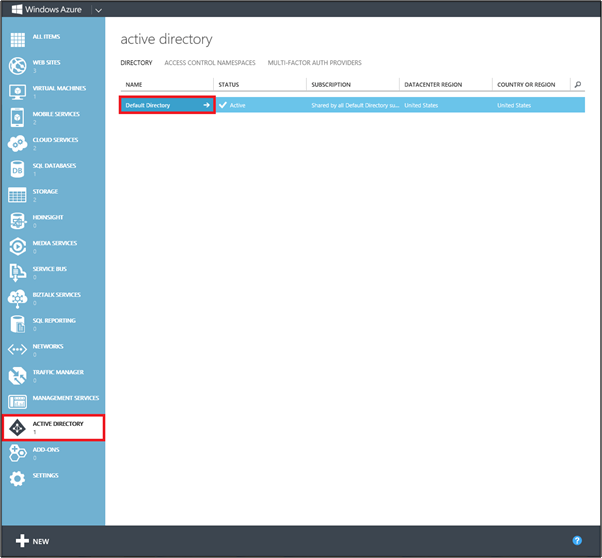

1. 向 Azure Active Directory 租用戶註冊您的行動應用程式後端，遵循 [How to configure your Mobile App with Azure Active Directory] 主題。

2. 瀏覽至 **Active Directory** 中 [Azure classic portal]

   

3. 選取您的目錄，然後選取 **應用程式** 頂端的索引標籤。 按一下 [ **新增** 底部建立新的應用程式註冊。 

4. 按一下 [ **加入我的組織正在開發的應用程式**。

5. 在 [新增應用程式精靈] 中，輸入 **名稱** 您的應用程式，然後按一下 [  **原生用戶端應用程式** 型別。 接著，按一下以繼續。

6. 在 **重新導向 URI** 方塊中，輸入登入/完成您的應用程式服務閘道的端點。 此值應與 https://contoso.azurewebsites.net/login/done 類似。

7. 一旦新增原生應用程式之後，按一下 [ **設定** ] 索引標籤。 複製 **用戶端識別碼**。 稍後您將會需要此資訊。

8. 將頁面向下的捲動 **其他應用程式的權限** 區段，然後按一下 **新增應用程式**。

9. 搜尋先前註冊的 Web 應用程式，再按一下加號圖示。 然後按一下核取標記以關閉對話方塊。

10. 在您剛才加入的新項目，開啟 **委派的權限** 下拉式清單中選取 **存取 (appName)**。 然後按一下 [ **儲存**

   

您的應用程式現在已設定於 AAD 中，因此使用者可以使用 AAD 單一登入來登入。

[Azure classic portal]: https://manage.windowsazure.com/
[How to configure your Mobile App with Azure Active Directory]: ../articles/app-service-how-to-configure-active-directory-authentication.md

