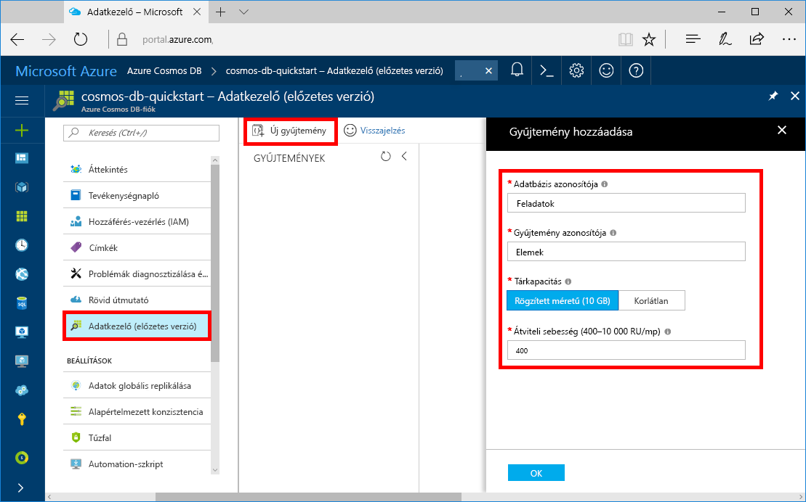
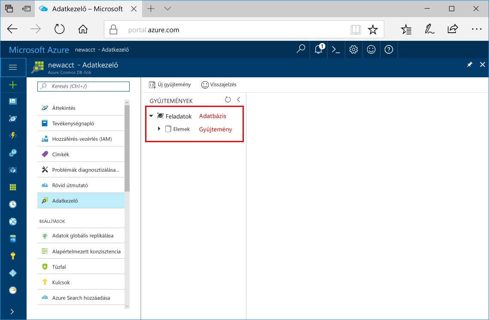

Az Azure Portal Adatkezelő eszközét mostantól adatbázis és gyűjtemény létrehozására is használhatja. 

1. Kattintson az **Adatkezelő** > **Új gyűjtemény** elemre. 
    
    A jobb szélen megjelenik a **Gyűjtemény hozzáadása** terület. Előfordulhat, hogy jobbra kell görgetnie, hogy lássa.

    

2. A **Gyűjtemény hozzáadása** oldalon adja meg az új gyűjtemény beállításait.

    Beállítás|Ajánlott érték|Leírás
    ---|---|---
    Adatbázis azonosítója|Feladatok|Az új adatbázisnak adja a *Feladatok* nevet. Az adatbázis neve 1–255 karakter hosszúságú lehet, és nem tartalmazhat /, \\, #, ? karaktereket vagy záró szóközt.
    Gyűjtemény azonosítója|Elemek|Az új gyűjteménynek adja az *Elemek* nevet. A gyűjteményazonosítók nevére ugyanazok a karakterkorlátozások vonatkoznak, mint az adatbázisnevekre.
    Tárkapacitás| Rögzített méretű (10 GB)|Módosítsa az értéket **Rögzített méretű (10 GB)** értékre. Ez az érték az adatbázis tárkapacitása.
    Teljesítmény|400 kérelemegység|Módosítsa az átviteli sebességet másodpercenként 400 kérelemegységre (RU/s). A tárolási kapacitást **Rögzített méretű (10 GB)** értékre kell állítania, hogy másodpercenként 400 kérelemegység (RU/s) értékű átviteli teljesítményt tudjon megadni. Később lehetősége lesz növelni az átviteli sebességet a késés csökkentése érdekében. 
    Partíciókulcs|/kategória|Adja meg a */category* értéket partíciókulcsként. A partíciókulcs egyenletesen elosztja az adatokat az adatbázis egyes partíciói között. A particionálásról a [Particionálásra való tervezést](../articles/cosmos-db/partition-data.md#designing-for-partitioning) ismertető részben olvashat bővebben.

    Kattintson az **OK** gombra.

    Az Adatkezelő megjeleníti az új adatbázist és gyűjteményt.

    