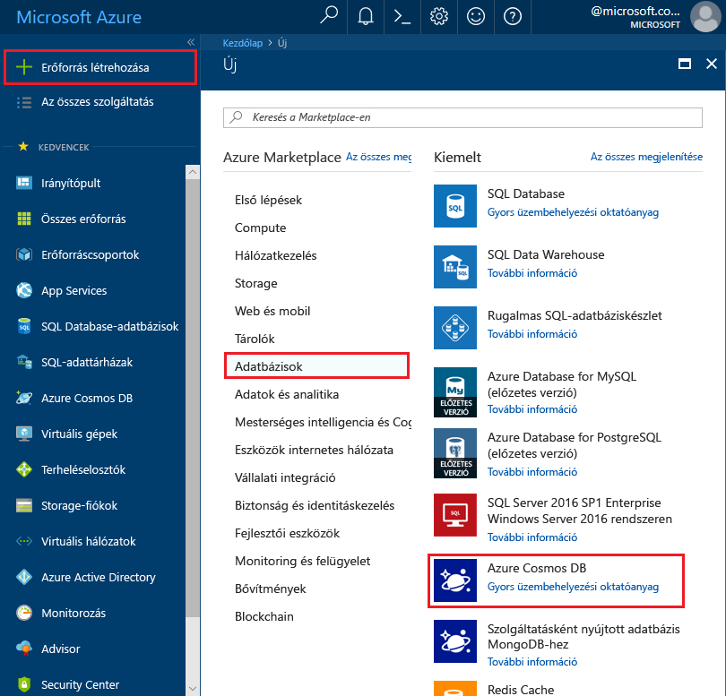

1. Egy új ablakban jelentkezzen be az [Azure Portalra](https://portal.azure.com/).
2. A bal oldali panelen kattintson az **Új**, az **Adatbázisok**, majd az **Azure Cosmos DB** elemre, végül a **Létrehozás** parancsra.
   
   

3. Az **Új fiók** panelen adja meg az Azure Cosmos DB-fiók kívánt beállításait. 

    Az Azure Cosmos DB használata esetén négy programozási modell közül választhat: Gremlin (Graph), MongoDB, SQL (DocumentDB) vagy Tábla (kulcs-érték). Jelenleg mindegyikhez külön fiókra van szükség.
    
    Ebben a rövid útmutatóban a DocumentDB API használatával fogunk programozni, tehát az űrlap kitöltésekor az **SQL (DocumentDB)** lehetőséget kell választania. Ha egy közösségi hálózati alkalmazás gráfadataival, kulcs/érték (tábla) típusú adatokkal vagy MongoDB-alkalmazásból migrált adatokkal dolgozik, vegye figyelembe, hogy az Azure Cosmos DB képes magas rendelkezésre állású, globálisan elosztott adatbázis-szolgáltatási platformot biztosítani az összes alapvető fontosságú alkalmazáshoz.

    Töltse ki az **Új fiók** panel mezőit. Ehhez használja segítségként az alábbi képernyőképen szereplő információkat – az Ön értékei eltérhetnek a képernyőképen láthatóktól.
 
    

    Beállítás|Ajánlott érték|Leírás
    ---|---|---
    ID (Azonosító)|*Egyedi érték*|Az Azure Cosmos DB-fiókot azonosító egyedi név. A rendszer a *documents.azure.com* utótaggal egészíti ki a megadott azonosítót az URI létrehozásához, ezért válasszon egyedi, de felismerhető azonosítót. Az azonosító csak kisbetűket, számokat és a kötőjel (-) karaktert tartalmazhatja, valamint 3–50 karakter hosszúságúnak kell lennie.
    API|SQL (DocumentDB)|Ebben a cikkben a [DocumentDB API](../articles/documentdb/documentdb-introduction.md) használatával fogunk programozni.|
    Előfizetés|*Az Ön előfizetése*|Az Azure Cosmos DB-fiókhoz használni kívánt Azure-előfizetés. 
    Erőforráscsoport|*Megegyezik az azonosítóval*|A fiók új erőforráscsoport-neve. Az egyszerűség kedvéért használhat az azonosítójával megegyező nevet. 
    Hely|*A felhasználókhoz legközelebb eső régió*|Az a földrajzi hely, ahol az Azure Cosmos DB-fiókot üzemeltetni fogja. Válassza ki a felhasználókhoz legközelebb lévő helyet, hogy a lehető leggyorsabb hozzáférést biztosítsa az adatokhoz.
4. A fiók létrehozásához kattintson a **Létrehozás** gombra.
5. A felső eszköztáron kattintson az **Értesítések** ikonra  az üzembe helyezési folyamat monitorozásához.

    

6.  Amikor az Értesítések ablak azt jelzi, hogy az üzembe helyezés sikeresen megtörtént, zárja be az értesítési ablakot, és nyissa meg az új fiókot az Irányítópult **Minden erőforrás** csempéjéről. 

    
 
