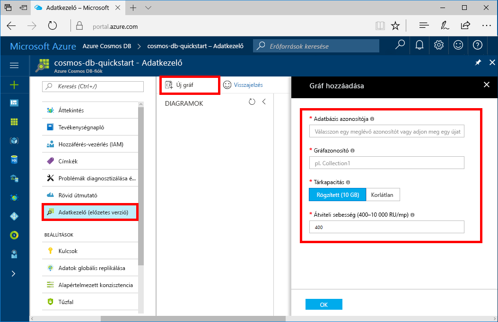

Az Azure Portal Adatkezelő eszközét mostantól gráfadatbázisok létrehozására is használhatja. 

1. Az Azure portálon a bal oldali menüben válassza ki a **adatok kezelővel (előzetes verzió)**.

2. A **adatok kezelővel (előzetes verzió)**, jelölje be **új diagram**. Az alábbi információk segítségével, majd adja meg a lap:

    

    Beállítás|Ajánlott érték|Leírás
    ---|---|---
    Adatbázis azonosítója|sample-database|Adja meg *-mintaadatbázist* , az új adatbázis nevét. Adatbázis nevének 1 és 255 karakter közé kell esnie, és nem tartalmazhat `/ \ # ?` vagy záró szóköz.
    Gráfazonosító|sample-graph|Adja meg *minta-grafikon* az új gyűjtemény néven. Graph nevek rendelkezik adatbázis azonosítók megegyező karakter követelmények vonatkoznak.
    Tárkapacitás| 10 GB|Ne módosítsa az alapértelmezett értéket. Ez az adatbázis tárkapacitása.
    Teljesítmény|400 kérelemegység|Ne módosítsa az alapértelmezett értéket. Később lehetősége lesz növelni az átviteli sebességet a késés csökkentése érdekében.
    Partíciókulcs|/firstName|Az egyes partíciók között az adatokat egyenletesen elosztó partíciókulcs. A megfelelő partíciós kulcs kiválasztása fontos performant grafikon létrehozni. További információkért lásd: [a particionálás tervezése](../articles/cosmos-db/partition-data.md#designing-for-partitioning).

3. Miután a rendszer kitölti az űrlapot, jelölje ki a **OK**.
