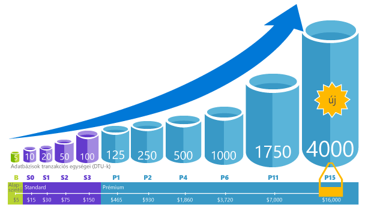

A Database Transaction Unit (DTU) az SQL Database mértékegysége, amely valós mérték, az adatbázisadatbázis-tranzakciók alapján jelöli az adatbázisok teljesítményszintjét. Egy online tranzakció-feldolgozási (OLTP-) kérésre jellemző műveletkészlet esetében megmértük, hogy teljes terhelés mellett hány tranzakció teljesíthető másodpercenként (ez a rövid verzió, a részleteket a [referenciaalap áttekintésében](../articles/sql-database/sql-database-benchmark-overview.md) olvashatja). 

Például egy 1750 DTU-val rendelkező Prémium P11 adatbázis 350x több DTU számítási teljesítményt nyújt, mint egy 5 DTU-val rendelkező Alapszintű adatbázis. 

> [!NOTE]
> Egy létező SQL Server-adatbázis áttelepítésekor egy külső eszközzel, [az Azure SQL Database DTU kalkulátorával](http://dtucalculator.azurewebsites.net/) megbecsülheti azt a teljesítményszintet és szolgáltatásréteget, amelyre az adatbázisnak szüksége lehet az Azure SQL Database-ben.
> 
> 

### DTU és eDTU
A DTU az önálló adatbázisok esetében ugyanaz, mint az eDTU a rugalmas adatbázisoknál. Egy Alapszintű rugalmas adatbáziskészletben található adatbázis például legfeljebb 5 eDTU-t kínál. Ez ugyanaz a teljesítmény, mint egy önálló Alapszintű adatbázis esetében. A különbség abban rejlik, hogy a rugalmas adatbázis addig nem használ fel eDTU-t a készletből, amíg rá nem kényszerül. 

Egy egyszerű példa segíthet. Vegyünk egy 1000 DTU-val ellátott Alapszintű rugalmas adatbáziskészletet, és helyezzünk bele 800 adatbázist. Amíg bármilyen időpontban csak 200 adatbázist használ a 800-ból (5 DTU X 200 = 1000), addig nem éri el a készlet kapacitását, és az adatbázis teljesítménye nem csökken. Ezt a példát az érthetőség kedvéért leegyszerűsítettük. A valódi számítás egy kicsit bonyolultabb. A portál elvégzi Ön helyett a számításokat, és javaslatot tesz az adatbázis-használati előzmények alapján. Ha szeretné megtudni, hogyan működnek a javaslatok, vagy ha szeretné maga elvégezni a számításokat, akkor tekintse meg [a rugalmas adatbáziskészlet költségekkel és teljesítménnyel kapcsolatos tudnivalóit](../articles/sql-database/sql-database-elastic-pool-guidance.md). 

<!--HONumber=Jun16_HO2-->

